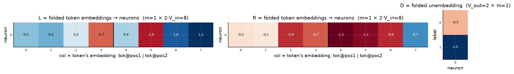
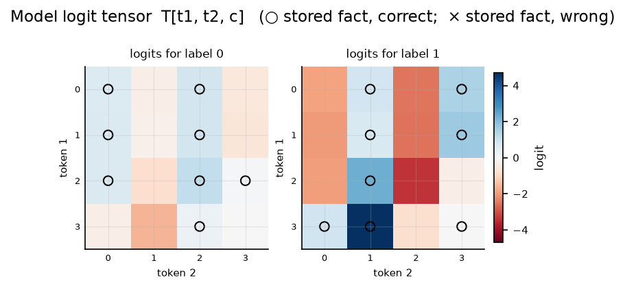

# Bilinear model, d = 2

| | |
|---|---|
| architecture | `logits = D((Lx) ⊙ (Rx))`, x = [onehot(t1); onehot(t2)] |
| V_in / V_out / m | 4 / 2 / 1 |
| parameters | 18 |
| capacity (acc ≥ 0.9, any of 11 seeds) | **16** of 16 possible facts |
| showcase model trained on | 16 facts (best seed of ≤11) |
| memorized (argmax correct) | **16 / 16**  (acc 1.000) |
| margin stats | min +0.01, median +2.28, max +6.30 |

## Weights

These three matrices are the *entire* model — the challenge architecture (post Fig. 4) folds the MLP input matrix into the embeddings and the output matrix into the unembedding. Because the input is a one-hot concat, **column t of L/R *is* token t's embedding vector**, mapping it straight to neuron pre-activations; **D is the unembedding** (neurons → label logits). The black divider separates the position-1 block (columns 0..V_in-1, read by token 1) from the position-2 block (read by token 2).

## Third-order logit tensor

The model's complete input→output function: `T[t1, t2, c]` for every possible input pair, one panel per label. Circles mark stored facts of that label (× = stored but predicted wrong). A perfect memorizer would have every circled cell be the winner across its panel-stack; everything un-circled is free to be arbitrary interference.

## Worked examples by success tier

Facts sorted by margin = `logit[correct] − max wrong logit` (positive ⇒ memorized). `c*` is the strongest competing label.

### Near-perfect (largest margin, ~zero loss)

**Fact 14** — margin +6.30, CE loss 0.002

`t1=3, t2=1` → label **1**. `Lx[n] = L[n,3] + L[n,4+1]`, same for `Rx`; `h = Lx*Rx`; `logit[c] = Σ_n D[c,n]·h[n]`.

| n | Lx | Rx | h=Lx·Rx | D[y=1,n] | →logit[1] | D[c*=0,n] | →logit[0] |
|---|---|---|---|---|---|---|---|
| 0 | -1.71 | -1.82 | +3.11 | +1.51 | +4.70 | -0.51 | -1.60 |
| **Σ** | | | | | **+4.70** | | **-1.60** |

All logits: [-1.60, **+4.70**] — margin +6.30 vs label 0.

**Fact 2** — margin +4.53, CE loss 0.011

`t1=2, t2=2` → label **0**. `Lx[n] = L[n,2] + L[n,4+2]`, same for `Rx`; `h = Lx*Rx`; `logit[c] = Σ_n D[c,n]·h[n]`.

| n | Lx | Rx | h=Lx·Rx | D[y=0,n] | →logit[0] | D[c*=1,n] | →logit[1] |
|---|---|---|---|---|---|---|---|
| 0 | +1.25 | -1.79 | -2.24 | -0.51 | +1.15 | +1.51 | -3.38 |
| **Σ** | | | | | **+1.15** | | **-3.38** |

All logits: [**+1.15**, -3.38] — margin +4.53 vs label 1.

### Comfortable (median margin)

**Fact 9** — margin +2.28, CE loss 0.097

`t1=1, t2=3` → label **1**. `Lx[n] = L[n,1] + L[n,4+3]`, same for `Rx`; `h = Lx*Rx`; `logit[c] = Σ_n D[c,n]·h[n]`.

| n | Lx | Rx | h=Lx·Rx | D[y=1,n] | →logit[1] | D[c*=0,n] | →logit[0] |
|---|---|---|---|---|---|---|---|
| 0 | +1.83 | +0.62 | +1.13 | +1.51 | +1.70 | -0.51 | -0.58 |
| **Σ** | | | | | **+1.70** | | **-0.58** |

All logits: [-0.58, **+1.70**] — margin +2.28 vs label 0.

**Fact 8** — margin +1.98, CE loss 0.129

`t1=0, t2=3` → label **1**. `Lx[n] = L[n,0] + L[n,4+3]`, same for `Rx`; `h = Lx*Rx`; `logit[c] = Σ_n D[c,n]·h[n]`.

| n | Lx | Rx | h=Lx·Rx | D[y=1,n] | →logit[1] | D[c*=0,n] | →logit[0] |
|---|---|---|---|---|---|---|---|
| 0 | +1.74 | +0.56 | +0.98 | +1.51 | +1.48 | -0.51 | -0.50 |
| **Σ** | | | | | **+1.48** | | **-0.50** |

All logits: [-0.50, **+1.48**] — margin +1.98 vs label 0.

### At the margin (barely memorized)

**Fact 7** — margin +0.42, CE loss 0.504

`t1=2, t2=3` → label **0**. `Lx[n] = L[n,2] + L[n,4+3]`, same for `Rx`; `h = Lx*Rx`; `logit[c] = Σ_n D[c,n]·h[n]`.

| n | Lx | Rx | h=Lx·Rx | D[y=0,n] | →logit[0] | D[c*=1,n] | →logit[1] |
|---|---|---|---|---|---|---|---|
| 0 | +1.45 | -0.14 | -0.21 | -0.51 | +0.11 | +1.51 | -0.31 |
| **Σ** | | | | | **+0.11** | | **-0.31** |

All logits: [**+0.11**, -0.31] — margin +0.42 vs label 1.

**Fact 10** — margin +0.01, CE loss 0.688

`t1=3, t2=3` → label **1**. `Lx[n] = L[n,3] + L[n,4+3]`, same for `Rx`; `h = Lx*Rx`; `logit[c] = Σ_n D[c,n]·h[n]`.

| n | Lx | Rx | h=Lx·Rx | D[y=1,n] | →logit[1] | D[c*=0,n] | →logit[0] |
|---|---|---|---|---|---|---|---|
| 0 | +0.51 | +0.01 | +0.00 | +1.51 | +0.01 | -0.51 | -0.00 |
| **Σ** | | | | | **+0.01** | | **-0.00** |

All logits: [-0.00, **+0.01**] — margin +0.01 vs label 0.

*(no unmemorized facts — this model is at 100% accuracy)*
