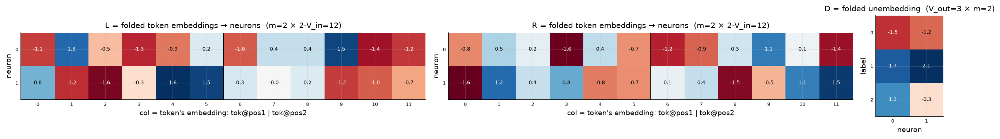
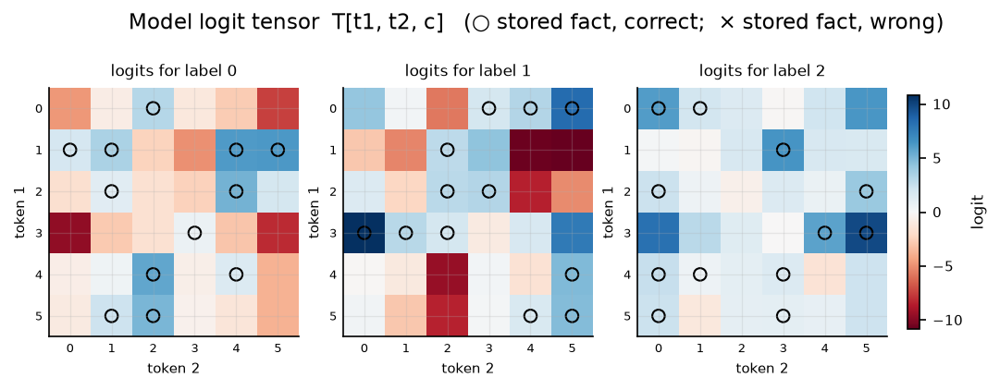

# Bilinear model, d = 3

| | |
|---|---|
| architecture | `logits = D((Lx) ⊙ (Rx))`, x = [onehot(t1); onehot(t2)] |
| V_in / V_out / m | 6 / 3 / 2 |
| parameters | 54 |
| capacity (acc ≥ 0.9, any of 11 seeds) | **36** of 36 possible facts |
| showcase model trained on | 36 facts (best seed of ≤11) |
| memorized (argmax correct) | **36 / 36**  (acc 1.000) |
| margin stats | min +0.10, median +1.98, max +4.64 |

## Weights

These three matrices are the *entire* model — the challenge architecture (post Fig. 4) folds the MLP input matrix into the embeddings and the output matrix into the unembedding. Because the input is a one-hot concat, **column t of L/R *is* token t's embedding vector**, mapping it straight to neuron pre-activations; **D is the unembedding** (neurons → label logits). The black divider separates the position-1 block (columns 0..V_in-1, read by token 1) from the position-2 block (read by token 2).

## Third-order logit tensor

The model's complete input→output function: `T[t1, t2, c]` for every possible input pair, one panel per label. Circles mark stored facts of that label (× = stored but predicted wrong). A perfect memorizer would have every circled cell be the winner across its panel-stack; everything un-circled is free to be arbitrary interference.

## Worked examples by success tier

Facts sorted by margin = `logit[correct] − max wrong logit` (positive ⇒ memorized). `c*` is the strongest competing label.

### Near-perfect (largest margin, ~zero loss)

**Fact 0** — margin +4.64, CE loss 0.010

`t1=1, t2=5` → label **0**. `Lx[n] = L[n,1] + L[n,6+5]`, same for `Rx`; `h = Lx*Rx`; `logit[c] = Σ_n D[c,n]·h[n]`.

| n | Lx | Rx | h=Lx·Rx | D[y=0,n] | →logit[0] | D[c*=2,n] | →logit[2] |
|---|---|---|---|---|---|---|---|
| 0 | +0.13 | -0.87 | -0.11 | -1.51 | +0.17 | +1.28 | -0.14 |
| 1 | -1.86 | +2.76 | -5.14 | -1.19 | +6.10 | -0.35 | +1.78 |
| **Σ** | | | | | **+6.27** | | **+1.63** |

All logits: [**+6.27**, -10.79, +1.63] — margin +4.64 vs label 2.

**Fact 6** — margin +4.57, CE loss 0.010

`t1=4, t2=2` → label **0**. `Lx[n] = L[n,4] + L[n,6+2]`, same for `Rx`; `h = Lx*Rx`; `logit[c] = Σ_n D[c,n]·h[n]`.

| n | Lx | Rx | h=Lx·Rx | D[y=0,n] | →logit[0] | D[c*=2,n] | →logit[2] |
|---|---|---|---|---|---|---|---|
| 0 | -0.48 | +0.73 | -0.35 | -1.51 | +0.52 | +1.28 | -0.44 |
| 1 | +1.86 | -2.30 | -4.30 | -1.19 | +5.09 | -0.35 | +1.48 |
| **Σ** | | | | | **+5.62** | | **+1.04** |

All logits: [**+5.62**, -9.44, +1.04] — margin +4.57 vs label 2.

### Comfortable (median margin)

**Fact 25** — margin +1.98, CE loss 0.129

`t1=1, t2=3` → label **2**. `Lx[n] = L[n,1] + L[n,6+3]`, same for `Rx`; `h = Lx*Rx`; `logit[c] = Σ_n D[c,n]·h[n]`.

| n | Lx | Rx | h=Lx·Rx | D[y=2,n] | →logit[2] | D[c*=1,n] | →logit[1] |
|---|---|---|---|---|---|---|---|
| 0 | +2.80 | +1.62 | +4.55 | +1.28 | +5.82 | +1.71 | +7.78 |
| 1 | -2.36 | +0.69 | -1.64 | -0.35 | +0.57 | +2.06 | -3.38 |
| **Σ** | | | | | **+6.39** | | **+4.40** |

All logits: [-4.93, +4.40, **+6.39**] — margin +1.98 vs label 1.

**Fact 13** — margin +1.98, CE loss 0.171

`t1=0, t2=3` → label **1**. `Lx[n] = L[n,0] + L[n,6+3]`, same for `Rx`; `h = Lx*Rx`; `logit[c] = Σ_n D[c,n]·h[n]`.

| n | Lx | Rx | h=Lx·Rx | D[y=1,n] | →logit[1] | D[c*=2,n] | →logit[2] |
|---|---|---|---|---|---|---|---|
| 0 | +0.37 | +0.35 | +0.13 | +1.71 | +0.22 | +1.28 | +0.17 |
| 1 | -0.37 | -2.14 | +0.80 | +2.06 | +1.65 | -0.35 | -0.28 |
| **Σ** | | | | | **+1.87** | | **-0.11** |

All logits: [-1.14, **+1.87**, -0.11] — margin +1.98 vs label 2.

### At the margin (barely memorized)

**Fact 12** — margin +0.13, CE loss 0.629

`t1=3, t2=1` → label **1**. `Lx[n] = L[n,3] + L[n,6+1]`, same for `Rx`; `h = Lx*Rx`; `logit[c] = Σ_n D[c,n]·h[n]`.

| n | Lx | Rx | h=Lx·Rx | D[y=1,n] | →logit[1] | D[c*=2,n] | →logit[2] |
|---|---|---|---|---|---|---|---|
| 0 | -0.86 | -2.51 | +2.17 | +1.71 | +3.71 | +1.28 | +2.77 |
| 1 | -0.28 | +1.19 | -0.33 | +2.06 | -0.68 | -0.35 | +0.11 |
| **Σ** | | | | | **+3.02** | | **+2.89** |

All logits: [-2.88, **+3.02**, +2.89] — margin +0.13 vs label 2.

**Fact 32** — margin +0.10, CE loss 0.740

`t1=4, t2=1` → label **2**. `Lx[n] = L[n,4] + L[n,6+1]`, same for `Rx`; `h = Lx*Rx`; `logit[c] = Σ_n D[c,n]·h[n]`.

| n | Lx | Rx | h=Lx·Rx | D[y=2,n] | →logit[2] | D[c*=0,n] | →logit[0] |
|---|---|---|---|---|---|---|---|
| 0 | -0.48 | -0.53 | +0.26 | +1.28 | +0.33 | -1.51 | -0.39 |
| 1 | +1.64 | -0.45 | -0.74 | -0.35 | +0.25 | -1.19 | +0.87 |
| **Σ** | | | | | **+0.58** | | **+0.48** |

All logits: [+0.48, -1.08, **+0.58**] — margin +0.10 vs label 0.

*(no unmemorized facts — this model is at 100% accuracy)*
