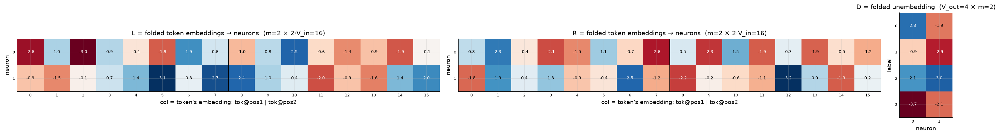
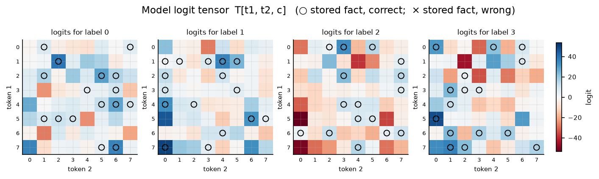

# Bilinear model, d = 4

| | |
|---|---|
| architecture | `logits = D((Lx) ⊙ (Rx))`, x = [onehot(t1); onehot(t2)] |
| V_in / V_out / m | 8 / 4 / 2 |
| parameters | 72 |
| capacity (acc ≥ 0.9, any of 11 seeds) | **64** of 64 possible facts |
| showcase model trained on | 64 facts (best seed of ≤11) |
| memorized (argmax correct) | **64 / 64**  (acc 1.000) |
| margin stats | min +0.01, median +3.36, max +39.67 |

## Weights

These three matrices are the *entire* model — the challenge architecture (post Fig. 4) folds the MLP input matrix into the embeddings and the output matrix into the unembedding. Because the input is a one-hot concat, **column t of L/R *is* token t's embedding vector**, mapping it straight to neuron pre-activations; **D is the unembedding** (neurons → label logits). The black divider separates the position-1 block (columns 0..V_in-1, read by token 1) from the position-2 block (read by token 2).

## Third-order logit tensor

The model's complete input→output function: `T[t1, t2, c]` for every possible input pair, one panel per label. Circles mark stored facts of that label (× = stored but predicted wrong). A perfect memorizer would have every circled cell be the winner across its panel-stack; everything un-circled is free to be arbitrary interference.

## Worked examples by success tier

Facts sorted by margin = `logit[correct] − max wrong logit` (positive ⇒ memorized). `c*` is the strongest competing label.

### Near-perfect (largest margin, ~zero loss)

**Fact 39** — margin +39.67, CE loss 0.000

`t1=0, t2=3` → label **2**. `Lx[n] = L[n,0] + L[n,8+3]`, same for `Rx`; `h = Lx*Rx`; `logit[c] = Σ_n D[c,n]·h[n]`.

| n | Lx | Rx | h=Lx·Rx | D[y=2,n] | →logit[2] | D[c*=0,n] | →logit[0] |
|---|---|---|---|---|---|---|---|
| 0 | -3.24 | -1.13 | +3.65 | +2.15 | +7.86 | +2.75 | +10.06 |
| 1 | -2.87 | -2.97 | +8.50 | +2.99 | +25.42 | -1.94 | -16.45 |
| **Σ** | | | | | **+33.27** | | **-6.39** |

All logits: [-6.39, -27.63, **+33.27**, -31.03] — margin +39.67 vs label 0.

**Fact 58** — margin +24.86, CE loss 0.000

`t1=6, t2=1` → label **3**. `Lx[n] = L[n,6] + L[n,8+1]`, same for `Rx`; `h = Lx*Rx`; `logit[c] = Σ_n D[c,n]·h[n]`.

| n | Lx | Rx | h=Lx·Rx | D[y=3,n] | →logit[3] | D[c*=1,n] | →logit[1] |
|---|---|---|---|---|---|---|---|
| 0 | +2.73 | -2.94 | -8.03 | -3.67 | +29.47 | -0.86 | +6.94 |
| 1 | +1.23 | +2.34 | +2.88 | -2.08 | -5.98 | -2.88 | -8.31 |
| **Σ** | | | | | **+23.49** | | **-1.37** |

All logits: [-27.70, -1.37, -8.65, **+23.49**] — margin +24.86 vs label 1.

### Comfortable (median margin)

**Fact 49** — margin +3.36, CE loss 0.034

`t1=6, t2=5` → label **3**. `Lx[n] = L[n,6] + L[n,8+5]`, same for `Rx`; `h = Lx*Rx`; `logit[c] = Σ_n D[c,n]·h[n]`.

| n | Lx | Rx | h=Lx·Rx | D[y=3,n] | →logit[3] | D[c*=1,n] | →logit[1] |
|---|---|---|---|---|---|---|---|
| 0 | +0.99 | -2.54 | -2.51 | -3.67 | +9.19 | -0.86 | +2.16 |
| 1 | -1.31 | +3.48 | -4.55 | -2.08 | +9.44 | -2.88 | +13.10 |
| **Σ** | | | | | **+18.63** | | **+15.27** |

All logits: [+1.91, +15.27, -19.00, **+18.63**] — margin +3.36 vs label 1.

**Fact 36** — margin +3.07, CE loss 0.045

`t1=5, t2=4` → label **2**. `Lx[n] = L[n,5] + L[n,8+4]`, same for `Rx`; `h = Lx*Rx`; `logit[c] = Σ_n D[c,n]·h[n]`.

| n | Lx | Rx | h=Lx·Rx | D[y=2,n] | →logit[2] | D[c*=3,n] | →logit[3] |
|---|---|---|---|---|---|---|---|
| 0 | -3.31 | +1.45 | -4.80 | +2.15 | -10.31 | -3.67 | +17.59 |
| 1 | +2.20 | +2.77 | +6.11 | +2.99 | +18.29 | -2.08 | -12.68 |
| **Σ** | | | | | **+7.98** | | **+4.90** |

All logits: [-25.04, -13.47, **+7.98**, +4.90] — margin +3.07 vs label 3.

### At the margin (barely memorized)

**Fact 24** — margin +0.55, CE loss 0.656

`t1=1, t2=1` → label **1**. `Lx[n] = L[n,1] + L[n,8+1]`, same for `Rx`; `h = Lx*Rx`; `logit[c] = Σ_n D[c,n]·h[n]`.

| n | Lx | Rx | h=Lx·Rx | D[y=1,n] | →logit[1] | D[c*=3,n] | →logit[3] |
|---|---|---|---|---|---|---|---|
| 0 | +1.80 | -0.03 | -0.06 | -0.86 | +0.05 | -3.67 | +0.22 |
| 1 | -0.52 | +1.71 | -0.89 | -2.88 | +2.57 | -2.08 | +1.85 |
| **Σ** | | | | | **+2.62** | | **+2.07** |

All logits: [+1.57, **+2.62**, -2.80, +2.07] — margin +0.55 vs label 3.

**Fact 26** — margin +0.01, CE loss 0.994

`t1=1, t2=0` → label **1**. `Lx[n] = L[n,1] + L[n,8+0]`, same for `Rx`; `h = Lx*Rx`; `logit[c] = Σ_n D[c,n]·h[n]`.

| n | Lx | Rx | h=Lx·Rx | D[y=1,n] | →logit[1] | D[c*=3,n] | →logit[3] |
|---|---|---|---|---|---|---|---|
| 0 | -0.03 | +2.77 | -0.08 | -0.86 | +0.07 | -3.67 | +0.29 |
| 1 | +0.95 | -0.31 | -0.29 | -2.88 | +0.84 | -2.08 | +0.60 |
| **Σ** | | | | | **+0.90** | | **+0.89** |

All logits: [+0.35, **+0.90**, -1.04, +0.89] — margin +0.01 vs label 3.

*(no unmemorized facts — this model is at 100% accuracy)*
