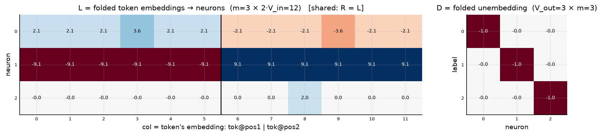
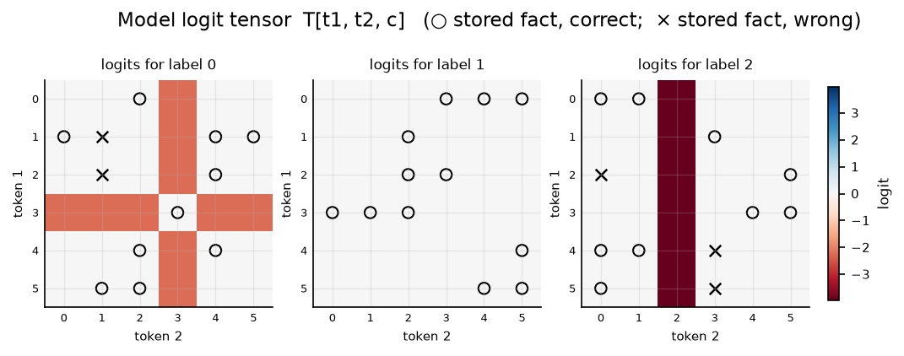
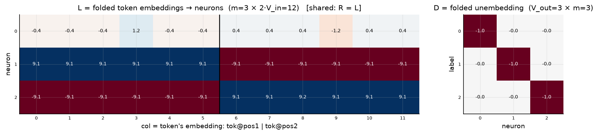
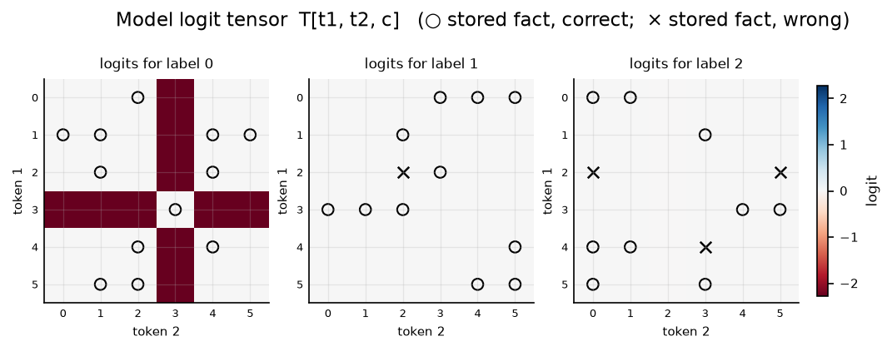
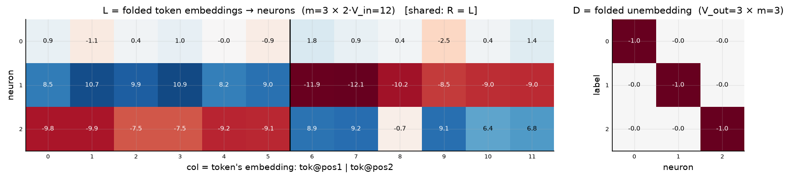
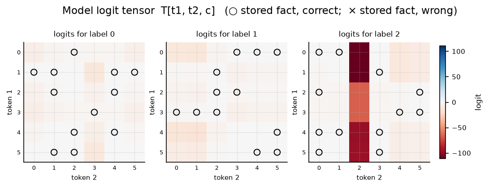

# Construction stages, symmetric bilinear d = 3

n = 36 facts (full ceiling), m = 3 neurons, D fixed at −I (silence code: label logit = −(own neuron's squared response); a label wins by being *quietest*, so its facts sit at the whitest cells of its own mostly-red tensor slice).

## Stage 1 — anti-Rayleigh spectral init (one eigensolve per label)

Accuracy: **0.861**  (31/36 facts)

## Stage 2 — + iterative fact reweighting (best of 40 rounds)

Accuracy: **0.889**  (32/36 facts)

## Stage 3 — + hinge-margin greedy repair (best of 8 restarts)

Accuracy: **1.000**  (36/36 facts)

