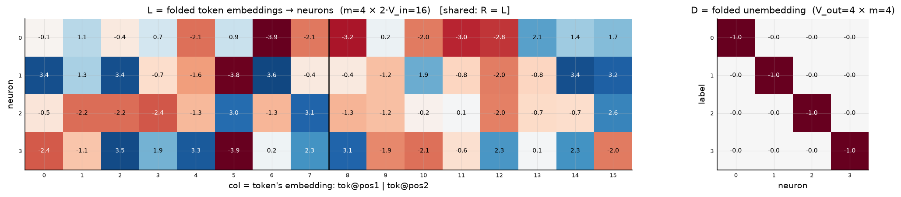
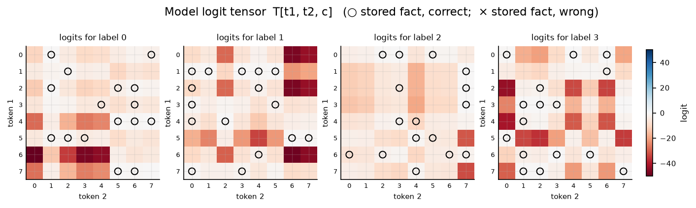

# GD-trained model with D fixed to −I, d = 4

L trained by Adam (seed 0), D frozen at −I; n = 64 facts (full ceiling), accuracy **1.000**. Silence code: every tensor slice is −(own neuron's response)² ≤ 0; a label's facts must be the *whitest* cells of its own slice.

