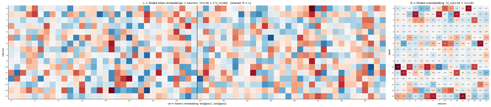
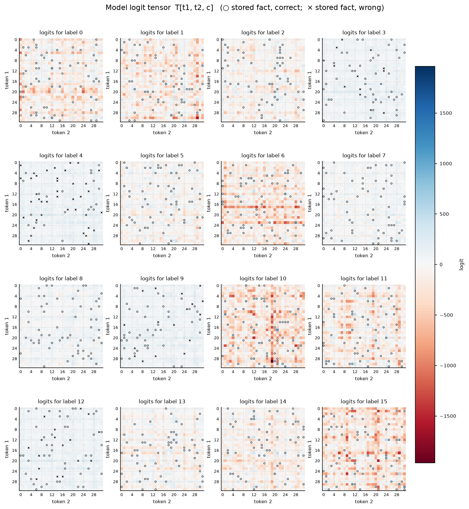

# Symmetric bilinear model (R = L), d = 16

| | |
|---|---|
| architecture | `logits = D((Lx) ⊙ (Lx))` — shared input matrix, x = [onehot(t1); onehot(t2)]. All hidden activations are ≥ 0. |
| V_in / V_out / m | 32 / 16 / 16 |
| parameters | 1280 |
| capacity (acc ≥ 0.9, any of 11 seeds) | **960** of 1024 possible facts |
| showcase model trained on | 960 facts (best seed of ≤11) |
| memorized (argmax correct) | **873 / 960**  (acc 0.909) |
| margin stats | min -3.86, median +4.33, max +450.03 |

## Weights

These three matrices are the *entire* model — the challenge architecture (post Fig. 4) folds the MLP input matrix into the embeddings and the output matrix into the unembedding. Because the input is a one-hot concat, **column t of L/R *is* token t's embedding vector**, mapping it straight to neuron pre-activations; **D is the unembedding** (neurons → label logits). The black divider separates the position-1 block (columns 0..V_in-1, read by token 1) from the position-2 block (read by token 2).

## Third-order logit tensor

The model's complete input→output function: `T[t1, t2, c]` for every possible input pair, one panel per label. Circles mark stored facts of that label (× = stored but predicted wrong). A perfect memorizer would have every circled cell be the winner across its panel-stack; everything un-circled is free to be arbitrary interference.

## Worked examples by success tier

Facts sorted by margin = `logit[correct] − max wrong logit` (positive ⇒ memorized). `c*` is the strongest competing label.

### Near-perfect (largest margin, ~zero loss)

**Fact 413** — margin +450.03, CE loss 0.000

`t1=23, t2=28` → label **6**. `Lx[n] = L[n,23] + L[n,32+28]`, same for `Rx`; `h = Lx*Rx`; `logit[c] = Σ_n D[c,n]·h[n]`.

| n | Lx | Rx | h=Lx·Rx | D[y=6,n] | →logit[6] | D[c*=0,n] | →logit[0] |
|---|---|---|---|---|---|---|---|
| 0 | +5.91 | +5.91 | +34.92 | -0.95 | -33.21 | +1.43 | +49.95 |
| 1 | -8.69 | -8.69 | +75.53 | +4.52 | +341.19 | +0.55 | +41.49 |
| 2 | -9.47 | -9.47 | +89.77 | +1.40 | +125.35 | +0.36 | +32.02 |
| 3 | -3.89 | -3.89 | +15.13 | +1.65 | +25.00 | +2.34 | +35.39 |
| 4 | +0.83 | +0.83 | +0.69 | -2.26 | -1.57 | +3.83 | +2.66 |
| 5 | -5.88 | -5.88 | +34.56 | +2.41 | +83.26 | +3.56 | +123.11 |
| 6 | +0.60 | +0.60 | +0.36 | -2.82 | -1.02 | -0.48 | -0.17 |
| 7 | -0.61 | -0.61 | +0.37 | -0.59 | -0.22 | -1.72 | -0.63 |
| 8 | +2.74 | +2.74 | +7.50 | -5.64 | -42.30 | -5.16 | -38.72 |
| 9 | -0.36 | -0.36 | +0.13 | -4.58 | -0.58 | -3.64 | -0.46 |
| 10 | -6.53 | -6.53 | +42.62 | +2.29 | +97.72 | +1.60 | +68.06 |
| 11 | +0.55 | +0.55 | +0.30 | -1.79 | -0.54 | -0.59 | -0.18 |
| 12 | +1.76 | +1.76 | +3.09 | -0.18 | -0.54 | -7.52 | -23.24 |
| 13 | -7.36 | -7.36 | +54.23 | +3.67 | +199.19 | +0.23 | +12.37 |
| 14 | +2.21 | +2.21 | +4.89 | -7.71 | -37.73 | +0.54 | +2.66 |
| 15 | -1.16 | -1.16 | +1.34 | +0.37 | +0.50 | +0.13 | +0.18 |
| **Σ** | | | | | **+754.51** | | **+304.48** |

All logits: [+304.48, -134.31, -577.21, +127.98, +120.49, -216.73, **+754.51**, +294.29, +63.17, +112.77, -1389.00, -695.95, +107.35, -130.31, -150.01, +130.61] — margin +450.03 vs label 0.

**Fact 910** — margin +329.25, CE loss 0.000

`t1=29, t2=11` → label **15**. `Lx[n] = L[n,29] + L[n,32+11]`, same for `Rx`; `h = Lx*Rx`; `logit[c] = Σ_n D[c,n]·h[n]`.

| n | Lx | Rx | h=Lx·Rx | D[y=15,n] | →logit[15] | D[c*=0,n] | →logit[0] |
|---|---|---|---|---|---|---|---|
| 0 | -0.39 | -0.39 | +0.15 | -3.44 | -0.53 | +1.43 | +0.22 |
| 1 | +2.79 | +2.79 | +7.76 | -3.00 | -23.27 | +0.55 | +4.26 |
| 2 | -7.64 | -7.64 | +58.40 | +3.31 | +193.16 | +0.36 | +20.83 |
| 3 | -8.16 | -8.16 | +66.55 | +1.42 | +94.80 | +2.34 | +155.63 |
| 4 | +2.43 | +2.43 | +5.90 | +2.56 | +15.10 | +3.83 | +22.59 |
| 5 | -1.64 | -1.64 | +2.70 | -5.47 | -14.74 | +3.56 | +9.60 |
| 6 | +2.08 | +2.08 | +4.31 | -7.10 | -30.58 | -0.48 | -2.06 |
| 7 | +5.29 | +5.29 | +27.94 | -0.57 | -15.82 | -1.72 | -47.94 |
| 8 | -2.18 | -2.18 | +4.74 | +1.73 | +8.18 | -5.16 | -24.47 |
| 9 | +1.38 | +1.38 | +1.90 | +1.49 | +2.83 | -3.64 | -6.94 |
| 10 | +3.54 | +3.54 | +12.53 | +3.38 | +42.33 | +1.60 | +20.00 |
| 11 | +0.06 | +0.06 | +0.00 | -8.02 | -0.03 | -0.59 | -0.00 |
| 12 | +0.40 | +0.40 | +0.16 | -0.94 | -0.15 | -7.52 | -1.22 |
| 13 | +4.02 | +4.02 | +16.16 | +3.41 | +55.05 | +0.23 | +3.69 |
| 14 | -5.09 | -5.09 | +25.91 | +1.66 | +43.05 | +0.54 | +14.07 |
| 15 | +6.66 | +6.66 | +44.39 | +3.02 | +134.05 | +0.13 | +5.93 |
| **Σ** | | | | | **+503.44** | | **+174.20** |

All logits: [+174.20, -431.46, -284.25, +43.21, +36.51, -152.30, +60.31, +104.02, -35.80, +26.03, -172.01, -84.87, +31.16, -204.95, -252.38, **+503.44**] — margin +329.25 vs label 0.

### Comfortable (median margin)

**Fact 801** — margin +4.48, CE loss 0.014

`t1=22, t2=9` → label **13**. `Lx[n] = L[n,22] + L[n,32+9]`, same for `Rx`; `h = Lx*Rx`; `logit[c] = Σ_n D[c,n]·h[n]`.

| n | Lx | Rx | h=Lx·Rx | D[y=13,n] | →logit[13] | D[c*=3,n] | →logit[3] |
|---|---|---|---|---|---|---|---|
| 0 | -4.36 | -4.36 | +18.98 | +0.77 | +14.54 | +0.21 | +4.03 |
| 1 | +2.31 | +2.31 | +5.33 | -0.17 | -0.92 | +0.56 | +2.96 |
| 2 | +3.79 | +3.79 | +14.34 | -2.24 | -32.12 | +0.49 | +7.03 |
| 3 | +0.80 | +0.80 | +0.65 | +1.80 | +1.17 | +0.36 | +0.23 |
| 4 | -3.07 | -3.07 | +9.41 | +0.37 | +3.45 | -0.89 | -8.34 |
| 5 | +2.66 | +2.66 | +7.06 | +1.09 | +7.67 | +0.35 | +2.45 |
| 6 | +7.38 | +7.38 | +54.47 | +3.31 | +180.50 | +0.26 | +14.02 |
| 7 | -3.99 | -3.99 | +15.93 | +0.06 | +0.88 | -0.29 | -4.63 |
| 8 | +3.33 | +3.33 | +11.10 | +0.60 | +6.68 | +0.93 | +10.31 |
| 9 | -3.08 | -3.08 | +9.51 | +0.03 | +0.28 | +0.79 | +7.53 |
| 10 | -4.87 | -4.87 | +23.68 | -1.16 | -27.56 | +0.62 | +14.65 |
| 11 | -6.19 | -6.19 | +38.32 | +0.49 | +18.66 | +0.38 | +14.59 |
| 12 | +3.90 | +3.90 | +15.23 | +0.20 | +3.03 | +0.88 | +13.37 |
| 13 | +5.37 | +5.37 | +28.89 | +1.11 | +32.16 | -0.40 | -11.58 |
| 14 | -3.90 | -3.90 | +15.18 | -4.54 | -68.88 | +0.87 | +13.18 |
| 15 | -5.90 | -5.90 | +34.87 | -2.31 | -80.53 | -0.72 | -25.27 |
| **Σ** | | | | | **+59.01** | | **+54.52** |

All logits: [-127.31, -42.26, +52.67, +54.52, +50.94, -125.30, -260.76, +24.02, +39.04, +45.57, -421.70, -33.64, +52.22, **+59.01**, +22.83, -422.48] — margin +4.48 vs label 3.

**Fact 839** — margin +4.48, CE loss 0.017

`t1=28, t2=17` → label **13**. `Lx[n] = L[n,28] + L[n,32+17]`, same for `Rx`; `h = Lx*Rx`; `logit[c] = Σ_n D[c,n]·h[n]`.

| n | Lx | Rx | h=Lx·Rx | D[y=13,n] | →logit[13] | D[c*=12,n] | →logit[12] |
|---|---|---|---|---|---|---|---|
| 0 | -2.84 | -2.84 | +8.07 | +0.77 | +6.18 | +0.23 | +1.88 |
| 1 | -7.06 | -7.06 | +49.83 | -0.17 | -8.56 | +0.53 | +26.45 |
| 2 | +2.87 | +2.87 | +8.23 | -2.24 | -18.44 | +0.20 | +1.64 |
| 3 | +2.82 | +2.82 | +7.95 | +1.80 | +14.32 | +0.38 | +3.02 |
| 4 | -5.87 | -5.87 | +34.41 | +0.37 | +12.61 | -0.98 | -33.84 |
| 5 | -8.68 | -8.68 | +75.33 | +1.09 | +81.78 | +0.49 | +36.67 |
| 6 | -4.39 | -4.39 | +19.25 | +3.31 | +63.78 | +0.18 | +3.45 |
| 7 | +2.68 | +2.68 | +7.20 | +0.06 | +0.40 | -0.13 | -0.93 |
| 8 | -7.63 | -7.63 | +58.18 | +0.60 | +35.02 | +0.91 | +52.83 |
| 9 | -7.65 | -7.65 | +58.54 | +0.03 | +1.70 | +0.78 | +45.79 |
| 10 | -4.72 | -4.72 | +22.25 | -1.16 | -25.89 | +0.65 | +14.42 |
| 11 | +2.66 | +2.66 | +7.10 | +0.49 | +3.46 | +0.47 | +3.35 |
| 12 | -0.30 | -0.30 | +0.09 | +0.20 | +0.02 | +0.84 | +0.08 |
| 13 | -7.07 | -7.07 | +50.02 | +1.11 | +55.69 | -0.39 | -19.50 |
| 14 | +3.85 | +3.85 | +14.81 | -4.54 | -67.22 | +0.84 | +12.46 |
| 15 | +1.28 | +1.28 | +1.63 | -2.31 | -3.77 | -0.73 | -1.18 |
| **Σ** | | | | | **+151.07** | | **+146.59** |

All logits: [-24.13, +110.74, -257.25, +143.26, +145.88, +58.64, -200.41, -139.25, +66.88, +143.06, -916.48, -328.08, +146.59, **+151.07**, -191.74, -197.47] — margin +4.48 vs label 12.

### At the margin (barely memorized)

**Fact 589** — margin +0.02, CE loss 0.917

`t1=7, t2=2` → label **9**. `Lx[n] = L[n,7] + L[n,32+2]`, same for `Rx`; `h = Lx*Rx`; `logit[c] = Σ_n D[c,n]·h[n]`.

| n | Lx | Rx | h=Lx·Rx | D[y=9,n] | →logit[9] | D[c*=3,n] | →logit[3] |
|---|---|---|---|---|---|---|---|
| 0 | +1.38 | +1.38 | +1.92 | +0.28 | +0.54 | +0.21 | +0.41 |
| 1 | -5.08 | -5.08 | +25.83 | +0.51 | +13.06 | +0.56 | +14.34 |
| 2 | -1.83 | -1.83 | +3.35 | +0.31 | +1.03 | +0.49 | +1.64 |
| 3 | +0.62 | +0.62 | +0.38 | +0.43 | +0.16 | +0.36 | +0.14 |
| 4 | +3.76 | +3.76 | +14.12 | -0.80 | -11.28 | -0.89 | -12.52 |
| 5 | -2.74 | -2.74 | +7.53 | +0.37 | +2.78 | +0.35 | +2.61 |
| 6 | +2.68 | +2.68 | +7.17 | +0.22 | +1.55 | +0.26 | +1.85 |
| 7 | -1.85 | -1.85 | +3.42 | -0.22 | -0.74 | -0.29 | -0.99 |
| 8 | -0.50 | -0.50 | +0.25 | +0.96 | +0.24 | +0.93 | +0.23 |
| 9 | -4.01 | -4.01 | +16.11 | +0.74 | +11.90 | +0.79 | +12.75 |
| 10 | -4.58 | -4.58 | +20.97 | +0.69 | +14.38 | +0.62 | +12.97 |
| 11 | -0.52 | -0.52 | +0.27 | +0.45 | +0.12 | +0.38 | +0.10 |
| 12 | +2.39 | +2.39 | +5.72 | +0.89 | +5.07 | +0.88 | +5.02 |
| 13 | -0.84 | -0.84 | +0.70 | -0.44 | -0.30 | -0.40 | -0.28 |
| 14 | -3.08 | -3.08 | +9.48 | +0.85 | +8.02 | +0.87 | +8.23 |
| 15 | +0.22 | +0.22 | +0.05 | -1.01 | -0.05 | -0.72 | -0.03 |
| **Σ** | | | | | **+46.48** | | **+46.46** |

All logits: [+26.37, -59.46, -10.81, +46.46, +45.49, -59.85, -14.93, +12.71, +5.59, **+46.48**, -136.11, -281.29, +44.62, -37.34, -63.12, -24.26] — margin +0.02 vs label 3.

**Fact 261** — margin +0.02, CE loss 0.720

`t1=4, t2=27` → label **4**. `Lx[n] = L[n,4] + L[n,32+27]`, same for `Rx`; `h = Lx*Rx`; `logit[c] = Σ_n D[c,n]·h[n]`.

| n | Lx | Rx | h=Lx·Rx | D[y=4,n] | →logit[4] | D[c*=12,n] | →logit[12] |
|---|---|---|---|---|---|---|---|
| 0 | -8.49 | -8.49 | +72.03 | +0.24 | +17.63 | +0.23 | +16.75 |
| 1 | -6.09 | -6.09 | +37.07 | +0.56 | +20.86 | +0.53 | +19.68 |
| 2 | +3.24 | +3.24 | +10.51 | +0.31 | +3.29 | +0.20 | +2.10 |
| 3 | +1.95 | +1.95 | +3.81 | +0.40 | +1.53 | +0.38 | +1.45 |
| 4 | +0.21 | +0.21 | +0.04 | -0.92 | -0.04 | -0.98 | -0.04 |
| 5 | +8.15 | +8.15 | +66.47 | +0.45 | +29.88 | +0.49 | +32.35 |
| 6 | +0.03 | +0.03 | +0.00 | +0.17 | +0.00 | +0.18 | +0.00 |
| 7 | -4.47 | -4.47 | +19.94 | -0.15 | -3.03 | -0.13 | -2.57 |
| 8 | -5.13 | -5.13 | +26.36 | +0.91 | +23.97 | +0.91 | +23.93 |
| 9 | -3.59 | -3.59 | +12.91 | +0.73 | +9.39 | +0.78 | +10.10 |
| 10 | +1.39 | +1.39 | +1.93 | +0.65 | +1.25 | +0.65 | +1.25 |
| 11 | -1.73 | -1.73 | +2.99 | +0.44 | +1.32 | +0.47 | +1.41 |
| 12 | -6.91 | -6.91 | +47.78 | +0.85 | +40.76 | +0.84 | +40.25 |
| 13 | +2.58 | +2.58 | +6.64 | -0.37 | -2.46 | -0.39 | -2.59 |
| 14 | +0.60 | +0.60 | +0.36 | +0.83 | +0.30 | +0.84 | +0.30 |
| 15 | +2.07 | +2.07 | +4.27 | -0.78 | -3.34 | -0.73 | -3.10 |
| **Σ** | | | | | **+141.30** | | **+141.28** |

All logits: [-199.91, -63.42, -57.92, +133.14, **+141.30**, +122.17, +74.30, +118.41, +138.47, +137.06, -882.66, +95.15, +141.28, +126.28, +13.95, -655.23] — margin +0.02 vs label 12.

### Just below the margin (barely NOT memorized)

**Fact 205** — margin -0.04, CE loss 0.962

`t1=10, t2=4` → label **3**. `Lx[n] = L[n,10] + L[n,32+4]`, same for `Rx`; `h = Lx*Rx`; `logit[c] = Σ_n D[c,n]·h[n]`.

| n | Lx | Rx | h=Lx·Rx | D[y=3,n] | →logit[3] | D[c*=12,n] | →logit[12] |
|---|---|---|---|---|---|---|---|
| 0 | +1.25 | +1.25 | +1.56 | +0.21 | +0.33 | +0.23 | +0.36 |
| 1 | -3.95 | -3.95 | +15.57 | +0.56 | +8.64 | +0.53 | +8.26 |
| 2 | +5.09 | +5.09 | +25.93 | +0.49 | +12.72 | +0.20 | +5.18 |
| 3 | +3.61 | +3.61 | +13.00 | +0.36 | +4.66 | +0.38 | +4.95 |
| 4 | +0.86 | +0.86 | +0.75 | -0.89 | -0.66 | -0.98 | -0.73 |
| 5 | +3.59 | +3.59 | +12.89 | +0.35 | +4.46 | +0.49 | +6.27 |
| 6 | +3.82 | +3.82 | +14.59 | +0.26 | +3.76 | +0.18 | +2.61 |
| 7 | -5.18 | -5.18 | +26.85 | -0.29 | -7.81 | -0.13 | -3.46 |
| 8 | -0.39 | -0.39 | +0.15 | +0.93 | +0.14 | +0.91 | +0.14 |
| 9 | +4.33 | +4.33 | +18.71 | +0.79 | +14.81 | +0.78 | +14.63 |
| 10 | -1.73 | -1.73 | +2.98 | +0.62 | +1.84 | +0.65 | +1.93 |
| 11 | -5.60 | -5.60 | +31.38 | +0.38 | +11.95 | +0.47 | +14.81 |
| 12 | -2.07 | -2.07 | +4.27 | +0.88 | +3.75 | +0.84 | +3.59 |
| 13 | +4.35 | +4.35 | +18.96 | -0.40 | -7.60 | -0.39 | -7.39 |
| 14 | +1.85 | +1.85 | +3.44 | +0.87 | +2.99 | +0.84 | +2.89 |
| 15 | +5.31 | +5.31 | +28.15 | -0.72 | -20.41 | -0.73 | -20.44 |
| **Σ** | | | | | **+33.58** | | **+33.62** |

All logits: [-58.82, -97.94, +10.67, **+33.58**, +33.02, -68.76, +16.01, +9.75, -68.64, +23.17, -153.94, -60.04, +33.62, -18.27, -7.27, -197.33] — margin -0.04 vs label 12.

**Fact 223** — margin -0.05, CE loss 1.189

`t1=0, t2=7` → label **3**. `Lx[n] = L[n,0] + L[n,32+7]`, same for `Rx`; `h = Lx*Rx`; `logit[c] = Σ_n D[c,n]·h[n]`.

| n | Lx | Rx | h=Lx·Rx | D[y=3,n] | →logit[3] | D[c*=4,n] | →logit[4] |
|---|---|---|---|---|---|---|---|
| 0 | -0.98 | -0.98 | +0.97 | +0.21 | +0.21 | +0.24 | +0.24 |
| 1 | +3.95 | +3.95 | +15.60 | +0.56 | +8.66 | +0.56 | +8.77 |
| 2 | +3.82 | +3.82 | +14.60 | +0.49 | +7.16 | +0.31 | +4.58 |
| 3 | -0.06 | -0.06 | +0.00 | +0.36 | +0.00 | +0.40 | +0.00 |
| 4 | -2.67 | -2.67 | +7.12 | -0.89 | -6.31 | -0.92 | -6.55 |
| 5 | -5.60 | -5.60 | +31.33 | +0.35 | +10.85 | +0.45 | +14.08 |
| 6 | -4.33 | -4.33 | +18.78 | +0.26 | +4.84 | +0.17 | +3.27 |
| 7 | +2.30 | +2.30 | +5.27 | -0.29 | -1.53 | -0.15 | -0.80 |
| 8 | -0.15 | -0.15 | +0.02 | +0.93 | +0.02 | +0.91 | +0.02 |
| 9 | +2.72 | +2.72 | +7.37 | +0.79 | +5.83 | +0.73 | +5.36 |
| 10 | -0.24 | -0.24 | +0.06 | +0.62 | +0.03 | +0.65 | +0.04 |
| 11 | -5.07 | -5.07 | +25.70 | +0.38 | +9.79 | +0.44 | +11.32 |
| 12 | +5.45 | +5.45 | +29.69 | +0.88 | +26.08 | +0.85 | +25.33 |
| 13 | +2.94 | +2.94 | +8.64 | -0.40 | -3.46 | -0.37 | -3.21 |
| 14 | -2.46 | -2.46 | +6.04 | +0.87 | +5.24 | +0.83 | +5.01 |
| 15 | +0.29 | +0.29 | +0.08 | -0.72 | -0.06 | -0.78 | -0.06 |
| **Σ** | | | | | **+67.35** | | **+67.40** |

All logits: [-124.12, +65.60, +10.43, **+67.35**, +67.40, -43.69, -6.33, +51.37, +42.81, +65.98, -292.58, -10.07, +66.97, +65.14, +30.43, -474.31] — margin -0.05 vs label 4.

### Not memorized at all (worst margin)

**Fact 237** — margin -2.83, CE loss 3.411

`t1=11, t2=23` → label **3**. `Lx[n] = L[n,11] + L[n,32+23]`, same for `Rx`; `h = Lx*Rx`; `logit[c] = Σ_n D[c,n]·h[n]`.

| n | Lx | Rx | h=Lx·Rx | D[y=3,n] | →logit[3] | D[c*=12,n] | →logit[12] |
|---|---|---|---|---|---|---|---|
| 0 | +1.36 | +1.36 | +1.86 | +0.21 | +0.39 | +0.23 | +0.43 |
| 1 | -4.84 | -4.84 | +23.45 | +0.56 | +13.02 | +0.53 | +12.44 |
| 2 | +2.16 | +2.16 | +4.68 | +0.49 | +2.30 | +0.20 | +0.94 |
| 3 | +2.50 | +2.50 | +6.27 | +0.36 | +2.25 | +0.38 | +2.39 |
| 4 | +2.55 | +2.55 | +6.50 | -0.89 | -5.76 | -0.98 | -6.39 |
| 5 | +3.66 | +3.66 | +13.36 | +0.35 | +4.63 | +0.49 | +6.50 |
| 6 | -1.91 | -1.91 | +3.66 | +0.26 | +0.94 | +0.18 | +0.66 |
| 7 | +3.30 | +3.30 | +10.86 | -0.29 | -3.16 | -0.13 | -1.40 |
| 8 | +6.07 | +6.07 | +36.85 | +0.93 | +34.21 | +0.91 | +33.46 |
| 9 | -5.02 | -5.02 | +25.20 | +0.79 | +19.95 | +0.78 | +19.71 |
| 10 | -1.98 | -1.98 | +3.90 | +0.62 | +2.41 | +0.65 | +2.53 |
| 11 | -5.50 | -5.50 | +30.21 | +0.38 | +11.50 | +0.47 | +14.26 |
| 12 | +1.23 | +1.23 | +1.52 | +0.88 | +1.34 | +0.84 | +1.28 |
| 13 | -2.42 | -2.42 | +5.85 | -0.40 | -2.35 | -0.39 | -2.28 |
| 14 | -0.93 | -0.93 | +0.86 | +0.87 | +0.75 | +0.84 | +0.72 |
| 15 | +0.40 | +0.40 | +0.16 | -0.72 | -0.12 | -0.73 | -0.12 |
| **Σ** | | | | | **+82.31** | | **+85.14** |

All logits: [-219.32, -12.89, +80.58, **+82.31**, +84.04, +63.80, -231.75, -82.27, +7.47, +84.19, +69.76, -197.92, +85.14, +63.43, -202.12, -248.50] — margin -2.83 vs label 12.

**Fact 230** — margin -3.86, CE loss 4.346

`t1=18, t2=8` → label **3**. `Lx[n] = L[n,18] + L[n,32+8]`, same for `Rx`; `h = Lx*Rx`; `logit[c] = Σ_n D[c,n]·h[n]`.

| n | Lx | Rx | h=Lx·Rx | D[y=3,n] | →logit[3] | D[c*=9,n] | →logit[9] |
|---|---|---|---|---|---|---|---|
| 0 | +0.42 | +0.42 | +0.17 | +0.21 | +0.04 | +0.28 | +0.05 |
| 1 | +3.46 | +3.46 | +11.95 | +0.56 | +6.64 | +0.51 | +6.04 |
| 2 | -1.02 | -1.02 | +1.04 | +0.49 | +0.51 | +0.31 | +0.32 |
| 3 | +4.19 | +4.19 | +17.53 | +0.36 | +6.29 | +0.43 | +7.48 |
| 4 | +4.76 | +4.76 | +22.65 | -0.89 | -20.08 | -0.80 | -18.08 |
| 5 | +3.86 | +3.86 | +14.87 | +0.35 | +5.15 | +0.37 | +5.48 |
| 6 | +1.60 | +1.60 | +2.55 | +0.26 | +0.66 | +0.22 | +0.55 |
| 7 | +3.68 | +3.68 | +13.55 | -0.29 | -3.94 | -0.22 | -2.94 |
| 8 | +2.50 | +2.50 | +6.24 | +0.93 | +5.79 | +0.96 | +6.00 |
| 9 | +3.85 | +3.85 | +14.79 | +0.79 | +11.70 | +0.74 | +10.93 |
| 10 | -3.19 | -3.19 | +10.17 | +0.62 | +6.29 | +0.69 | +6.97 |
| 11 | -4.37 | -4.37 | +19.12 | +0.38 | +7.28 | +0.45 | +8.51 |
| 12 | -4.98 | -4.98 | +24.82 | +0.88 | +21.80 | +0.89 | +22.02 |
| 13 | -3.78 | -3.78 | +14.28 | -0.40 | -5.72 | -0.44 | -6.22 |
| 14 | +3.11 | +3.11 | +9.66 | +0.87 | +8.39 | +0.85 | +8.17 |
| 15 | -1.47 | -1.47 | +2.17 | -0.72 | -1.58 | -1.01 | -2.20 |
| **Σ** | | | | | **+49.21** | | **+53.08** |

All logits: [-95.53, -149.55, -112.03, **+49.21**, +52.02, +13.48, -85.61, +5.76, +47.94, +53.08, -17.75, -127.93, +51.67, +34.62, -3.57, -95.40] — margin -3.86 vs label 9.
