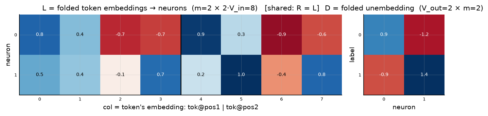
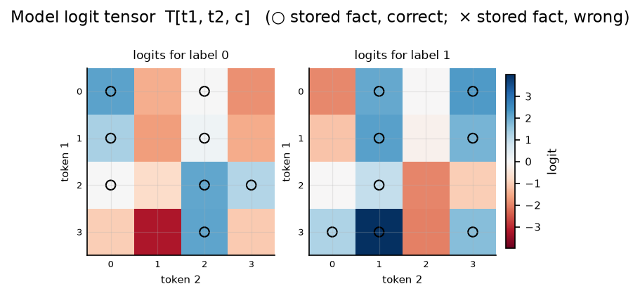
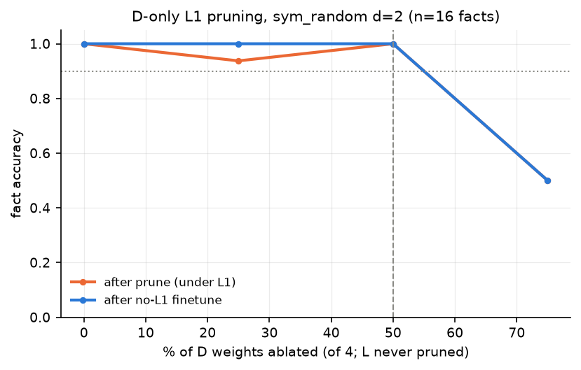
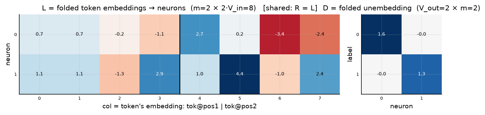
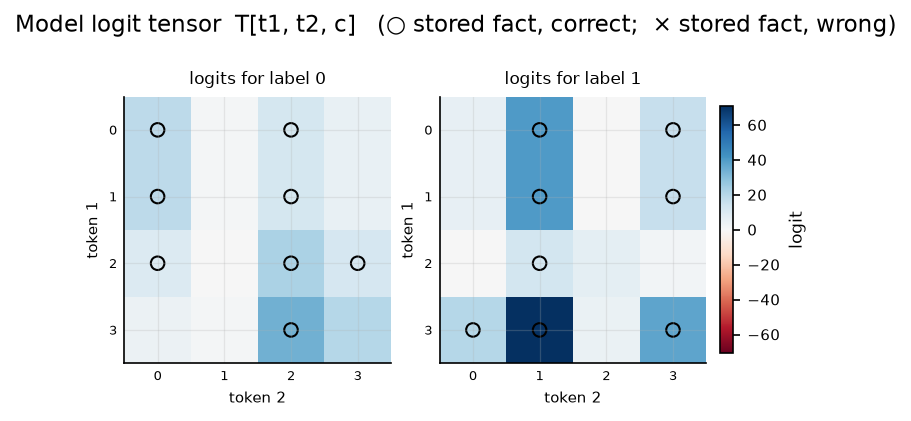
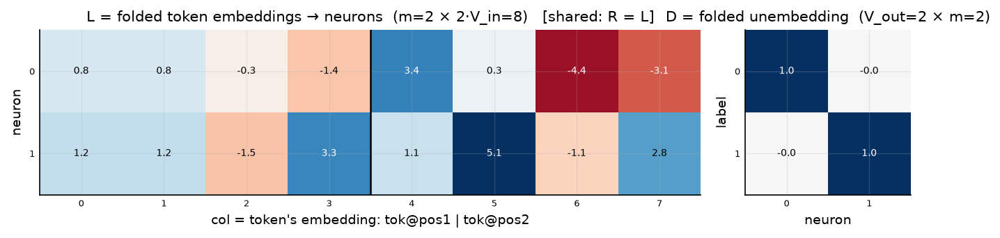

# Symmetric bilinear model (R = L), d = 2

| | |
|---|---|
| architecture | `logits = D((Lx) ⊙ (Lx))` — shared input matrix, x = [onehot(t1); onehot(t2)]. All hidden activations are ≥ 0. |
| V_in / V_out / m | 4 / 2 / 2 |
| parameters | 20 |
| capacity (acc ≥ 0.9, any of 11 seeds) | **16** of 16 possible facts |
| showcase model trained on | 16 facts (best seed of ≤11) |
| memorized (argmax correct) | **16 / 16**  (acc 1.000) |
| margin stats | min +0.00, median +2.73, max +7.21 |

## Weights

These three matrices are the *entire* model — the challenge architecture (post Fig. 4) folds the MLP input matrix into the embeddings and the output matrix into the unembedding. Because the input is a one-hot concat, **column t of L/R *is* token t's embedding vector**, mapping it straight to neuron pre-activations; **D is the unembedding** (neurons → label logits). The black divider separates the position-1 block (columns 0..V_in-1, read by token 1) from the position-2 block (read by token 2).

## Third-order logit tensor

The model's complete input→output function: `T[t1, t2, c]` for every possible input pair, one panel per label. Circles mark stored facts of that label (× = stored but predicted wrong). A perfect memorizer would have every circled cell be the winner across its panel-stack; everything un-circled is free to be arbitrary interference.

## Worked examples by success tier

Facts sorted by margin = `logit[correct] − max wrong logit` (positive ⇒ memorized). `c*` is the strongest competing label.

### Near-perfect (largest margin, ~zero loss)

**Fact 14** — margin +7.21, CE loss 0.001

`t1=3, t2=1` → label **1**. `Lx[n] = L[n,3] + L[n,4+1]`, same for `Rx`; `h = Lx*Rx`; `logit[c] = Σ_n D[c,n]·h[n]`.

| n | Lx | Rx | h=Lx·Rx | D[y=1,n] | →logit[1] | D[c*=0,n] | →logit[0] |
|---|---|---|---|---|---|---|---|
| 0 | -0.41 | -0.41 | +0.17 | -0.91 | -0.15 | +0.94 | +0.16 |
| 1 | +1.71 | +1.71 | +2.93 | +1.41 | +4.14 | -1.15 | -3.37 |
| **Σ** | | | | | **+3.99** | | **-3.22** |

All logits: [-3.22, **+3.99**] — margin +7.21 vs label 0.

**Fact 4** — margin +4.09, CE loss 0.017

`t1=3, t2=2` → label **0**. `Lx[n] = L[n,3] + L[n,4+2]`, same for `Rx`; `h = Lx*Rx`; `logit[c] = Σ_n D[c,n]·h[n]`.

| n | Lx | Rx | h=Lx·Rx | D[y=0,n] | →logit[0] | D[c*=1,n] | →logit[1] |
|---|---|---|---|---|---|---|---|
| 0 | -1.53 | -1.53 | +2.33 | +0.94 | +2.20 | -0.91 | -2.13 |
| 1 | +0.30 | +0.30 | +0.09 | -1.15 | -0.11 | +1.41 | +0.13 |
| **Σ** | | | | | **+2.09** | | **-2.00** |

All logits: [**+2.09**, -2.00] — margin +4.09 vs label 1.

### Comfortable (median margin)

**Fact 10** — margin +2.73, CE loss 0.063

`t1=3, t2=3` → label **1**. `Lx[n] = L[n,3] + L[n,4+3]`, same for `Rx`; `h = Lx*Rx`; `logit[c] = Σ_n D[c,n]·h[n]`.

| n | Lx | Rx | h=Lx·Rx | D[y=1,n] | →logit[1] | D[c*=0,n] | →logit[0] |
|---|---|---|---|---|---|---|---|
| 0 | -1.30 | -1.30 | +1.70 | -0.91 | -1.55 | +0.94 | +1.60 |
| 1 | +1.51 | +1.51 | +2.29 | +1.41 | +3.24 | -1.15 | -2.64 |
| **Σ** | | | | | **+1.69** | | **-1.04** |

All logits: [-1.04, **+1.69**] — margin +2.73 vs label 0.

**Fact 6** — margin +2.44, CE loss 0.083

`t1=1, t2=0` → label **0**. `Lx[n] = L[n,1] + L[n,4+0]`, same for `Rx`; `h = Lx*Rx`; `logit[c] = Σ_n D[c,n]·h[n]`.

| n | Lx | Rx | h=Lx·Rx | D[y=0,n] | →logit[0] | D[c*=1,n] | →logit[1] |
|---|---|---|---|---|---|---|---|
| 0 | +1.34 | +1.34 | +1.81 | +0.94 | +1.70 | -0.91 | -1.65 |
| 1 | +0.60 | +0.60 | +0.36 | -1.15 | -0.41 | +1.41 | +0.50 |
| **Σ** | | | | | **+1.29** | | **-1.15** |

All logits: [**+1.29**, -1.15] — margin +2.44 vs label 1.

### At the margin (barely memorized)

**Fact 5** — margin +0.01, CE loss 0.687

`t1=2, t2=0` → label **0**. `Lx[n] = L[n,2] + L[n,4+0]`, same for `Rx`; `h = Lx*Rx`; `logit[c] = Σ_n D[c,n]·h[n]`.

| n | Lx | Rx | h=Lx·Rx | D[y=0,n] | →logit[0] | D[c*=1,n] | →logit[1] |
|---|---|---|---|---|---|---|---|
| 0 | +0.19 | +0.19 | +0.04 | +0.94 | +0.04 | -0.91 | -0.03 |
| 1 | +0.15 | +0.15 | +0.02 | -1.15 | -0.03 | +1.41 | +0.03 |
| **Σ** | | | | | **+0.01** | | **-0.00** |

All logits: [**+0.01**, -0.00] — margin +0.01 vs label 1.

**Fact 3** — margin +0.00, CE loss 0.691

`t1=0, t2=2` → label **0**. `Lx[n] = L[n,0] + L[n,4+2]`, same for `Rx`; `h = Lx*Rx`; `logit[c] = Σ_n D[c,n]·h[n]`.

| n | Lx | Rx | h=Lx·Rx | D[y=0,n] | →logit[0] | D[c*=1,n] | →logit[1] |
|---|---|---|---|---|---|---|---|
| 0 | -0.08 | -0.08 | +0.01 | +0.94 | +0.01 | -0.91 | -0.01 |
| 1 | +0.06 | +0.06 | +0.00 | -1.15 | -0.00 | +1.41 | +0.00 |
| **Σ** | | | | | **+0.00** | | **-0.00** |

All logits: [**+0.00**, -0.00] — margin +0.00 vs label 1.

*(no unmemorized facts — this model is at 100% accuracy)*

## Sparsity: D only

Iterative L1 (λ=0.003) on D only + prune 5% of remaining (min 1) per round; L trains freely. At each level a 1500-epoch no-L1 finetune measures recoverable accuracy.

Sparsest level with finetuned acc ≥ 0.9: **2 of 4 D weights** (50% ablated), finetuned acc 1.000; nonzero D weights per label: [1, 1].

Weights of that frontier model:

Full logit tensor of that frontier model (acc 1.000):

Canonical form of the frontier model: per-neuron scales folded out of D into L (D = exact identity, so logit[c] = h_c; functionally identical to the model above, max logit diff 4e-6):

