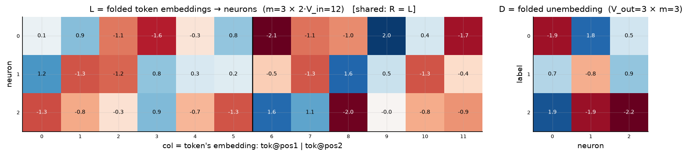
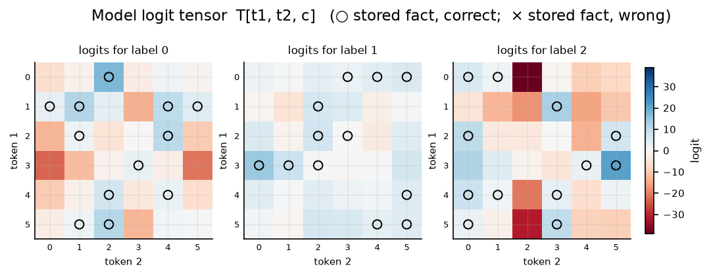
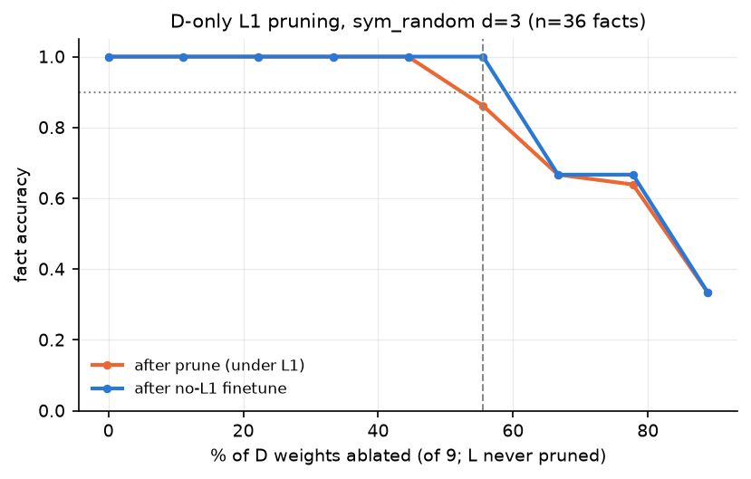
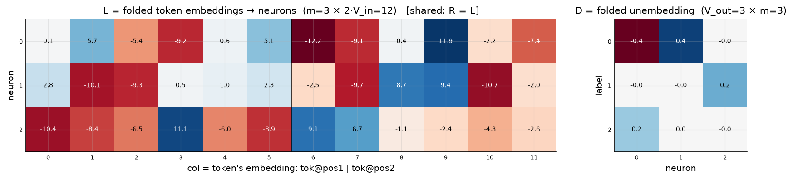
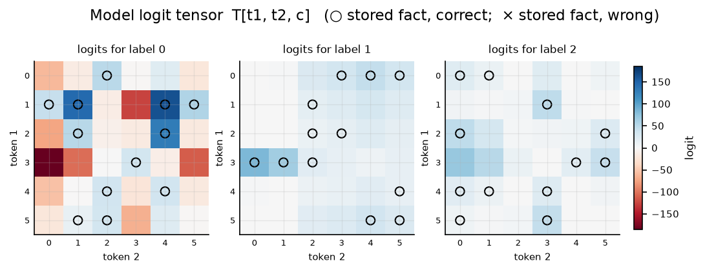
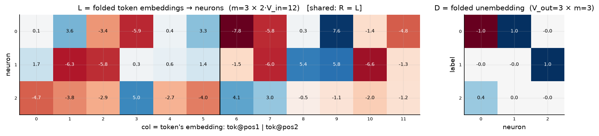

# Symmetric bilinear model (R = L), d = 3

| | |
|---|---|
| architecture | `logits = D((Lx) ⊙ (Lx))` — shared input matrix, x = [onehot(t1); onehot(t2)]. All hidden activations are ≥ 0. |
| V_in / V_out / m | 6 / 3 / 3 |
| parameters | 45 |
| capacity (acc ≥ 0.9, any of 11 seeds) | **36** of 36 possible facts |
| showcase model trained on | 36 facts (best seed of ≤11) |
| memorized (argmax correct) | **36 / 36**  (acc 1.000) |
| margin stats | min +0.03, median +3.34, max +16.77 |

## Weights

These three matrices are the *entire* model — the challenge architecture (post Fig. 4) folds the MLP input matrix into the embeddings and the output matrix into the unembedding. Because the input is a one-hot concat, **column t of L/R *is* token t's embedding vector**, mapping it straight to neuron pre-activations; **D is the unembedding** (neurons → label logits). The black divider separates the position-1 block (columns 0..V_in-1, read by token 1) from the position-2 block (read by token 2).

## Third-order logit tensor

The model's complete input→output function: `T[t1, t2, c]` for every possible input pair, one panel per label. Circles mark stored facts of that label (× = stored but predicted wrong). A perfect memorizer would have every circled cell be the winner across its panel-stack; everything un-circled is free to be arbitrary interference.

## Worked examples by success tier

Facts sorted by margin = `logit[correct] − max wrong logit` (positive ⇒ memorized). `c*` is the strongest competing label.

### Near-perfect (largest margin, ~zero loss)

**Fact 9** — margin +16.77, CE loss 0.000

`t1=1, t2=1` → label **0**. `Lx[n] = L[n,1] + L[n,6+1]`, same for `Rx`; `h = Lx*Rx`; `logit[c] = Σ_n D[c,n]·h[n]`.

| n | Lx | Rx | h=Lx·Rx | D[y=0,n] | →logit[0] | D[c*=1,n] | →logit[1] |
|---|---|---|---|---|---|---|---|
| 0 | -0.24 | -0.24 | +0.06 | -1.90 | -0.11 | +0.66 | +0.04 |
| 1 | -2.57 | -2.57 | +6.60 | +1.76 | +11.61 | -0.81 | -5.35 |
| 2 | +0.30 | +0.30 | +0.09 | +0.45 | +0.04 | +0.89 | +0.08 |
| **Σ** | | | | | **+11.54** | | **-5.23** |

All logits: [**+11.54**, -5.23, -12.88] — margin +16.77 vs label 1.

**Fact 8** — margin +14.16, CE loss 0.000

`t1=2, t2=4` → label **0**. `Lx[n] = L[n,2] + L[n,6+4]`, same for `Rx`; `h = Lx*Rx`; `logit[c] = Σ_n D[c,n]·h[n]`.

| n | Lx | Rx | h=Lx·Rx | D[y=0,n] | →logit[0] | D[c*=1,n] | →logit[1] |
|---|---|---|---|---|---|---|---|
| 0 | -0.72 | -0.72 | +0.52 | -1.90 | -0.99 | +0.66 | +0.34 |
| 1 | -2.50 | -2.50 | +6.23 | +1.76 | +10.96 | -0.81 | -5.05 |
| 2 | -1.08 | -1.08 | +1.17 | +0.45 | +0.53 | +0.89 | +1.04 |
| **Σ** | | | | | **+10.49** | | **-3.66** |

All logits: [**+10.49**, -3.66, -13.70] — margin +14.16 vs label 1.

### Comfortable (median margin)

**Fact 12** — margin +3.34, CE loss 0.035

`t1=3, t2=1` → label **1**. `Lx[n] = L[n,3] + L[n,6+1]`, same for `Rx`; `h = Lx*Rx`; `logit[c] = Σ_n D[c,n]·h[n]`.

| n | Lx | Rx | h=Lx·Rx | D[y=1,n] | →logit[1] | D[c*=2,n] | →logit[2] |
|---|---|---|---|---|---|---|---|
| 0 | -2.73 | -2.73 | +7.46 | +0.66 | +4.94 | +1.93 | +14.43 |
| 1 | -0.45 | -0.45 | +0.21 | -0.81 | -0.17 | -1.94 | -0.40 |
| 2 | +2.00 | +2.00 | +4.02 | +0.89 | +3.58 | -2.24 | -9.02 |
| **Σ** | | | | | **+8.35** | | **+5.01** |

All logits: [-12.01, **+8.35**, +5.01] — margin +3.34 vs label 2.

**Fact 15** — margin +3.16, CE loss 0.042

`t1=1, t2=2` → label **1**. `Lx[n] = L[n,1] + L[n,6+2]`, same for `Rx`; `h = Lx*Rx`; `logit[c] = Σ_n D[c,n]·h[n]`.

| n | Lx | Rx | h=Lx·Rx | D[y=1,n] | →logit[1] | D[c*=0,n] | →logit[0] |
|---|---|---|---|---|---|---|---|
| 0 | -0.11 | -0.11 | +0.01 | +0.66 | +0.01 | -1.90 | -0.02 |
| 1 | +0.34 | +0.34 | +0.12 | -0.81 | -0.09 | +1.76 | +0.20 |
| 2 | -2.79 | -2.79 | +7.77 | +0.89 | +6.93 | +0.45 | +3.50 |
| **Σ** | | | | | **+6.84** | | **+3.68** |

All logits: [+3.68, **+6.84**, -17.66] — margin +3.16 vs label 0.

### At the margin (barely memorized)

**Fact 32** — margin +0.92, CE loss 0.355

`t1=4, t2=1` → label **2**. `Lx[n] = L[n,4] + L[n,6+1]`, same for `Rx`; `h = Lx*Rx`; `logit[c] = Σ_n D[c,n]·h[n]`.

| n | Lx | Rx | h=Lx·Rx | D[y=2,n] | →logit[2] | D[c*=1,n] | →logit[1] |
|---|---|---|---|---|---|---|---|
| 0 | -1.39 | -1.39 | +1.92 | +1.93 | +3.71 | +0.66 | +1.27 |
| 1 | -0.95 | -0.95 | +0.90 | -1.94 | -1.74 | -0.81 | -0.73 |
| 2 | +0.41 | +0.41 | +0.16 | -2.24 | -0.37 | +0.89 | +0.15 |
| **Σ** | | | | | **+1.61** | | **+0.69** |

All logits: [-2.00, +0.69, **+1.61**] — margin +0.92 vs label 1.

**Fact 19** — margin +0.03, CE loss 0.914

`t1=2, t2=3` → label **1**. `Lx[n] = L[n,2] + L[n,6+3]`, same for `Rx`; `h = Lx*Rx`; `logit[c] = Σ_n D[c,n]·h[n]`.

| n | Lx | Rx | h=Lx·Rx | D[y=1,n] | →logit[1] | D[c*=2,n] | →logit[2] |
|---|---|---|---|---|---|---|---|
| 0 | +0.88 | +0.88 | +0.78 | +0.66 | +0.51 | +1.93 | +1.50 |
| 1 | -0.74 | -0.74 | +0.55 | -0.81 | -0.44 | -1.94 | -1.06 |
| 2 | -0.36 | -0.36 | +0.13 | +0.89 | +0.11 | -2.24 | -0.29 |
| **Σ** | | | | | **+0.18** | | **+0.15** |

All logits: [-0.45, **+0.18**, +0.15] — margin +0.03 vs label 2.

*(no unmemorized facts — this model is at 100% accuracy)*

## Sparsity: D only

Iterative L1 (λ=0.003) on D only + prune 5% of remaining (min 1) per round; L trains freely. At each level a 1500-epoch no-L1 finetune measures recoverable accuracy.

Sparsest level with finetuned acc ≥ 0.9: **4 of 9 D weights** (56% ablated), finetuned acc 1.000; nonzero D weights per label: [2, 1, 1].

Weights of that frontier model:

Full logit tensor of that frontier model (acc 1.000):

Canonical form of the frontier model: each D column's largest-|entry| scaled to 1, with the scale folded into the corresponding L row as its square root; functionally identical (max logit diff 2.3e-05). Remaining D entries (signs, within-column ratios) are irreducible structure.

