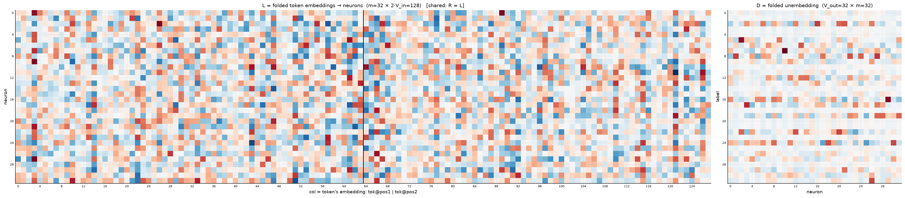
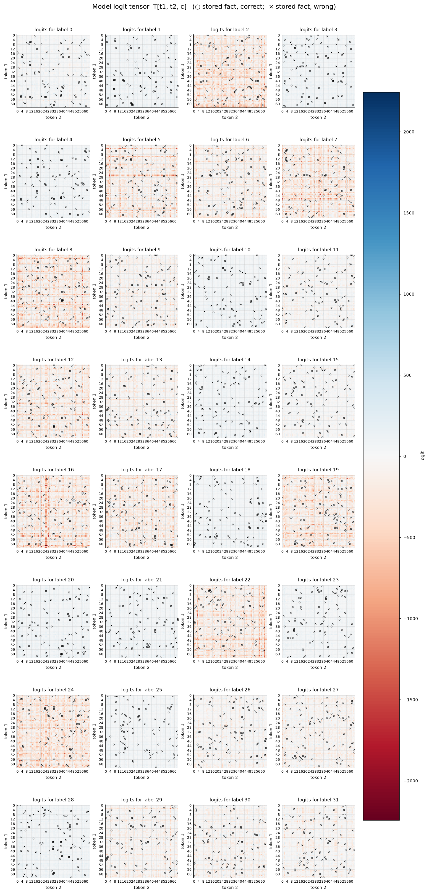

# Symmetric bilinear model (R = L), d = 32

| | |
|---|---|
| architecture | `logits = D((Lx) ⊙ (Lx))` — shared input matrix, x = [onehot(t1); onehot(t2)]. All hidden activations are ≥ 0. |
| V_in / V_out / m | 64 / 32 / 32 |
| parameters | 5120 |
| capacity (acc ≥ 0.9, any of 11 seeds) | **3008** of 4096 possible facts |
| showcase model trained on | 3008 facts (best seed of ≤11) |
| memorized (argmax correct) | **2754 / 3008**  (acc 0.916) |
| margin stats | min -13.36, median +3.21, max +327.64 |

## Weights

These three matrices are the *entire* model — the challenge architecture (post Fig. 4) folds the MLP input matrix into the embeddings and the output matrix into the unembedding. Because the input is a one-hot concat, **column t of L/R *is* token t's embedding vector**, mapping it straight to neuron pre-activations; **D is the unembedding** (neurons → label logits). The black divider separates the position-1 block (columns 0..V_in-1, read by token 1) from the position-2 block (read by token 2).

## Third-order logit tensor

The model's complete input→output function: `T[t1, t2, c]` for every possible input pair, one panel per label. Circles mark stored facts of that label (× = stored but predicted wrong). A perfect memorizer would have every circled cell be the winner across its panel-stack; everything un-circled is free to be arbitrary interference.

## Worked examples by success tier

Facts sorted by margin = `logit[correct] − max wrong logit` (positive ⇒ memorized). `c*` is the strongest competing label.

### Near-perfect (largest margin, ~zero loss)

**Fact 2291** — margin +327.64, CE loss 0.000

`t1=3, t2=3` → label **24**. `Lx[n] = L[n,3] + L[n,64+3]`, same for `Rx`; `h = Lx*Rx`; `logit[c] = Σ_n D[c,n]·h[n]`.

| n | Lx | Rx | h=Lx·Rx | D[y=24,n] | →logit[24] | D[c*=16,n] | →logit[16] |
|---|---|---|---|---|---|---|---|
| 0 | -6.05 | -6.05 | +36.60 | -3.51 | -128.61 | -4.66 | -170.51 |
| 1 | +0.01 | +0.01 | +0.00 | -2.73 | -0.00 | +1.67 | +0.00 |
| 2 | -1.29 | -1.29 | +1.68 | +2.26 | +3.79 | +2.63 | +4.41 |
| 3 | -1.98 | -1.98 | +3.92 | -3.99 | -15.63 | +1.42 | +5.57 |
| 4 | -0.27 | -0.27 | +0.07 | -2.62 | -0.19 | -0.58 | -0.04 |
| 5 | -0.56 | -0.56 | +0.31 | -2.69 | -0.84 | -4.72 | -1.48 |
| 6 | -0.95 | -0.95 | +0.90 | -4.48 | -4.01 | -4.85 | -4.34 |
| 7 | -7.38 | -7.38 | +54.41 | -1.46 | -79.68 | +1.22 | +66.48 |
| 8 | +3.06 | +3.06 | +9.36 | -5.75 | -53.79 | -5.34 | -49.98 |
| 9 | -3.26 | -3.26 | +10.65 | +1.05 | +11.21 | -4.59 | -48.86 |
| 10 | +4.05 | +4.05 | +16.37 | +0.95 | +15.53 | +0.10 | +1.71 |
| 11 | -2.35 | -2.35 | +5.54 | -4.77 | -26.40 | +2.49 | +13.81 |
| 12 | +6.14 | +6.14 | +37.70 | -0.92 | -34.77 | -3.87 | -146.03 |
| 13 | +5.26 | +5.26 | +27.63 | +1.31 | +36.28 | -0.89 | -24.52 |
| 14 | -3.62 | -3.62 | +13.08 | -1.16 | -15.23 | -0.30 | -3.98 |
| 15 | +0.32 | +0.32 | +0.10 | -2.91 | -0.29 | -1.48 | -0.15 |
| 16 | -5.47 | -5.47 | +29.94 | +1.26 | +37.64 | -2.31 | -69.09 |
| 17 | +4.40 | +4.40 | +19.32 | +5.24 | +101.30 | +3.58 | +69.19 |
| 18 | -0.17 | -0.17 | +0.03 | -6.56 | -0.18 | -2.24 | -0.06 |
| 19 | -0.16 | -0.16 | +0.03 | -3.89 | -0.10 | -4.34 | -0.11 |
| 20 | -1.77 | -1.77 | +3.13 | +3.78 | +11.83 | +1.44 | +4.51 |
| 21 | -6.63 | -6.63 | +43.93 | +1.41 | +62.12 | +4.67 | +205.05 |
| 22 | +0.30 | +0.30 | +0.09 | -0.75 | -0.07 | -0.37 | -0.03 |
| 23 | -5.50 | -5.50 | +30.27 | +3.40 | +102.83 | +3.36 | +101.82 |
| 24 | +7.07 | +7.07 | +50.00 | -1.11 | -55.71 | -1.35 | -67.66 |
| 25 | -5.07 | -5.07 | +25.67 | +5.58 | +143.13 | -0.13 | -3.29 |
| 26 | +3.20 | +3.20 | +10.26 | +2.92 | +29.97 | +0.93 | +9.52 |
| 27 | -12.11 | -12.11 | +146.54 | +2.18 | +319.69 | +1.97 | +288.45 |
| 28 | +3.01 | +3.01 | +9.09 | +0.70 | +6.34 | -0.30 | -2.70 |
| 29 | +3.35 | +3.35 | +11.24 | +0.89 | +10.05 | -9.26 | -104.04 |
| 30 | +2.25 | +2.25 | +5.07 | -6.70 | -33.93 | +1.86 | +9.44 |
| 31 | -3.97 | -3.97 | +15.79 | +2.15 | +33.92 | +4.14 | +65.46 |
| **Σ** | | | | | **+476.19** | | **+148.55** |

All logits: [+62.01, +77.39, -278.61, +104.10, +94.36, -34.58, -268.16, -878.05, -1434.96, -44.10, +106.50, +95.14, -144.82, -409.06, +105.70, +71.26, +148.55, -1176.48, +125.01, -746.05, +119.20, +103.65, -124.05, +100.71, **+476.19**, +107.50, +125.46, +88.17, +108.13, -280.88, -137.30, -4.62] — margin +327.64 vs label 16.

**Fact 2142** — margin +251.62, CE loss 0.000

`t1=55, t2=4` → label **22**. `Lx[n] = L[n,55] + L[n,64+4]`, same for `Rx`; `h = Lx*Rx`; `logit[c] = Σ_n D[c,n]·h[n]`.

| n | Lx | Rx | h=Lx·Rx | D[y=22,n] | →logit[22] | D[c*=0,n] | →logit[0] |
|---|---|---|---|---|---|---|---|
| 0 | -0.13 | -0.13 | +0.02 | +1.89 | +0.03 | +0.34 | +0.01 |
| 1 | +0.57 | +0.57 | +0.33 | -0.30 | -0.10 | -0.21 | -0.07 |
| 2 | -0.93 | -0.93 | +0.86 | -5.81 | -5.00 | -0.82 | -0.70 |
| 3 | +3.68 | +3.68 | +13.57 | +4.03 | +54.75 | +0.85 | +11.47 |
| 4 | +1.55 | +1.55 | +2.41 | -4.05 | -9.74 | -0.13 | -0.32 |
| 5 | -1.86 | -1.86 | +3.47 | +0.53 | +1.84 | -1.16 | -4.04 |
| 6 | -4.87 | -4.87 | +23.76 | +2.16 | +51.25 | +1.12 | +26.70 |
| 7 | +2.81 | +2.81 | +7.89 | +2.10 | +16.58 | +0.73 | +5.78 |
| 8 | -3.20 | -3.20 | +10.22 | +0.67 | +6.86 | +0.56 | +5.73 |
| 9 | -3.20 | -3.20 | +10.26 | -0.83 | -8.52 | +0.34 | +3.47 |
| 10 | +6.76 | +6.76 | +45.76 | +0.11 | +4.84 | +0.58 | +26.51 |
| 11 | +0.19 | +0.19 | +0.03 | -2.40 | -0.08 | +0.42 | +0.01 |
| 12 | -1.80 | -1.80 | +3.25 | -6.46 | -21.00 | +0.80 | +2.62 |
| 13 | -1.93 | -1.93 | +3.73 | -0.13 | -0.49 | -1.05 | -3.92 |
| 14 | +1.94 | +1.94 | +3.77 | -3.60 | -13.57 | +0.09 | +0.36 |
| 15 | +4.95 | +4.95 | +24.50 | -1.19 | -29.26 | -1.09 | -26.61 |
| 16 | -1.80 | -1.80 | +3.25 | -0.69 | -2.25 | +0.23 | +0.76 |
| 17 | +1.35 | +1.35 | +1.82 | -0.35 | -0.63 | +0.95 | +1.74 |
| 18 | -2.14 | -2.14 | +4.60 | -0.65 | -2.97 | -1.67 | -7.69 |
| 19 | -1.05 | -1.05 | +1.10 | -3.51 | -3.85 | +0.22 | +0.24 |
| 20 | -3.48 | -3.48 | +12.12 | -6.84 | -82.82 | -0.54 | -6.60 |
| 21 | +1.69 | +1.69 | +2.85 | -3.54 | -10.07 | -0.23 | -0.65 |
| 22 | +6.56 | +6.56 | +43.03 | +3.53 | +151.96 | +1.83 | +78.65 |
| 23 | -5.51 | -5.51 | +30.38 | +5.04 | +153.26 | -1.17 | -35.60 |
| 24 | +5.93 | +5.93 | +35.16 | +1.94 | +68.17 | -0.05 | -1.63 |
| 25 | +1.94 | +1.94 | +3.75 | +0.36 | +1.34 | -0.54 | -2.04 |
| 26 | -1.83 | -1.83 | +3.34 | +2.28 | +7.61 | -0.45 | -1.51 |
| 27 | -1.55 | -1.55 | +2.42 | -0.66 | -1.60 | +0.03 | +0.07 |
| 28 | -4.06 | -4.06 | +16.46 | +1.45 | +23.88 | -0.24 | -4.02 |
| 29 | +2.83 | +2.83 | +8.02 | -0.26 | -2.10 | +0.84 | +6.71 |
| 30 | -3.09 | -3.09 | +9.53 | -1.22 | -11.62 | +1.02 | +9.70 |
| 31 | -0.04 | -0.04 | +0.00 | +0.48 | +0.00 | +0.63 | +0.00 |
| **Σ** | | | | | **+336.73** | | **+85.10** |

All logits: [+85.10, +74.35, -107.52, +79.06, +62.05, -63.16, -233.08, -283.63, -449.45, +35.33, +70.18, +48.57, -86.39, +67.29, +81.80, -77.51, -252.15, -250.80, +49.23, -263.50, +72.23, +67.75, **+336.73**, +59.06, -214.07, +59.16, -29.03, -86.76, +69.52, -40.62, -1.36, +77.86] — margin +251.62 vs label 0.

### Comfortable (median margin)

**Fact 1672** — margin +3.36, CE loss 0.059

`t1=4, t2=7` → label **17**. `Lx[n] = L[n,4] + L[n,64+7]`, same for `Rx`; `h = Lx*Rx`; `logit[c] = Σ_n D[c,n]·h[n]`.

| n | Lx | Rx | h=Lx·Rx | D[y=17,n] | →logit[17] | D[c*=14,n] | →logit[14] |
|---|---|---|---|---|---|---|---|
| 0 | -2.96 | -2.96 | +8.77 | +0.27 | +2.37 | +0.49 | +4.33 |
| 1 | -1.28 | -1.28 | +1.64 | -1.27 | -2.08 | +0.41 | +0.67 |
| 2 | -2.50 | -2.50 | +6.23 | -0.13 | -0.84 | +0.18 | +1.12 |
| 3 | -1.70 | -1.70 | +2.88 | -7.56 | -21.78 | +0.19 | +0.56 |
| 4 | +1.57 | +1.57 | +2.46 | +4.36 | +10.72 | +0.07 | +0.17 |
| 5 | +0.29 | +0.29 | +0.08 | +0.19 | +0.02 | -0.26 | -0.02 |
| 6 | +1.10 | +1.10 | +1.21 | +2.48 | +2.99 | +0.79 | +0.95 |
| 7 | +2.79 | +2.79 | +7.79 | +0.00 | +0.03 | -0.03 | -0.21 |
| 8 | +2.13 | +2.13 | +4.53 | +2.10 | +9.51 | +0.91 | +4.12 |
| 9 | +2.20 | +2.20 | +4.85 | +0.79 | +3.81 | +0.04 | +0.20 |
| 10 | +0.09 | +0.09 | +0.01 | +1.15 | +0.01 | +0.63 | +0.01 |
| 11 | -4.07 | -4.07 | +16.56 | +2.62 | +43.32 | +0.14 | +2.28 |
| 12 | -5.52 | -5.52 | +30.44 | +2.75 | +83.63 | +0.70 | +21.22 |
| 13 | +0.04 | +0.04 | +0.00 | -0.68 | -0.00 | +0.84 | +0.00 |
| 14 | -2.89 | -2.89 | +8.34 | -1.65 | -13.77 | +0.49 | +4.09 |
| 15 | +1.35 | +1.35 | +1.83 | -0.57 | -1.04 | -0.93 | -1.70 |
| 16 | -1.06 | -1.06 | +1.12 | -3.19 | -3.58 | +0.29 | +0.32 |
| 17 | -0.52 | -0.52 | +0.27 | -3.25 | -0.89 | -0.25 | -0.07 |
| 18 | -1.97 | -1.97 | +3.88 | +0.55 | +2.12 | -0.10 | -0.38 |
| 19 | -4.63 | -4.63 | +21.41 | +2.90 | +61.99 | +0.81 | +17.28 |
| 20 | -1.74 | -1.74 | +3.03 | +2.45 | +7.42 | -0.42 | -1.27 |
| 21 | +3.13 | +3.13 | +9.81 | -2.45 | -24.07 | -0.18 | -1.80 |
| 22 | +4.37 | +4.37 | +19.10 | -1.03 | -19.60 | +1.00 | +19.05 |
| 23 | -2.43 | -2.43 | +5.89 | -4.96 | -29.17 | -0.36 | -2.14 |
| 24 | +2.02 | +2.02 | +4.08 | -0.99 | -4.04 | +0.08 | +0.31 |
| 25 | +3.66 | +3.66 | +13.39 | -2.82 | -37.73 | -0.41 | -5.42 |
| 26 | +2.08 | +2.08 | +4.32 | +0.70 | +3.04 | -0.08 | -0.34 |
| 27 | -1.17 | -1.17 | +1.37 | -5.12 | -7.03 | +0.18 | +0.25 |
| 28 | -0.49 | -0.49 | +0.24 | -3.63 | -0.88 | +0.04 | +0.01 |
| 29 | -1.65 | -1.65 | +2.72 | +1.06 | +2.90 | +0.35 | +0.95 |
| 30 | +1.57 | +1.57 | +2.47 | +0.33 | +0.81 | +0.63 | +1.56 |
| 31 | +1.73 | +1.73 | +2.98 | +0.52 | +1.57 | +0.10 | +0.30 |
| **Σ** | | | | | **+69.76** | | **+66.40** |

All logits: [+61.23, +60.70, -156.01, +63.61, +48.04, -10.24, -21.68, +65.86, -68.52, -63.55, +60.59, +49.66, -313.18, -110.00, +66.40, +32.32, -193.13, **+69.76**, +54.40, -194.93, +60.96, +61.62, -285.87, +49.07, -196.00, +42.73, -41.19, -101.95, +63.91, -9.48, -63.81, -28.38] — margin +3.36 vs label 14.

**Fact 639** — margin +3.36, CE loss 0.049

`t1=55, t2=40` → label **6**. `Lx[n] = L[n,55] + L[n,64+40]`, same for `Rx`; `h = Lx*Rx`; `logit[c] = Σ_n D[c,n]·h[n]`.

| n | Lx | Rx | h=Lx·Rx | D[y=6,n] | →logit[6] | D[c*=8,n] | →logit[8] |
|---|---|---|---|---|---|---|---|
| 0 | -1.75 | -1.75 | +3.06 | +0.98 | +2.99 | +3.72 | +11.38 |
| 1 | -1.25 | -1.25 | +1.56 | -2.25 | -3.52 | -6.97 | -10.89 |
| 2 | -3.19 | -3.19 | +10.16 | +1.98 | +20.08 | +1.48 | +15.01 |
| 3 | +2.15 | +2.15 | +4.63 | -0.19 | -0.88 | -0.01 | -0.06 |
| 4 | +3.77 | +3.77 | +14.24 | -3.42 | -48.63 | -4.05 | -57.71 |
| 5 | -6.47 | -6.47 | +41.90 | +2.43 | +101.82 | +4.83 | +202.33 |
| 6 | +5.85 | +5.85 | +34.21 | -0.74 | -25.31 | -4.15 | -142.07 |
| 7 | +2.39 | +2.39 | +5.70 | -4.45 | -25.34 | -3.76 | -21.40 |
| 8 | -3.34 | -3.34 | +11.15 | -1.89 | -21.11 | +0.40 | +4.50 |
| 9 | -5.48 | -5.48 | +30.00 | -1.47 | -44.08 | +2.37 | +71.06 |
| 10 | -2.47 | -2.47 | +6.08 | +0.72 | +4.36 | +0.12 | +0.72 |
| 11 | +4.47 | +4.47 | +19.95 | +0.72 | +14.39 | +0.21 | +4.27 |
| 12 | +0.90 | +0.90 | +0.81 | +0.27 | +0.22 | +0.78 | +0.64 |
| 13 | -2.94 | -2.94 | +8.66 | -6.19 | -53.63 | -4.10 | -35.51 |
| 14 | -1.82 | -1.82 | +3.32 | +0.46 | +1.54 | +0.91 | +3.03 |
| 15 | -0.65 | -0.65 | +0.43 | -2.10 | -0.90 | +2.20 | +0.94 |
| 16 | +2.13 | +2.13 | +4.55 | +0.70 | +3.17 | +2.34 | +10.66 |
| 17 | -0.49 | -0.49 | +0.24 | -2.64 | -0.62 | -5.45 | -1.28 |
| 18 | +4.10 | +4.10 | +16.77 | -0.93 | -15.68 | -1.24 | -20.83 |
| 19 | +2.56 | +2.56 | +6.58 | +1.58 | +10.41 | +1.20 | +7.87 |
| 20 | -1.14 | -1.14 | +1.29 | -0.06 | -0.08 | +2.47 | +3.18 |
| 21 | +0.95 | +0.95 | +0.90 | +1.06 | +0.96 | -0.91 | -0.82 |
| 22 | -1.06 | -1.06 | +1.11 | -4.26 | -4.74 | -6.41 | -7.14 |
| 23 | -3.10 | -3.10 | +9.60 | +1.31 | +12.61 | +1.79 | +17.18 |
| 24 | +1.78 | +1.78 | +3.17 | -0.88 | -2.79 | -6.06 | -19.23 |
| 25 | -3.14 | -3.14 | +9.85 | +1.36 | +13.45 | -0.08 | -0.81 |
| 26 | -2.87 | -2.87 | +8.24 | +1.85 | +15.28 | +2.38 | +19.58 |
| 27 | -0.39 | -0.39 | +0.15 | -0.27 | -0.04 | -7.27 | -1.08 |
| 28 | -5.42 | -5.42 | +29.39 | +3.24 | +95.18 | +0.10 | +2.81 |
| 29 | -1.75 | -1.75 | +3.08 | +0.37 | +1.15 | -1.34 | -4.11 |
| 30 | -0.93 | -0.93 | +0.87 | +0.49 | +0.43 | +2.91 | +2.54 |
| 31 | +2.86 | +2.86 | +8.16 | +2.94 | +24.02 | +2.04 | +16.63 |
| **Σ** | | | | | **+74.71** | | **+71.35** |

All logits: [-35.20, +69.99, -92.00, +61.89, +54.86, -184.29, **+74.71**, -123.32, +71.35, +68.76, +44.95, +1.45, -25.33, +69.21, +49.85, -137.19, -539.83, +54.30, +61.48, -99.83, +54.56, +63.34, +8.22, +29.43, -418.77, +22.51, -220.85, -9.83, +58.62, -18.40, +63.29, +19.47] — margin +3.36 vs label 8.

### At the margin (barely memorized)

**Fact 1897** — margin +0.01, CE loss 1.050

`t1=0, t2=14` → label **20**. `Lx[n] = L[n,0] + L[n,64+14]`, same for `Rx`; `h = Lx*Rx`; `logit[c] = Σ_n D[c,n]·h[n]`.

| n | Lx | Rx | h=Lx·Rx | D[y=20,n] | →logit[20] | D[c*=14,n] | →logit[14] |
|---|---|---|---|---|---|---|---|
| 0 | +0.05 | +0.05 | +0.00 | +0.40 | +0.00 | +0.49 | +0.00 |
| 1 | -0.64 | -0.64 | +0.41 | +0.59 | +0.25 | +0.41 | +0.17 |
| 2 | +1.99 | +1.99 | +3.96 | +0.26 | +1.02 | +0.18 | +0.71 |
| 3 | +2.12 | +2.12 | +4.48 | +0.06 | +0.26 | +0.19 | +0.86 |
| 4 | +1.93 | +1.93 | +3.71 | +0.16 | +0.58 | +0.07 | +0.25 |
| 5 | +3.26 | +3.26 | +10.62 | +0.00 | +0.01 | -0.26 | -2.76 |
| 6 | +1.98 | +1.98 | +3.93 | +0.76 | +3.01 | +0.79 | +3.10 |
| 7 | +1.36 | +1.36 | +1.84 | +0.03 | +0.06 | -0.03 | -0.05 |
| 8 | -0.93 | -0.93 | +0.87 | +0.69 | +0.60 | +0.91 | +0.79 |
| 9 | +1.63 | +1.63 | +2.66 | -0.03 | -0.08 | +0.04 | +0.11 |
| 10 | -0.06 | -0.06 | +0.00 | +0.68 | +0.00 | +0.63 | +0.00 |
| 11 | +0.79 | +0.79 | +0.63 | +0.19 | +0.12 | +0.14 | +0.09 |
| 12 | +2.84 | +2.84 | +8.08 | +0.65 | +5.26 | +0.70 | +5.64 |
| 13 | +3.51 | +3.51 | +12.32 | +0.76 | +9.42 | +0.84 | +10.29 |
| 14 | +0.28 | +0.28 | +0.08 | +0.40 | +0.03 | +0.49 | +0.04 |
| 15 | +0.18 | +0.18 | +0.03 | -0.96 | -0.03 | -0.93 | -0.03 |
| 16 | -0.23 | -0.23 | +0.05 | +0.48 | +0.03 | +0.29 | +0.02 |
| 17 | +0.36 | +0.36 | +0.13 | +0.12 | +0.02 | -0.25 | -0.03 |
| 18 | -3.07 | -3.07 | +9.45 | -0.41 | -3.87 | -0.10 | -0.93 |
| 19 | +2.22 | +2.22 | +4.95 | +0.71 | +3.53 | +0.81 | +3.99 |
| 20 | -2.02 | -2.02 | +4.09 | -0.32 | -1.31 | -0.42 | -1.72 |
| 21 | -2.93 | -2.93 | +8.59 | -0.18 | -1.58 | -0.18 | -1.57 |
| 22 | +4.08 | +4.08 | +16.65 | +0.93 | +15.50 | +1.00 | +16.60 |
| 23 | +3.09 | +3.09 | +9.55 | -0.37 | -3.50 | -0.36 | -3.47 |
| 24 | -2.42 | -2.42 | +5.85 | -0.02 | -0.10 | +0.08 | +0.45 |
| 25 | -1.35 | -1.35 | +1.82 | -0.32 | -0.58 | -0.41 | -0.74 |
| 26 | -3.58 | -3.58 | +12.83 | +0.02 | +0.22 | -0.08 | -1.02 |
| 27 | +4.88 | +4.88 | +23.79 | +0.24 | +5.70 | +0.18 | +4.28 |
| 28 | -0.01 | -0.01 | +0.00 | +0.05 | +0.00 | +0.04 | +0.00 |
| 29 | -0.60 | -0.60 | +0.36 | +0.43 | +0.15 | +0.35 | +0.12 |
| 30 | -0.67 | -0.67 | +0.45 | +0.33 | +0.15 | +0.63 | +0.29 |
| 31 | -3.69 | -3.69 | +13.59 | +0.15 | +2.01 | +0.10 | +1.39 |
| **Σ** | | | | | **+36.88** | | **+36.87** |

All logits: [-7.91, +26.19, -96.63, +34.70, +30.52, -96.47, -66.96, -17.09, -264.73, -7.96, +33.71, +29.12, -30.02, -33.93, +36.87, +3.89, +24.89, -160.27, +36.27, -286.84, **+36.88**, +31.32, -2.88, +19.49, +21.11, +28.52, -28.31, -31.15, +35.06, -89.40, +1.98, -48.77] — margin +0.01 vs label 14.

**Fact 1327** — margin +0.00, CE loss 0.959

`t1=16, t2=2` → label **14**. `Lx[n] = L[n,16] + L[n,64+2]`, same for `Rx`; `h = Lx*Rx`; `logit[c] = Σ_n D[c,n]·h[n]`.

| n | Lx | Rx | h=Lx·Rx | D[y=14,n] | →logit[14] | D[c*=3,n] | →logit[3] |
|---|---|---|---|---|---|---|---|
| 0 | -0.31 | -0.31 | +0.10 | +0.49 | +0.05 | +0.50 | +0.05 |
| 1 | +5.15 | +5.15 | +26.47 | +0.41 | +10.87 | +0.56 | +14.70 |
| 2 | +4.25 | +4.25 | +18.06 | +0.18 | +3.26 | +0.22 | +4.06 |
| 3 | +4.03 | +4.03 | +16.21 | +0.19 | +3.13 | +0.19 | +3.01 |
| 4 | -2.67 | -2.67 | +7.11 | +0.07 | +0.49 | +0.28 | +2.01 |
| 5 | +3.69 | +3.69 | +13.60 | -0.26 | -3.54 | -0.02 | -0.22 |
| 6 | +2.89 | +2.89 | +8.34 | +0.79 | +6.58 | +0.74 | +6.18 |
| 7 | +6.83 | +6.83 | +46.68 | -0.03 | -1.25 | +0.03 | +1.31 |
| 8 | -1.30 | -1.30 | +1.68 | +0.91 | +1.53 | +0.72 | +1.20 |
| 9 | -5.16 | -5.16 | +26.63 | +0.04 | +1.11 | -0.02 | -0.63 |
| 10 | -2.15 | -2.15 | +4.63 | +0.63 | +2.93 | +0.69 | +3.21 |
| 11 | -1.83 | -1.83 | +3.35 | +0.14 | +0.46 | +0.18 | +0.60 |
| 12 | -0.99 | -0.99 | +0.99 | +0.70 | +0.69 | +0.80 | +0.79 |
| 13 | +6.27 | +6.27 | +39.34 | +0.84 | +32.87 | +0.71 | +28.03 |
| 14 | -6.13 | -6.13 | +37.58 | +0.49 | +18.42 | +0.49 | +18.38 |
| 15 | -3.29 | -3.29 | +10.80 | -0.93 | -10.02 | -0.91 | -9.83 |
| 16 | +2.27 | +2.27 | +5.17 | +0.29 | +1.48 | +0.37 | +1.93 |
| 17 | +1.85 | +1.85 | +3.41 | -0.25 | -0.84 | -0.14 | -0.47 |
| 18 | -7.48 | -7.48 | +55.97 | -0.10 | -5.53 | -0.15 | -8.63 |
| 19 | +3.23 | +3.23 | +10.44 | +0.81 | +8.43 | +0.67 | +6.95 |
| 20 | -4.08 | -4.08 | +16.68 | -0.42 | -7.02 | -0.38 | -6.27 |
| 21 | -1.82 | -1.82 | +3.31 | -0.18 | -0.61 | -0.23 | -0.78 |
| 22 | -4.86 | -4.86 | +23.60 | +1.00 | +23.53 | +0.88 | +20.84 |
| 23 | +3.58 | +3.58 | +12.84 | -0.36 | -4.66 | -0.33 | -4.18 |
| 24 | +1.40 | +1.40 | +1.95 | +0.08 | +0.15 | +0.01 | +0.03 |
| 25 | -0.93 | -0.93 | +0.86 | -0.41 | -0.35 | -0.46 | -0.39 |
| 26 | -4.68 | -4.68 | +21.90 | -0.08 | -1.75 | -0.09 | -1.91 |
| 27 | +2.10 | +2.10 | +4.40 | +0.18 | +0.79 | +0.15 | +0.67 |
| 28 | -3.57 | -3.57 | +12.71 | +0.04 | +0.51 | +0.23 | +2.91 |
| 29 | -1.86 | -1.86 | +3.45 | +0.35 | +1.20 | +0.38 | +1.32 |
| 30 | +1.60 | +1.60 | +2.56 | +0.63 | +1.62 | +0.48 | +1.23 |
| 31 | -7.77 | -7.77 | +60.36 | +0.10 | +6.15 | +0.08 | +4.60 |
| **Σ** | | | | | **+90.68** | | **+90.68** |

All logits: [-52.61, +90.01, +41.46, +90.68, +72.88, -401.05, -379.20, -21.86, -386.67, +82.00, +73.29, -94.17, -383.99, -42.61, **+90.68**, -55.65, +23.18, -201.01, +80.63, -221.79, +81.61, +76.75, -101.77, +61.15, -364.32, +77.41, -70.93, +2.81, +87.42, -11.33, +87.83, -41.01] — margin +0.00 vs label 3.

### Just below the margin (barely NOT memorized)

**Fact 1326** — margin -0.03, CE loss 0.818

`t1=0, t2=19` → label **14**. `Lx[n] = L[n,0] + L[n,64+19]`, same for `Rx`; `h = Lx*Rx`; `logit[c] = Σ_n D[c,n]·h[n]`.

| n | Lx | Rx | h=Lx·Rx | D[y=14,n] | →logit[14] | D[c*=25,n] | →logit[25] |
|---|---|---|---|---|---|---|---|
| 0 | -1.12 | -1.12 | +1.26 | +0.49 | +0.62 | +0.43 | +0.55 |
| 1 | +0.35 | +0.35 | +0.13 | +0.41 | +0.05 | +0.85 | +0.11 |
| 2 | +1.14 | +1.14 | +1.29 | +0.18 | +0.23 | +0.03 | +0.03 |
| 3 | +2.46 | +2.46 | +6.08 | +0.19 | +1.17 | +0.35 | +2.13 |
| 4 | -0.11 | -0.11 | +0.01 | +0.07 | +0.00 | -0.21 | -0.00 |
| 5 | +2.59 | +2.59 | +6.73 | -0.26 | -1.75 | +0.29 | +1.96 |
| 6 | -0.38 | -0.38 | +0.14 | +0.79 | +0.11 | +0.50 | +0.07 |
| 7 | -0.64 | -0.64 | +0.41 | -0.03 | -0.01 | -0.45 | -0.19 |
| 8 | -3.81 | -3.81 | +14.54 | +0.91 | +13.20 | +0.14 | +1.99 |
| 9 | +2.75 | +2.75 | +7.54 | +0.04 | +0.31 | +0.26 | +1.98 |
| 10 | -0.69 | -0.69 | +0.47 | +0.63 | +0.30 | +0.73 | +0.34 |
| 11 | -2.95 | -2.95 | +8.72 | +0.14 | +1.20 | -0.03 | -0.30 |
| 12 | +2.56 | +2.56 | +6.57 | +0.70 | +4.58 | +0.91 | +5.98 |
| 13 | +2.68 | +2.68 | +7.17 | +0.84 | +5.99 | +0.47 | +3.37 |
| 14 | +2.85 | +2.85 | +8.11 | +0.49 | +3.98 | +0.42 | +3.38 |
| 15 | +0.78 | +0.78 | +0.60 | -0.93 | -0.56 | -0.08 | -0.05 |
| 16 | -1.08 | -1.08 | +1.17 | +0.29 | +0.33 | +0.50 | +0.58 |
| 17 | -1.98 | -1.98 | +3.93 | -0.25 | -0.97 | -0.00 | -0.02 |
| 18 | -3.95 | -3.95 | +15.60 | -0.10 | -1.54 | +0.42 | +6.54 |
| 19 | +1.57 | +1.57 | +2.46 | +0.81 | +1.99 | +0.48 | +1.18 |
| 20 | -2.75 | -2.75 | +7.57 | -0.42 | -3.19 | -0.57 | -4.35 |
| 21 | -1.01 | -1.01 | +1.02 | -0.18 | -0.19 | +0.26 | +0.26 |
| 22 | +1.54 | +1.54 | +2.36 | +1.00 | +2.35 | +0.26 | +0.61 |
| 23 | +2.81 | +2.81 | +7.89 | -0.36 | -2.86 | -0.46 | -3.59 |
| 24 | -2.34 | -2.34 | +5.47 | +0.08 | +0.42 | +0.63 | +3.47 |
| 25 | -3.25 | -3.25 | +10.54 | -0.41 | -4.27 | -0.74 | -7.85 |
| 26 | -0.02 | -0.02 | +0.00 | -0.08 | -0.00 | -0.68 | -0.00 |
| 27 | +3.10 | +3.10 | +9.64 | +0.18 | +1.73 | +0.20 | +1.95 |
| 28 | +0.44 | +0.44 | +0.20 | +0.04 | +0.01 | -0.85 | -0.17 |
| 29 | -0.48 | -0.48 | +0.23 | +0.35 | +0.08 | -0.00 | -0.00 |
| 30 | -0.47 | -0.47 | +0.22 | +0.63 | +0.14 | +0.47 | +0.10 |
| 31 | -4.05 | -4.05 | +16.41 | +0.10 | +1.67 | +0.31 | +5.07 |
| **Σ** | | | | | **+25.14** | | **+25.17** |

All logits: [-16.10, +19.23, -90.10, +21.79, +16.11, -105.48, -18.64, -41.45, -42.59, +19.58, +20.22, +1.17, -99.97, -29.52, **+25.14**, +7.71, -67.63, -87.52, +19.95, -187.23, +20.17, +21.63, -78.88, +14.95, -97.11, +25.17, -23.41, -32.13, +22.32, -13.74, +22.58, +20.29] — margin -0.03 vs label 25.

**Fact 2422** — margin -0.03, CE loss 0.988

`t1=50, t2=38` → label **25**. `Lx[n] = L[n,50] + L[n,64+38]`, same for `Rx`; `h = Lx*Rx`; `logit[c] = Σ_n D[c,n]·h[n]`.

| n | Lx | Rx | h=Lx·Rx | D[y=25,n] | →logit[25] | D[c*=14,n] | →logit[14] |
|---|---|---|---|---|---|---|---|
| 0 | -0.19 | -0.19 | +0.04 | +0.43 | +0.02 | +0.49 | +0.02 |
| 1 | -2.63 | -2.63 | +6.91 | +0.85 | +5.89 | +0.41 | +2.84 |
| 2 | -0.57 | -0.57 | +0.32 | +0.03 | +0.01 | +0.18 | +0.06 |
| 3 | -1.60 | -1.60 | +2.56 | +0.35 | +0.90 | +0.19 | +0.49 |
| 4 | -0.84 | -0.84 | +0.70 | -0.21 | -0.15 | +0.07 | +0.05 |
| 5 | +1.19 | +1.19 | +1.42 | +0.29 | +0.41 | -0.26 | -0.37 |
| 6 | -0.07 | -0.07 | +0.00 | +0.50 | +0.00 | +0.79 | +0.00 |
| 7 | +1.79 | +1.79 | +3.19 | -0.45 | -1.43 | -0.03 | -0.09 |
| 8 | +2.33 | +2.33 | +5.41 | +0.14 | +0.74 | +0.91 | +4.91 |
| 9 | +1.18 | +1.18 | +1.39 | +0.26 | +0.36 | +0.04 | +0.06 |
| 10 | +0.37 | +0.37 | +0.14 | +0.73 | +0.10 | +0.63 | +0.09 |
| 11 | +1.44 | +1.44 | +2.08 | -0.03 | -0.07 | +0.14 | +0.29 |
| 12 | -1.27 | -1.27 | +1.60 | +0.91 | +1.46 | +0.70 | +1.12 |
| 13 | -2.04 | -2.04 | +4.16 | +0.47 | +1.96 | +0.84 | +3.48 |
| 14 | +2.93 | +2.93 | +8.57 | +0.42 | +3.57 | +0.49 | +4.20 |
| 15 | -2.71 | -2.71 | +7.32 | -0.08 | -0.57 | -0.93 | -6.79 |
| 16 | +2.45 | +2.45 | +6.00 | +0.50 | +3.01 | +0.29 | +1.72 |
| 17 | -1.55 | -1.55 | +2.41 | -0.00 | -0.01 | -0.25 | -0.59 |
| 18 | -0.36 | -0.36 | +0.13 | +0.42 | +0.06 | -0.10 | -0.01 |
| 19 | -1.88 | -1.88 | +3.52 | +0.48 | +1.69 | +0.81 | +2.84 |
| 20 | -1.79 | -1.79 | +3.20 | -0.57 | -1.84 | -0.42 | -1.34 |
| 21 | +0.23 | +0.23 | +0.05 | +0.26 | +0.01 | -0.18 | -0.01 |
| 22 | -2.47 | -2.47 | +6.12 | +0.26 | +1.59 | +1.00 | +6.10 |
| 23 | -2.14 | -2.14 | +4.56 | -0.46 | -2.08 | -0.36 | -1.66 |
| 24 | +3.20 | +3.20 | +10.26 | +0.63 | +6.51 | +0.08 | +0.79 |
| 25 | -0.66 | -0.66 | +0.43 | -0.74 | -0.32 | -0.41 | -0.18 |
| 26 | -2.06 | -2.06 | +4.26 | -0.68 | -2.90 | -0.08 | -0.34 |
| 27 | +3.50 | +3.50 | +12.27 | +0.20 | +2.48 | +0.18 | +2.21 |
| 28 | -1.16 | -1.16 | +1.35 | -0.85 | -1.15 | +0.04 | +0.05 |
| 29 | -0.39 | -0.39 | +0.15 | -0.00 | -0.00 | +0.35 | +0.05 |
| 30 | -3.40 | -3.40 | +11.55 | +0.47 | +5.38 | +0.63 | +7.29 |
| 31 | -2.77 | -2.77 | +7.69 | +0.31 | +2.38 | +0.10 | +0.78 |
| **Σ** | | | | | **+28.02** | | **+28.06** |

All logits: [+17.79, +24.98, -53.88, +25.61, +24.33, +24.41, -64.03, -52.61, -151.99, -10.70, +25.40, -4.16, -87.20, +9.78, +28.06, +14.92, +22.18, -129.53, +17.56, -184.35, +25.74, +25.65, -23.48, +18.92, -106.42, **+28.02**, +23.14, +26.13, +24.69, -27.83, -7.05, +4.30] — margin -0.03 vs label 14.

### Not memorized at all (worst margin)

**Fact 426** — margin -10.75, CE loss 11.966

`t1=27, t2=31` → label **4**. `Lx[n] = L[n,27] + L[n,64+31]`, same for `Rx`; `h = Lx*Rx`; `logit[c] = Σ_n D[c,n]·h[n]`.

| n | Lx | Rx | h=Lx·Rx | D[y=4,n] | →logit[4] | D[c*=20,n] | →logit[20] |
|---|---|---|---|---|---|---|---|
| 0 | +2.74 | +2.74 | +7.53 | +0.39 | +2.91 | +0.40 | +3.03 |
| 1 | -1.17 | -1.17 | +1.36 | -0.26 | -0.35 | +0.59 | +0.81 |
| 2 | -3.46 | -3.46 | +12.00 | +0.06 | +0.77 | +0.26 | +3.08 |
| 3 | +0.66 | +0.66 | +0.44 | +0.21 | +0.09 | +0.06 | +0.03 |
| 4 | +1.24 | +1.24 | +1.54 | +0.28 | +0.43 | +0.16 | +0.24 |
| 5 | -1.13 | -1.13 | +1.29 | +0.15 | +0.20 | +0.00 | +0.00 |
| 6 | +1.31 | +1.31 | +1.72 | +0.69 | +1.19 | +0.76 | +1.31 |
| 7 | +1.69 | +1.69 | +2.85 | +0.19 | +0.54 | +0.03 | +0.10 |
| 8 | -1.92 | -1.92 | +3.69 | +0.52 | +1.93 | +0.69 | +2.55 |
| 9 | +3.14 | +3.14 | +9.83 | +0.08 | +0.79 | -0.03 | -0.28 |
| 10 | +2.89 | +2.89 | +8.36 | +0.69 | +5.79 | +0.68 | +5.69 |
| 11 | -2.51 | -2.51 | +6.29 | +0.13 | +0.81 | +0.19 | +1.19 |
| 12 | -1.93 | -1.93 | +3.71 | +0.54 | +2.01 | +0.65 | +2.42 |
| 13 | -1.06 | -1.06 | +1.12 | +0.76 | +0.85 | +0.76 | +0.86 |
| 14 | -2.39 | -2.39 | +5.73 | +0.21 | +1.18 | +0.40 | +2.28 |
| 15 | +0.14 | +0.14 | +0.02 | -0.50 | -0.01 | -0.96 | -0.02 |
| 16 | +0.96 | +0.96 | +0.93 | +0.55 | +0.51 | +0.48 | +0.44 |
| 17 | -2.25 | -2.25 | +5.05 | -0.03 | -0.15 | +0.12 | +0.62 |
| 18 | +0.59 | +0.59 | +0.35 | -0.37 | -0.13 | -0.41 | -0.14 |
| 19 | -0.43 | -0.43 | +0.18 | +1.19 | +0.22 | +0.71 | +0.13 |
| 20 | -0.93 | -0.93 | +0.86 | -0.15 | -0.13 | -0.32 | -0.27 |
| 21 | +1.41 | +1.41 | +2.00 | -0.47 | -0.95 | -0.18 | -0.37 |
| 22 | +3.07 | +3.07 | +9.44 | +0.44 | +4.15 | +0.93 | +8.79 |
| 23 | -1.44 | -1.44 | +2.08 | -0.39 | -0.80 | -0.37 | -0.76 |
| 24 | -1.53 | -1.53 | +2.33 | -0.10 | -0.22 | -0.02 | -0.04 |
| 25 | +1.15 | +1.15 | +1.33 | -0.78 | -1.04 | -0.32 | -0.43 |
| 26 | -1.85 | -1.85 | +3.42 | -0.05 | -0.18 | +0.02 | +0.06 |
| 27 | +0.24 | +0.24 | +0.06 | +0.24 | +0.01 | +0.24 | +0.01 |
| 28 | -1.03 | -1.03 | +1.07 | -0.07 | -0.07 | +0.05 | +0.05 |
| 29 | -1.01 | -1.01 | +1.02 | +0.56 | +0.57 | +0.43 | +0.44 |
| 30 | -0.40 | -0.40 | +0.16 | +0.64 | +0.10 | +0.33 | +0.05 |
| 31 | -0.77 | -0.77 | +0.60 | +0.32 | +0.19 | +0.15 | +0.09 |
| **Σ** | | | | | **+21.21** | | **+31.96** |

All logits: [+27.52, +28.33, -16.38, +31.42, **+21.21**, -147.47, -38.74, -79.54, -39.06, -41.72, +31.38, -40.26, -108.32, -5.38, +30.80, -7.35, -56.38, +0.25, +26.38, -40.16, +31.96, +30.10, -72.79, +30.34, -18.30, +19.52, +20.52, -16.86, +31.30, +24.31, -39.17, -5.61] — margin -10.75 vs label 20.

**Fact 1766** — margin -13.36, CE loss 14.134

`t1=28, t2=30` → label **18**. `Lx[n] = L[n,28] + L[n,64+30]`, same for `Rx`; `h = Lx*Rx`; `logit[c] = Σ_n D[c,n]·h[n]`.

| n | Lx | Rx | h=Lx·Rx | D[y=18,n] | →logit[18] | D[c*=28,n] | →logit[28] |
|---|---|---|---|---|---|---|---|
| 0 | +0.69 | +0.69 | +0.47 | +0.13 | +0.06 | +0.42 | +0.20 |
| 1 | +2.48 | +2.48 | +6.16 | +0.70 | +4.31 | +0.59 | +3.64 |
| 2 | -1.81 | -1.81 | +3.29 | +0.33 | +1.07 | +0.24 | +0.77 |
| 3 | +4.44 | +4.44 | +19.68 | +0.30 | +5.99 | +0.17 | +3.41 |
| 4 | -0.96 | -0.96 | +0.92 | +0.18 | +0.17 | +0.29 | +0.27 |
| 5 | -5.46 | -5.46 | +29.78 | +0.09 | +2.80 | -0.05 | -1.59 |
| 6 | +0.52 | +0.52 | +0.27 | +0.53 | +0.14 | +0.76 | +0.21 |
| 7 | +1.16 | +1.16 | +1.34 | -0.22 | -0.29 | +0.08 | +0.11 |
| 8 | -5.11 | -5.11 | +26.08 | +0.17 | +4.48 | +0.78 | +20.45 |
| 9 | -0.23 | -0.23 | +0.05 | +0.04 | +0.00 | -0.07 | -0.00 |
| 10 | -1.45 | -1.45 | +2.09 | +0.65 | +1.35 | +0.66 | +1.39 |
| 11 | -1.53 | -1.53 | +2.35 | +0.04 | +0.09 | +0.21 | +0.48 |
| 12 | +3.19 | +3.19 | +10.20 | +0.73 | +7.41 | +0.74 | +7.56 |
| 13 | +3.85 | +3.85 | +14.85 | +0.23 | +3.45 | +0.73 | +10.78 |
| 14 | +0.53 | +0.53 | +0.28 | +0.52 | +0.15 | +0.44 | +0.12 |
| 15 | -0.52 | -0.52 | +0.27 | -1.07 | -0.29 | -1.04 | -0.28 |
| 16 | -0.34 | -0.34 | +0.12 | +0.29 | +0.03 | +0.36 | +0.04 |
| 17 | -3.79 | -3.79 | +14.38 | +0.13 | +1.94 | +0.05 | +0.70 |
| 18 | +0.21 | +0.21 | +0.04 | +0.10 | +0.00 | -0.19 | -0.01 |
| 19 | -2.76 | -2.76 | +7.61 | +0.44 | +3.36 | +0.68 | +5.16 |
| 20 | -0.06 | -0.06 | +0.00 | -0.53 | -0.00 | -0.28 | -0.00 |
| 21 | +1.42 | +1.42 | +2.01 | +0.46 | +0.91 | -0.12 | -0.25 |
| 22 | -1.11 | -1.11 | +1.24 | +0.64 | +0.80 | +0.87 | +1.07 |
| 23 | +0.43 | +0.43 | +0.18 | -0.44 | -0.08 | -0.39 | -0.07 |
| 24 | -1.87 | -1.87 | +3.51 | -0.09 | -0.32 | -0.08 | -0.28 |
| 25 | -0.58 | -0.58 | +0.34 | -0.05 | -0.02 | -0.32 | -0.11 |
| 26 | -4.67 | -4.67 | +21.85 | -0.08 | -1.80 | +0.00 | +0.07 |
| 27 | +1.36 | +1.36 | +1.84 | +0.38 | +0.70 | +0.17 | +0.32 |
| 28 | -2.90 | -2.90 | +8.42 | +0.59 | +4.96 | +0.15 | +1.30 |
| 29 | -1.45 | -1.45 | +2.11 | +0.20 | +0.42 | +0.28 | +0.60 |
| 30 | +2.62 | +2.62 | +6.88 | +0.27 | +1.87 | +0.49 | +3.39 |
| 31 | -4.54 | -4.54 | +20.64 | +0.15 | +3.19 | +0.04 | +0.75 |
| **Σ** | | | | | **+46.84** | | **+60.20** |

All logits: [+15.13, +59.34, -216.61, +56.82, +58.89, -17.17, +17.30, -107.07, +55.49, -168.46, +54.57, +25.33, -186.66, +41.55, +54.06, +12.74, -159.67, -111.93, **+46.84**, -291.68, +59.26, +56.77, +52.81, +39.91, -205.37, +36.20, -20.25, +12.10, +60.20, -10.35, -124.36, -89.47] — margin -13.36 vs label 28.
