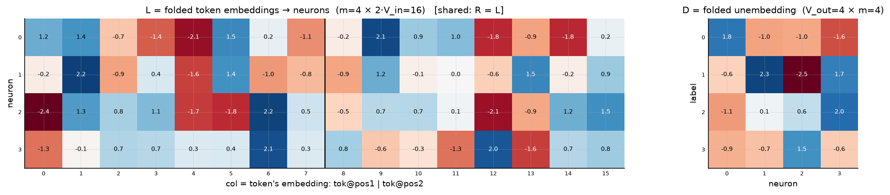
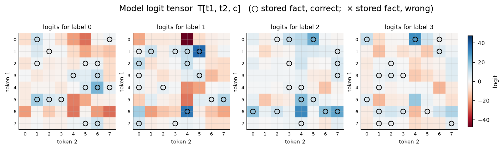
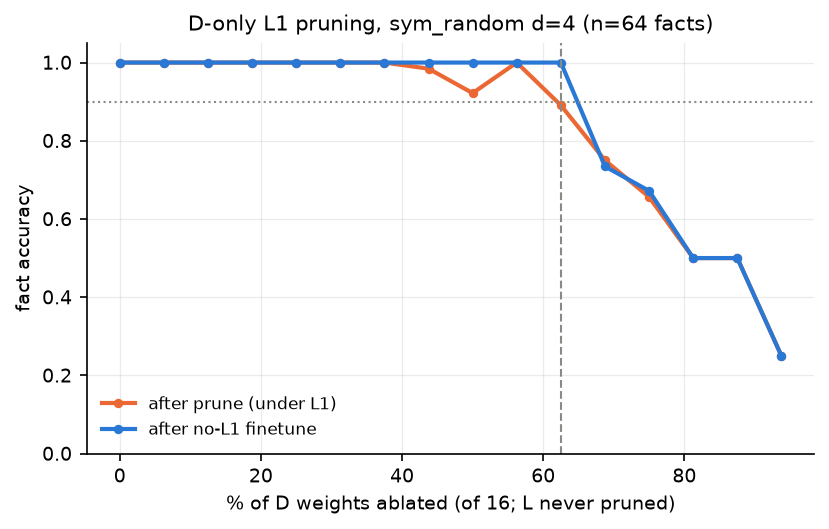
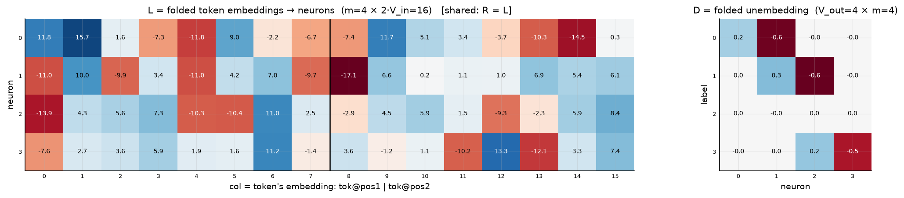
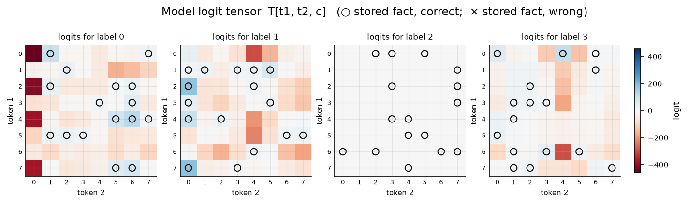
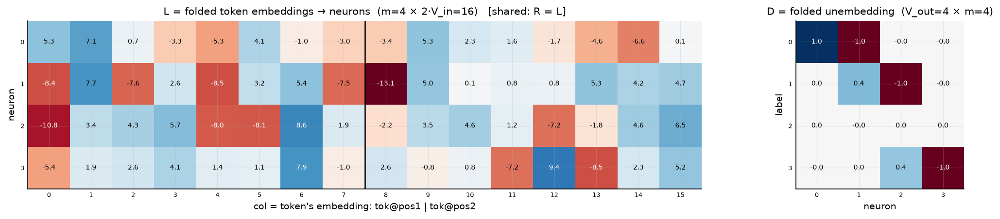

# Symmetric bilinear model (R = L), d = 4

| | |
|---|---|
| architecture | `logits = D((Lx) ⊙ (Lx))` — shared input matrix, x = [onehot(t1); onehot(t2)]. All hidden activations are ≥ 0. |
| V_in / V_out / m | 8 / 4 / 4 |
| parameters | 80 |
| capacity (acc ≥ 0.9, any of 11 seeds) | **64** of 64 possible facts |
| showcase model trained on | 64 facts (best seed of ≤11) |
| memorized (argmax correct) | **64 / 64**  (acc 1.000) |
| margin stats | min +0.05, median +2.28, max +30.02 |

## Weights

These three matrices are the *entire* model — the challenge architecture (post Fig. 4) folds the MLP input matrix into the embeddings and the output matrix into the unembedding. Because the input is a one-hot concat, **column t of L/R *is* token t's embedding vector**, mapping it straight to neuron pre-activations; **D is the unembedding** (neurons → label logits). The black divider separates the position-1 block (columns 0..V_in-1, read by token 1) from the position-2 block (read by token 2).

## Third-order logit tensor

The model's complete input→output function: `T[t1, t2, c]` for every possible input pair, one panel per label. Circles mark stored facts of that label (× = stored but predicted wrong). A perfect memorizer would have every circled cell be the winner across its panel-stack; everything un-circled is free to be arbitrary interference.

## Worked examples by success tier

Facts sorted by margin = `logit[correct] − max wrong logit` (positive ⇒ memorized). `c*` is the strongest competing label.

### Near-perfect (largest margin, ~zero loss)

**Fact 21** — margin +30.02, CE loss 0.000

`t1=1, t2=5` → label **1**. `Lx[n] = L[n,1] + L[n,8+5]`, same for `Rx`; `h = Lx*Rx`; `logit[c] = Σ_n D[c,n]·h[n]`.

| n | Lx | Rx | h=Lx·Rx | D[y=1,n] | →logit[1] | D[c*=2,n] | →logit[2] |
|---|---|---|---|---|---|---|---|
| 0 | +0.46 | +0.46 | +0.21 | -0.58 | -0.12 | -1.08 | -0.23 |
| 1 | +3.75 | +3.75 | +14.06 | +2.32 | +32.56 | +0.10 | +1.44 |
| 2 | +0.43 | +0.43 | +0.18 | -2.53 | -0.46 | +0.62 | +0.11 |
| 3 | -1.71 | -1.71 | +2.92 | +1.74 | +5.07 | +1.96 | +5.71 |
| **Σ** | | | | | **+37.05** | | **+7.03** |

All logits: [-18.75, **+37.05**, +7.03, -12.30] — margin +30.02 vs label 2.

**Fact 0** — margin +22.01, CE loss 0.000

`t1=4, t2=6` → label **0**. `Lx[n] = L[n,4] + L[n,8+6]`, same for `Rx`; `h = Lx*Rx`; `logit[c] = Σ_n D[c,n]·h[n]`.

| n | Lx | Rx | h=Lx·Rx | D[y=0,n] | →logit[0] | D[c*=1,n] | →logit[1] |
|---|---|---|---|---|---|---|---|
| 0 | -3.85 | -3.85 | +14.84 | +1.82 | +27.09 | -0.58 | -8.63 |
| 1 | -1.78 | -1.78 | +3.18 | -1.01 | -3.21 | +2.32 | +7.35 |
| 2 | -0.50 | -0.50 | +0.25 | -0.98 | -0.24 | -2.53 | -0.62 |
| 3 | +1.02 | +1.02 | +1.05 | -1.62 | -1.70 | +1.74 | +1.82 |
| **Σ** | | | | | **+21.93** | | **-0.08** |

All logits: [**+21.93**, -0.08, -13.52, -15.98] — margin +22.01 vs label 1.

### Comfortable (median margin)

**Fact 16** — margin +2.28, CE loss 0.100

`t1=5, t2=6` → label **1**. `Lx[n] = L[n,5] + L[n,8+6]`, same for `Rx`; `h = Lx*Rx`; `logit[c] = Σ_n D[c,n]·h[n]`.

| n | Lx | Rx | h=Lx·Rx | D[y=1,n] | →logit[1] | D[c*=2,n] | →logit[2] |
|---|---|---|---|---|---|---|---|
| 0 | -0.26 | -0.26 | +0.07 | -0.58 | -0.04 | -1.08 | -0.07 |
| 1 | +1.28 | +1.28 | +1.65 | +2.32 | +3.81 | +0.10 | +0.17 |
| 2 | -0.61 | -0.61 | +0.37 | -2.53 | -0.93 | +0.62 | +0.23 |
| 3 | +1.05 | +1.05 | +1.11 | +1.74 | +1.93 | +1.96 | +2.17 |
| **Σ** | | | | | **+4.77** | | **+2.49** |

All logits: [-3.70, **+4.77**, +2.49, -1.44] — margin +2.28 vs label 2.

**Fact 13** — margin +2.26, CE loss 0.106

`t1=4, t2=7` → label **0**. `Lx[n] = L[n,4] + L[n,8+7]`, same for `Rx`; `h = Lx*Rx`; `logit[c] = Σ_n D[c,n]·h[n]`.

| n | Lx | Rx | h=Lx·Rx | D[y=0,n] | →logit[0] | D[c*=1,n] | →logit[1] |
|---|---|---|---|---|---|---|---|
| 0 | -1.90 | -1.90 | +3.60 | +1.82 | +6.57 | -0.58 | -2.09 |
| 1 | -0.75 | -0.75 | +0.56 | -1.01 | -0.57 | +2.32 | +1.30 |
| 2 | -0.20 | -0.20 | +0.04 | -0.98 | -0.04 | -2.53 | -0.10 |
| 3 | +1.17 | +1.17 | +1.37 | -1.62 | -2.22 | +1.74 | +2.38 |
| **Σ** | | | | | **+3.75** | | **+1.48** |

All logits: [**+3.75**, +1.48, -1.13, -4.47] — margin +2.26 vs label 1.

### At the margin (barely memorized)

**Fact 55** — margin +0.08, CE loss 0.684

`t1=3, t2=3` → label **3**. `Lx[n] = L[n,3] + L[n,8+3]`, same for `Rx`; `h = Lx*Rx`; `logit[c] = Σ_n D[c,n]·h[n]`.

| n | Lx | Rx | h=Lx·Rx | D[y=3,n] | →logit[3] | D[c*=2,n] | →logit[2] |
|---|---|---|---|---|---|---|---|
| 0 | -0.41 | -0.41 | +0.17 | -0.90 | -0.15 | -1.08 | -0.18 |
| 1 | +0.39 | +0.39 | +0.15 | -0.75 | -0.11 | +0.10 | +0.02 |
| 2 | +1.14 | +1.14 | +1.29 | +1.54 | +1.98 | +0.62 | +0.80 |
| 3 | -0.62 | -0.62 | +0.39 | -0.64 | -0.25 | +1.96 | +0.76 |
| **Σ** | | | | | **+1.47** | | **+1.39** |

All logits: [-1.74, -2.34, +1.39, **+1.47**] — margin +0.08 vs label 2.

**Fact 50** — margin +0.05, CE loss 0.667

`t1=7, t2=7` → label **3**. `Lx[n] = L[n,7] + L[n,8+7]`, same for `Rx`; `h = Lx*Rx`; `logit[c] = Σ_n D[c,n]·h[n]`.

| n | Lx | Rx | h=Lx·Rx | D[y=3,n] | →logit[3] | D[c*=2,n] | →logit[2] |
|---|---|---|---|---|---|---|---|
| 0 | -0.92 | -0.92 | +0.85 | -0.90 | -0.76 | -1.08 | -0.92 |
| 1 | +0.11 | +0.11 | +0.01 | -0.75 | -0.01 | +0.10 | +0.00 |
| 2 | +1.94 | +1.94 | +3.77 | +1.54 | +5.80 | +0.62 | +2.33 |
| 3 | +1.17 | +1.17 | +1.37 | -0.64 | -0.88 | +1.96 | +2.68 |
| **Σ** | | | | | **+4.15** | | **+4.10** |

All logits: [-4.38, -7.63, +4.10, **+4.15**] — margin +0.05 vs label 2.

*(no unmemorized facts — this model is at 100% accuracy)*

## Sparsity: D only

Iterative L1 (λ=0.003) on D only + prune 5% of remaining (min 1) per round; L trains freely. At each level a 1500-epoch no-L1 finetune measures recoverable accuracy.

Sparsest level with finetuned acc ≥ 0.9: **6 of 16 D weights** (62% ablated), finetuned acc 1.000; nonzero D weights per label: [2, 2, 0, 2].

Weights of that frontier model:

Full logit tensor of that frontier model (acc 1.000):

Canonical form of the frontier model: each D column's largest-|entry| scaled to 1, with the scale folded into the corresponding L row as its square root; functionally identical (max logit diff 6.1e-05). Remaining D entries (signs, within-column ratios) are irreducible structure.

### Tap-ablation decomposition

Zeroing each D tap of the frontier model individually (baseline acc 1.000):

| ablated | acc | facts lost |
|---|---|---|
| excitation D[0,0]=+0.20 | 0.750 | all of label 0, nothing else |
| excitation D[1,1]=+0.26 | 0.750 | all of label 1, nothing else |
| excitation D[3,2]=+0.24 | 0.750 | all of label 3, nothing else |
| veto D[0,1]=−0.59 | 0.625 | all of label 2 (default) + 6 of label 1 + 2 of label 3 |
| veto D[1,2]=−0.61 | 0.594 | all of label 2 + 9 of label 3 + 1 of label 0 |
| veto D[3,3]=−0.50 | 0.719 | all of label 2 + 2 of label 0 |

**Excitation taps are label-local** (each kills exactly its own label's 16
facts). **Veto taps are shared infrastructure**: every veto ablation kills
the zero-tap default label completely — the default only wins when *all*
other labels are vetoed below zero, so it depends on every veto in the
model — plus collateral damage where that veto was also holding a rival
below the owner label. The chain decomposes, but asymmetrically: modular
excitations, load-bearing global vetoes.
