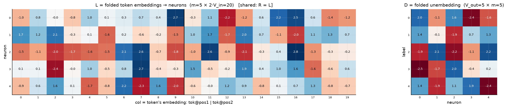
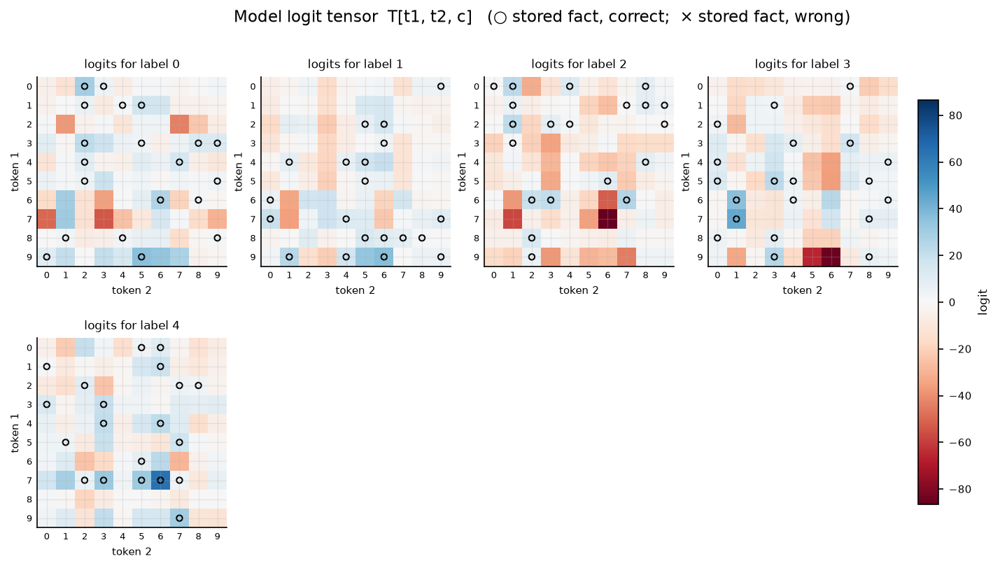
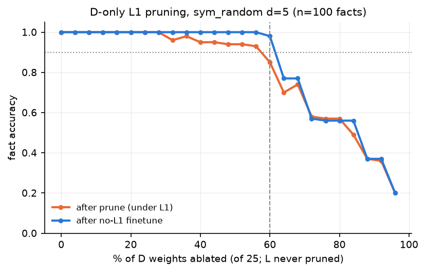
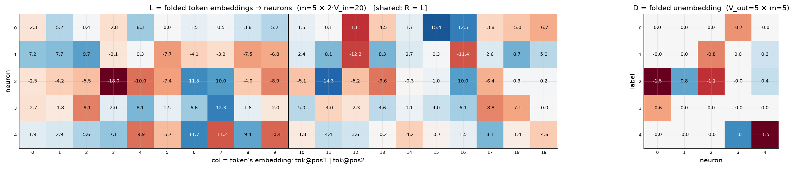
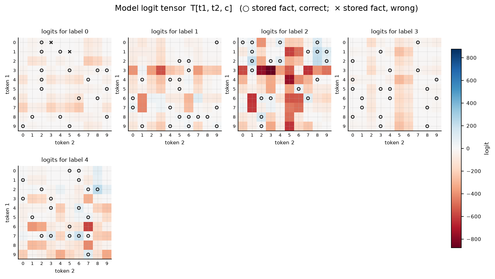
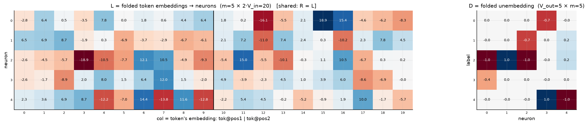

# Symmetric bilinear model (R = L), d = 5

| | |
|---|---|
| architecture | `logits = D((Lx) ⊙ (Lx))` — shared input matrix, x = [onehot(t1); onehot(t2)]. All hidden activations are ≥ 0. |
| V_in / V_out / m | 10 / 5 / 5 |
| parameters | 125 |
| capacity (acc ≥ 0.9, any of 11 seeds) | **100** of 100 possible facts |
| showcase model trained on | 100 facts (best seed of ≤11) |
| memorized (argmax correct) | **100 / 100**  (acc 1.000) |
| margin stats | min +0.07, median +3.02, max +48.31 |

## Weights

These three matrices are the *entire* model — the challenge architecture (post Fig. 4) folds the MLP input matrix into the embeddings and the output matrix into the unembedding. Because the input is a one-hot concat, **column t of L/R *is* token t's embedding vector**, mapping it straight to neuron pre-activations; **D is the unembedding** (neurons → label logits). The black divider separates the position-1 block (columns 0..V_in-1, read by token 1) from the position-2 block (read by token 2).

## Third-order logit tensor

The model's complete input→output function: `T[t1, t2, c]` for every possible input pair, one panel per label. Circles mark stored facts of that label (× = stored but predicted wrong). A perfect memorizer would have every circled cell be the winner across its panel-stack; everything un-circled is free to be arbitrary interference.

## Worked examples by success tier

Facts sorted by margin = `logit[correct] − max wrong logit` (positive ⇒ memorized). `c*` is the strongest competing label.

### Near-perfect (largest margin, ~zero loss)

**Fact 81** — margin +48.31, CE loss 0.000

`t1=7, t2=6` → label **4**. `Lx[n] = L[n,7] + L[n,10+6]`, same for `Rx`; `h = Lx*Rx`; `logit[c] = Σ_n D[c,n]·h[n]`.

| n | Lx | Rx | h=Lx·Rx | D[y=4,n] | →logit[4] | D[c*=3,n] | →logit[3] |
|---|---|---|---|---|---|---|---|
| 0 | +3.24 | +3.24 | +10.52 | +1.37 | +14.43 | -2.50 | -26.25 |
| 1 | -2.52 | -2.52 | +6.35 | -1.89 | -11.98 | -1.66 | -10.56 |
| 2 | +5.38 | +5.38 | +29.00 | +1.12 | +32.60 | +2.04 | +59.23 |
| 3 | +4.28 | +4.28 | +18.29 | +1.90 | +34.83 | -0.38 | -6.86 |
| 4 | -1.53 | -1.53 | +2.33 | -2.42 | -5.63 | +0.17 | +0.39 |
| **Σ** | | | | | **+64.26** | | **+15.94** |

All logits: [+14.37, -23.44, -86.45, +15.94, **+64.26**] — margin +48.31 vs label 3.

**Fact 52** — margin +25.30, CE loss 0.000

`t1=0, t2=1` → label **2**. `Lx[n] = L[n,0] + L[n,10+1]`, same for `Rx`; `h = Lx*Rx`; `logit[c] = Σ_n D[c,n]·h[n]`.

| n | Lx | Rx | h=Lx·Rx | D[y=2,n] | →logit[2] | D[c*=1,n] | →logit[1] |
|---|---|---|---|---|---|---|---|
| 0 | +0.13 | +0.13 | +0.02 | -1.92 | -0.03 | +1.37 | +0.02 |
| 1 | +3.37 | +3.37 | +11.36 | +2.11 | +23.92 | -0.14 | -1.54 |
| 2 | +1.15 | +1.15 | +1.32 | -2.23 | -2.95 | -1.85 | -2.45 |
| 3 | -0.44 | -0.44 | +0.19 | -1.09 | -0.21 | +0.75 | +0.14 |
| 4 | -0.94 | -0.94 | +0.88 | +2.18 | +1.91 | +1.32 | +1.16 |
| **Σ** | | | | | **+22.63** | | **-2.66** |

All logits: [-12.66, -2.66, **+22.63**, -16.16, -21.67] — margin +25.30 vs label 1.

### Comfortable (median margin)

**Fact 84** — margin +3.02, CE loss 0.060

`t1=2, t2=8` → label **4**. `Lx[n] = L[n,2] + L[n,10+8]`, same for `Rx`; `h = Lx*Rx`; `logit[c] = Σ_n D[c,n]·h[n]`.

| n | Lx | Rx | h=Lx·Rx | D[y=4,n] | →logit[4] | D[c*=2,n] | →logit[2] |
|---|---|---|---|---|---|---|---|
| 0 | -1.38 | -1.38 | +1.90 | +1.37 | +2.61 | -1.92 | -3.66 |
| 1 | +3.40 | +3.40 | +11.56 | -1.89 | -21.80 | +2.11 | +24.34 |
| 2 | -2.34 | -2.34 | +5.45 | +1.12 | +6.13 | -2.23 | -12.19 |
| 3 | -3.03 | -3.03 | +9.16 | +1.90 | +17.43 | -1.09 | -9.94 |
| 4 | +0.78 | +0.78 | +0.61 | -2.42 | -1.48 | +2.18 | +1.33 |
| **Σ** | | | | | **+2.90** | | **-0.12** |

All logits: [-23.05, -1.41, -0.12, -16.17, **+2.90**] — margin +3.02 vs label 2.

**Fact 69** — margin +2.97, CE loss 0.074

`t1=9, t2=3` → label **3**. `Lx[n] = L[n,9] + L[n,10+3]`, same for `Rx`; `h = Lx*Rx`; `logit[c] = Σ_n D[c,n]·h[n]`.

| n | Lx | Rx | h=Lx·Rx | D[y=3,n] | →logit[3] | D[c*=4,n] | →logit[4] |
|---|---|---|---|---|---|---|---|
| 0 | +1.47 | +1.47 | +2.17 | -2.50 | -5.42 | +1.37 | +2.98 |
| 1 | +0.52 | +0.52 | +0.27 | -1.66 | -0.45 | -1.89 | -0.51 |
| 2 | -3.90 | -3.90 | +15.18 | +2.04 | +31.02 | +1.12 | +17.07 |
| 3 | +1.62 | +1.62 | +2.62 | -0.38 | -0.98 | +1.90 | +5.00 |
| 4 | -1.14 | -1.14 | +1.29 | +0.17 | +0.21 | -2.42 | -3.13 |
| **Σ** | | | | | **+24.38** | | **+21.41** |

All logits: [+20.69, -21.53, -37.57, **+24.38**, +21.41] — margin +2.97 vs label 4.

### At the margin (barely memorized)

**Fact 30** — margin +0.38, CE loss 0.653

`t1=8, t2=8` → label **1**. `Lx[n] = L[n,8] + L[n,10+8]`, same for `Rx`; `h = Lx*Rx`; `logit[c] = Σ_n D[c,n]·h[n]`.

| n | Lx | Rx | h=Lx·Rx | D[y=1,n] | →logit[1] | D[c*=4,n] | →logit[4] |
|---|---|---|---|---|---|---|---|
| 0 | -0.96 | -0.96 | +0.93 | +1.37 | +1.27 | +1.37 | +1.27 |
| 1 | +1.09 | +1.09 | +1.19 | -0.14 | -0.16 | -1.89 | -2.24 |
| 2 | -0.98 | -0.98 | +0.96 | -1.85 | -1.78 | +1.12 | +1.08 |
| 3 | -1.03 | -1.03 | +1.05 | +0.75 | +0.79 | +1.90 | +2.01 |
| 4 | +0.80 | +0.80 | +0.64 | +1.32 | +0.84 | -2.42 | -1.54 |
| **Σ** | | | | | **+0.96** | | **+0.58** |

All logits: [-1.44, **+0.96**, -1.19, -2.62, +0.58] — margin +0.38 vs label 4.

**Fact 7** — margin +0.07, CE loss 0.687

`t1=3, t2=5` → label **0**. `Lx[n] = L[n,3] + L[n,10+5]`, same for `Rx`; `h = Lx*Rx`; `logit[c] = Σ_n D[c,n]·h[n]`.

| n | Lx | Rx | h=Lx·Rx | D[y=0,n] | →logit[0] | D[c*=4,n] | →logit[4] |
|---|---|---|---|---|---|---|---|
| 0 | +1.47 | +1.47 | +2.17 | +1.97 | +4.28 | +1.37 | +2.98 |
| 1 | -1.34 | -1.34 | +1.78 | -1.15 | -2.05 | -1.89 | -3.36 |
| 2 | -1.32 | -1.32 | +1.73 | +1.64 | +2.84 | +1.12 | +1.95 |
| 3 | +0.90 | +0.90 | +0.82 | -2.35 | -1.92 | +1.90 | +1.56 |
| 4 | +0.23 | +0.23 | +0.05 | -1.58 | -0.08 | -2.42 | -0.13 |
| **Σ** | | | | | **+3.07** | | **+3.00** |

All logits: [**+3.07**, +0.20, -5.07, -5.15, +3.00] — margin +0.07 vs label 4.

*(no unmemorized facts — this model is at 100% accuracy)*

## Sparsity: D only

Iterative L1 (λ=0.003) on D only + prune 5% of remaining (min 1) per round; L trains freely. At each level a 1500-epoch no-L1 finetune measures recoverable accuracy.

Sparsest level with finetuned acc ≥ 0.9: **10 of 25 D weights** (60% ablated), finetuned acc 0.980; nonzero D weights per label: [1, 2, 4, 1, 2].

Weights of that frontier model:

Full logit tensor of that frontier model (acc 0.980):

Canonical form of the frontier model: each D column's largest-|entry| scaled to 1, with the scale folded into the corresponding L row as its square root; functionally identical (max logit diff 1.8e-04). Remaining D entries (signs, within-column ratios) are irreducible structure.

