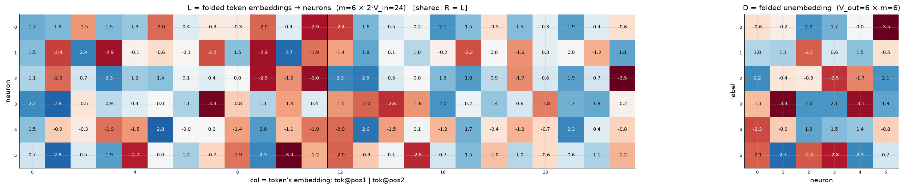
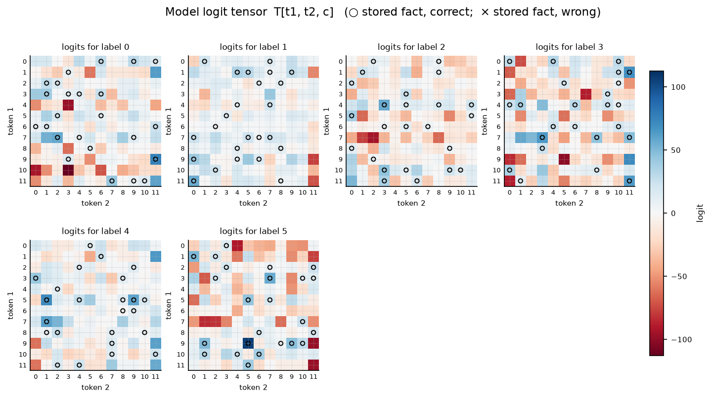

# Symmetric bilinear model (R = L), d = 6

| | |
|---|---|
| architecture | `logits = D((Lx) ⊙ (Lx))` — shared input matrix, x = [onehot(t1); onehot(t2)]. All hidden activations are ≥ 0. |
| V_in / V_out / m | 12 / 6 / 6 |
| parameters | 180 |
| capacity (acc ≥ 0.9, any of 11 seeds) | **144** of 144 possible facts |
| showcase model trained on | 144 facts (best seed of ≤11) |
| memorized (argmax correct) | **144 / 144**  (acc 1.000) |
| margin stats | min +0.01, median +3.66, max +64.74 |

## Weights

These three matrices are the *entire* model — the challenge architecture (post Fig. 4) folds the MLP input matrix into the embeddings and the output matrix into the unembedding. Because the input is a one-hot concat, **column t of L/R *is* token t's embedding vector**, mapping it straight to neuron pre-activations; **D is the unembedding** (neurons → label logits). The black divider separates the position-1 block (columns 0..V_in-1, read by token 1) from the position-2 block (read by token 2).

## Third-order logit tensor

The model's complete input→output function: `T[t1, t2, c]` for every possible input pair, one panel per label. Circles mark stored facts of that label (× = stored but predicted wrong). A perfect memorizer would have every circled cell be the winner across its panel-stack; everything un-circled is free to be arbitrary interference.

## Worked examples by success tier

Facts sorted by margin = `logit[correct] − max wrong logit` (positive ⇒ memorized). `c*` is the strongest competing label.

### Near-perfect (largest margin, ~zero loss)

**Fact 139** — margin +64.74, CE loss 0.000

`t1=9, t2=5` → label **5**. `Lx[n] = L[n,9] + L[n,12+5]`, same for `Rx`; `h = Lx*Rx`; `logit[c] = Σ_n D[c,n]·h[n]`.

| n | Lx | Rx | h=Lx·Rx | D[y=5,n] | →logit[5] | D[c*=1,n] | →logit[1] |
|---|---|---|---|---|---|---|---|
| 0 | -0.51 | -0.51 | +0.26 | -2.12 | -0.56 | +1.03 | +0.27 |
| 1 | -5.20 | -5.20 | +27.02 | +2.71 | +73.25 | +1.13 | +30.60 |
| 2 | -0.97 | -0.97 | +0.94 | -2.17 | -2.04 | -2.14 | -2.01 |
| 3 | +1.25 | +1.25 | +1.57 | -2.82 | -4.44 | +0.62 | +0.97 |
| 4 | +3.65 | +3.65 | +13.34 | +2.29 | +30.49 | +1.45 | +19.38 |
| 5 | +3.80 | +3.80 | +14.47 | +0.66 | +9.59 | -0.53 | -7.66 |
| **Σ** | | | | | **+106.29** | | **+41.55** |

All logits: [-52.29, +41.55, -8.64, -100.85, -14.46, **+106.29**] — margin +64.74 vs label 1.

**Fact 80** — margin +38.95, CE loss 0.000

`t1=7, t2=3` → label **3**. `Lx[n] = L[n,7] + L[n,12+3]`, same for `Rx`; `h = Lx*Rx`; `logit[c] = Σ_n D[c,n]·h[n]`.

| n | Lx | Rx | h=Lx·Rx | D[y=3,n] | →logit[3] | D[c*=4,n] | →logit[4] |
|---|---|---|---|---|---|---|---|
| 0 | -0.16 | -0.16 | +0.02 | -1.11 | -0.03 | -2.34 | -0.06 |
| 1 | -1.25 | -1.25 | +1.57 | -3.39 | -5.31 | -0.89 | -1.39 |
| 2 | +0.39 | +0.39 | +0.16 | +2.05 | +0.32 | +1.86 | +0.29 |
| 3 | -4.90 | -4.90 | +23.97 | +2.06 | +49.35 | +1.52 | +36.54 |
| 4 | +0.15 | +0.15 | +0.02 | -3.08 | -0.07 | +1.36 | +0.03 |
| 5 | -3.34 | -3.34 | +11.15 | +1.86 | +20.71 | -0.84 | -9.39 |
| **Σ** | | | | | **+64.97** | | **+26.03** |

All logits: [+0.70, +10.41, -38.41, **+64.97**, +26.03, -56.30] — margin +38.95 vs label 4.

### Comfortable (median margin)

**Fact 40** — margin +3.66, CE loss 0.031

`t1=7, t2=0` → label **1**. `Lx[n] = L[n,7] + L[n,12+0]`, same for `Rx`; `h = Lx*Rx`; `logit[c] = Σ_n D[c,n]·h[n]`.

| n | Lx | Rx | h=Lx·Rx | D[y=1,n] | →logit[1] | D[c*=0,n] | →logit[0] |
|---|---|---|---|---|---|---|---|
| 0 | -2.77 | -2.77 | +7.68 | +1.03 | +7.93 | -0.58 | -4.43 |
| 1 | -3.64 | -3.64 | +13.22 | +1.13 | +14.98 | -0.22 | -2.94 |
| 2 | +2.68 | +2.68 | +7.16 | -2.14 | -15.32 | +2.04 | +14.64 |
| 3 | -4.87 | -4.87 | +23.72 | +0.62 | +14.66 | +1.67 | +39.69 |
| 4 | -1.97 | -1.97 | +3.87 | +1.45 | +5.62 | +0.03 | +0.12 |
| 5 | -2.76 | -2.76 | +7.62 | -0.53 | -4.04 | -3.53 | -26.92 |
| **Σ** | | | | | **+23.82** | | **+20.16** |

All logits: [+20.16, **+23.82**, -42.15, +12.46, +18.64, -48.98] — margin +3.66 vs label 0.

**Fact 75** — margin +3.64, CE loss 0.026

`t1=10, t2=0` → label **3**. `Lx[n] = L[n,10] + L[n,12+0]`, same for `Rx`; `h = Lx*Rx`; `logit[c] = Σ_n D[c,n]·h[n]`.

| n | Lx | Rx | h=Lx·Rx | D[y=3,n] | →logit[3] | D[c*=2,n] | →logit[2] |
|---|---|---|---|---|---|---|---|
| 0 | -2.06 | -2.06 | +4.25 | -1.11 | -4.72 | +2.23 | +9.48 |
| 1 | +1.32 | +1.32 | +1.74 | -3.39 | -5.88 | -0.44 | -0.76 |
| 2 | +0.70 | +0.70 | +0.50 | +2.05 | +1.01 | -0.33 | -0.16 |
| 3 | -2.99 | -2.99 | +8.92 | +2.06 | +18.36 | -2.54 | -22.64 |
| 4 | -3.05 | -3.05 | +9.32 | -3.08 | -28.75 | -1.74 | -16.17 |
| 5 | -5.49 | -5.49 | +30.10 | +1.86 | +55.93 | +2.08 | +62.57 |
| **Σ** | | | | | **+35.96** | | **+32.32** |

All logits: [-92.91, +8.42, +32.32, **+35.96**, -9.66, +10.73] — margin +3.64 vs label 2.

### At the margin (barely memorized)

**Fact 25** — margin +0.35, CE loss 0.560

`t1=6, t2=2` → label **1**. `Lx[n] = L[n,6] + L[n,12+2]`, same for `Rx`; `h = Lx*Rx`; `logit[c] = Σ_n D[c,n]·h[n]`.

| n | Lx | Rx | h=Lx·Rx | D[y=1,n] | →logit[1] | D[c*=4,n] | →logit[4] |
|---|---|---|---|---|---|---|---|
| 0 | +0.97 | +0.97 | +0.95 | +1.03 | +0.98 | -2.34 | -2.22 |
| 1 | -0.02 | -0.02 | +0.00 | +1.13 | +0.00 | -0.89 | -0.00 |
| 2 | +0.63 | +0.63 | +0.40 | -2.14 | -0.86 | +1.86 | +0.74 |
| 3 | -1.48 | -1.48 | +2.18 | +0.62 | +1.35 | +1.52 | +3.33 |
| 4 | -1.49 | -1.49 | +2.21 | +1.45 | +3.22 | +1.36 | +3.01 |
| 5 | +1.29 | +1.29 | +1.66 | -0.53 | -0.88 | -0.84 | -1.40 |
| **Σ** | | | | | **+3.81** | | **+3.47** |

All logits: [-1.85, **+3.81**, -3.96, +0.52, +3.47, -2.89] — margin +0.35 vs label 4.

**Fact 115** — margin +0.01, CE loss 1.344

`t1=6, t2=8` → label **4**. `Lx[n] = L[n,6] + L[n,12+8]`, same for `Rx`; `h = Lx*Rx`; `logit[c] = Σ_n D[c,n]·h[n]`.

| n | Lx | Rx | h=Lx·Rx | D[y=4,n] | →logit[4] | D[c*=1,n] | →logit[1] |
|---|---|---|---|---|---|---|---|
| 0 | +0.78 | +0.78 | +0.61 | -2.34 | -1.43 | +1.03 | +0.63 |
| 1 | +0.23 | +0.23 | +0.05 | -0.89 | -0.05 | +1.13 | +0.06 |
| 2 | +0.68 | +0.68 | +0.47 | +1.86 | +0.87 | -2.14 | -1.00 |
| 3 | -0.69 | -0.69 | +0.47 | +1.52 | +0.72 | +0.62 | +0.29 |
| 4 | -0.72 | -0.72 | +0.52 | +1.36 | +0.70 | +1.45 | +0.75 |
| 5 | +0.52 | +0.52 | +0.27 | -0.84 | -0.22 | -0.53 | -0.14 |
| **Σ** | | | | | **+0.60** | | **+0.59** |

All logits: [+0.47, +0.59, -0.37, -0.02, **+0.60**, -2.14] — margin +0.01 vs label 1.

*(no unmemorized facts — this model is at 100% accuracy)*
