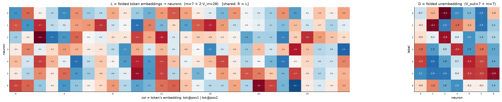
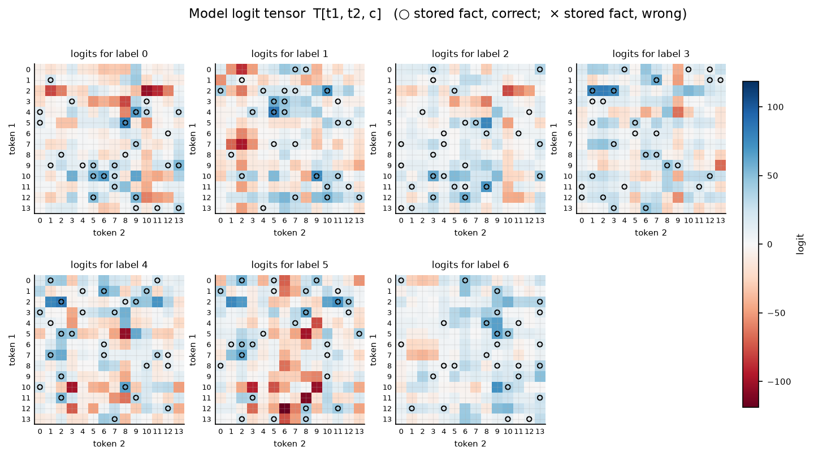

# Symmetric bilinear model (R = L), d = 7

| | |
|---|---|
| architecture | `logits = D((Lx) ⊙ (Lx))` — shared input matrix, x = [onehot(t1); onehot(t2)]. All hidden activations are ≥ 0. |
| V_in / V_out / m | 14 / 7 / 7 |
| parameters | 245 |
| capacity (acc ≥ 0.9, any of 11 seeds) | **196** of 196 possible facts |
| showcase model trained on | 196 facts (best seed of ≤11) |
| memorized (argmax correct) | **196 / 196**  (acc 1.000) |
| margin stats | min +0.03, median +2.68, max +52.99 |

## Weights

These three matrices are the *entire* model — the challenge architecture (post Fig. 4) folds the MLP input matrix into the embeddings and the output matrix into the unembedding. Because the input is a one-hot concat, **column t of L/R *is* token t's embedding vector**, mapping it straight to neuron pre-activations; **D is the unembedding** (neurons → label logits). The black divider separates the position-1 block (columns 0..V_in-1, read by token 1) from the position-2 block (read by token 2).

## Third-order logit tensor

The model's complete input→output function: `T[t1, t2, c]` for every possible input pair, one panel per label. Circles mark stored facts of that label (× = stored but predicted wrong). A perfect memorizer would have every circled cell be the winner across its panel-stack; everything un-circled is free to be arbitrary interference.

## Worked examples by success tier

Facts sorted by margin = `logit[correct] − max wrong logit` (positive ⇒ memorized). `c*` is the strongest competing label.

### Near-perfect (largest margin, ~zero loss)

**Fact 52** — margin +52.99, CE loss 0.000

`t1=4, t2=5` → label **1**. `Lx[n] = L[n,4] + L[n,14+5]`, same for `Rx`; `h = Lx*Rx`; `logit[c] = Σ_n D[c,n]·h[n]`.

| n | Lx | Rx | h=Lx·Rx | D[y=1,n] | →logit[1] | D[c*=6,n] | →logit[6] |
|---|---|---|---|---|---|---|---|
| 0 | +2.35 | +2.35 | +5.53 | -0.30 | -1.66 | -0.63 | -3.47 |
| 1 | +0.63 | +0.63 | +0.40 | -3.07 | -1.22 | -1.63 | -0.65 |
| 2 | +3.96 | +3.96 | +15.68 | +2.23 | +35.04 | +1.65 | +25.87 |
| 3 | -0.21 | -0.21 | +0.05 | -1.86 | -0.09 | +2.01 | +0.09 |
| 4 | +1.24 | +1.24 | +1.53 | -1.19 | -1.82 | -0.18 | -0.27 |
| 5 | -4.26 | -4.26 | +18.14 | +2.39 | +43.28 | -0.17 | -3.09 |
| 6 | +3.11 | +3.11 | +9.66 | +1.19 | +11.47 | +1.40 | +13.54 |
| **Σ** | | | | | **+85.02** | | **+32.03** |

All logits: [-11.97, **+85.02**, -9.97, -8.30, -11.63, -23.81, +32.03] — margin +52.99 vs label 6.

**Fact 85** — margin +52.83, CE loss 0.000

`t1=2, t2=3` → label **3**. `Lx[n] = L[n,2] + L[n,14+3]`, same for `Rx`; `h = Lx*Rx`; `logit[c] = Σ_n D[c,n]·h[n]`.

| n | Lx | Rx | h=Lx·Rx | D[y=3,n] | →logit[3] | D[c*=2,n] | →logit[2] |
|---|---|---|---|---|---|---|---|
| 0 | +1.50 | +1.50 | +2.24 | -1.83 | -4.10 | -0.54 | -1.22 |
| 1 | -4.17 | -4.17 | +17.40 | +1.86 | +32.37 | +0.25 | +4.37 |
| 2 | -4.00 | -4.00 | +15.97 | +0.89 | +14.29 | -2.82 | -45.01 |
| 3 | +0.91 | +0.91 | +0.83 | -2.46 | -2.03 | +0.36 | +0.30 |
| 4 | -4.83 | -4.83 | +23.35 | +1.94 | +45.33 | +1.98 | +46.32 |
| 5 | -3.20 | -3.20 | +10.23 | -1.79 | -18.27 | +1.37 | +14.02 |
| 6 | +2.30 | +2.30 | +5.30 | +1.72 | +9.09 | +0.95 | +5.06 |
| **Σ** | | | | | **+76.67** | | **+23.83** |

All logits: [-15.40, -16.90, +23.83, **+76.67**, -4.51, -9.08, -0.17] — margin +52.83 vs label 2.

### Comfortable (median margin)

**Fact 62** — margin +2.68, CE loss 0.066

`t1=10, t2=3` → label **2**. `Lx[n] = L[n,10] + L[n,14+3]`, same for `Rx`; `h = Lx*Rx`; `logit[c] = Σ_n D[c,n]·h[n]`.

| n | Lx | Rx | h=Lx·Rx | D[y=2,n] | →logit[2] | D[c*=0,n] | →logit[0] |
|---|---|---|---|---|---|---|---|
| 0 | +2.89 | +2.89 | +8.35 | -0.54 | -4.54 | +0.69 | +5.79 |
| 1 | +1.13 | +1.13 | +1.28 | +0.25 | +0.32 | -1.12 | -1.43 |
| 2 | -2.88 | -2.88 | +8.29 | -2.82 | -23.36 | -3.28 | -27.20 |
| 3 | -0.77 | -0.77 | +0.60 | +0.36 | +0.21 | +2.08 | +1.25 |
| 4 | -5.10 | -5.10 | +26.00 | +1.98 | +51.58 | +1.46 | +37.88 |
| 5 | -4.56 | -4.56 | +20.81 | +1.37 | +28.52 | +2.38 | +49.47 |
| 6 | +2.86 | +2.86 | +8.17 | +0.95 | +7.80 | -0.97 | -7.90 |
| **Σ** | | | | | **+60.54** | | **+57.86** |

All logits: [+57.86, +39.45, **+60.54**, +20.37, -99.22, -92.49, +10.83] — margin +2.68 vs label 0.

**Fact 168** — margin +2.67, CE loss 0.166

`t1=13, t2=12` → label **6**. `Lx[n] = L[n,13] + L[n,14+12]`, same for `Rx`; `h = Lx*Rx`; `logit[c] = Σ_n D[c,n]·h[n]`.

| n | Lx | Rx | h=Lx·Rx | D[y=6,n] | →logit[6] | D[c*=1,n] | →logit[1] |
|---|---|---|---|---|---|---|---|
| 0 | -2.41 | -2.41 | +5.79 | -0.63 | -3.63 | -0.30 | -1.73 |
| 1 | +0.51 | +0.51 | +0.26 | -1.63 | -0.42 | -3.07 | -0.78 |
| 2 | -0.51 | -0.51 | +0.26 | +1.65 | +0.43 | +2.23 | +0.58 |
| 3 | +1.38 | +1.38 | +1.91 | +2.01 | +3.85 | -1.86 | -3.56 |
| 4 | -0.33 | -0.33 | +0.11 | -0.18 | -0.02 | -1.19 | -0.13 |
| 5 | +1.31 | +1.31 | +1.73 | -0.17 | -0.29 | +2.39 | +4.12 |
| 6 | -2.42 | -2.42 | +5.88 | +1.40 | +8.24 | +1.19 | +6.98 |
| **Σ** | | | | | **+8.15** | | **+5.48** |

All logits: [+5.43, +5.48, +5.06, -7.36, -5.10, -7.52, **+8.15**] — margin +2.67 vs label 1.

### At the margin (barely memorized)

**Fact 185** — margin +0.15, CE loss 0.861

`t1=6, t2=0` → label **6**. `Lx[n] = L[n,6] + L[n,14+0]`, same for `Rx`; `h = Lx*Rx`; `logit[c] = Σ_n D[c,n]·h[n]`.

| n | Lx | Rx | h=Lx·Rx | D[y=6,n] | →logit[6] | D[c*=2,n] | →logit[2] |
|---|---|---|---|---|---|---|---|
| 0 | -0.19 | -0.19 | +0.04 | -0.63 | -0.02 | -0.54 | -0.02 |
| 1 | +0.34 | +0.34 | +0.11 | -1.63 | -0.18 | +0.25 | +0.03 |
| 2 | -0.27 | -0.27 | +0.07 | +1.65 | +0.12 | -2.82 | -0.20 |
| 3 | -1.18 | -1.18 | +1.39 | +2.01 | +2.79 | +0.36 | +0.50 |
| 4 | +1.05 | +1.05 | +1.11 | -0.18 | -0.20 | +1.98 | +2.20 |
| 5 | +0.53 | +0.53 | +0.28 | -0.17 | -0.05 | +1.37 | +0.39 |
| 6 | -1.16 | -1.16 | +1.34 | +1.40 | +1.87 | +0.95 | +1.28 |
| **Σ** | | | | | **+4.32** | | **+4.17** |

All logits: [+3.55, -1.83, +4.17, +0.74, +0.07, -6.14, **+4.32**] — margin +0.15 vs label 2.

**Fact 68** — margin +0.03, CE loss 0.935

`t1=6, t2=4` → label **2**. `Lx[n] = L[n,6] + L[n,14+4]`, same for `Rx`; `h = Lx*Rx`; `logit[c] = Σ_n D[c,n]·h[n]`.

| n | Lx | Rx | h=Lx·Rx | D[y=2,n] | →logit[2] | D[c*=6,n] | →logit[6] |
|---|---|---|---|---|---|---|---|
| 0 | -0.35 | -0.35 | +0.12 | -0.54 | -0.07 | -0.63 | -0.08 |
| 1 | -0.77 | -0.77 | +0.60 | +0.25 | +0.15 | -1.63 | -0.97 |
| 2 | -0.13 | -0.13 | +0.02 | -2.82 | -0.05 | +1.65 | +0.03 |
| 3 | -1.06 | -1.06 | +1.12 | +0.36 | +0.40 | +2.01 | +2.25 |
| 4 | +0.68 | +0.68 | +0.46 | +1.98 | +0.91 | -0.18 | -0.08 |
| 5 | +0.75 | +0.75 | +0.56 | +1.37 | +0.77 | -0.17 | -0.10 |
| 6 | -1.52 | -1.52 | +2.32 | +0.95 | +2.22 | +1.40 | +3.25 |
| **Σ** | | | | | **+4.34** | | **+4.31** |

All logits: [+1.46, -0.36, **+4.34**, +2.02, +3.46, -7.04, +4.31] — margin +0.03 vs label 6.

*(no unmemorized facts — this model is at 100% accuracy)*
