# Symmetric bilinear model (R = L), d = 8

| | |
|---|---|
| architecture | `logits = D((Lx) ⊙ (Lx))` — shared input matrix, x = [onehot(t1); onehot(t2)]. All hidden activations are ≥ 0. |
| V_in / V_out / m | 16 / 8 / 8 |
| parameters | 320 |
| capacity (acc ≥ 0.9, any of 11 seeds) | **256** of 256 possible facts |
| showcase model trained on | 256 facts (best seed of ≤11) |
| memorized (argmax correct) | **256 / 256**  (acc 1.000) |
| margin stats | min +0.05, median +4.17, max +156.46 |

## Weights

These three matrices are the *entire* model — the challenge architecture (post Fig. 4) folds the MLP input matrix into the embeddings and the output matrix into the unembedding. Because the input is a one-hot concat, **column t of L/R *is* token t's embedding vector**, mapping it straight to neuron pre-activations; **D is the unembedding** (neurons → label logits). The black divider separates the position-1 block (columns 0..V_in-1, read by token 1) from the position-2 block (read by token 2).

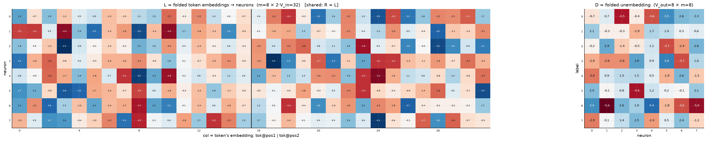

## Third-order logit tensor

The model's complete input→output function: `T[t1, t2, c]` for every possible input pair, one panel per label. Circles mark stored facts of that label (× = stored but predicted wrong). A perfect memorizer would have every circled cell be the winner across its panel-stack; everything un-circled is free to be arbitrary interference.

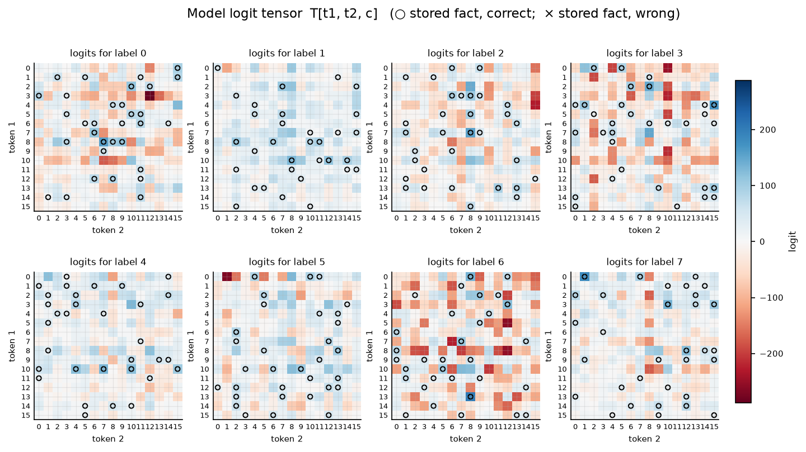

## Worked examples by success tier

Facts sorted by margin = `logit[correct] − max wrong logit` (positive ⇒ memorized). `c*` is the strongest competing label.

### Near-perfect (largest margin, ~zero loss)

**Fact 219** — margin +156.46, CE loss 0.000

`t1=13, t2=8` → label **6**. `Lx[n] = L[n,13] + L[n,16+8]`, same for `Rx`; `h = Lx*Rx`; `logit[c] = Σ_n D[c,n]·h[n]`.

| n | Lx | Rx | h=Lx·Rx | D[y=6,n] | →logit[6] | D[c*=1,n] | →logit[1] |
|---|---|---|---|---|---|---|---|
| 0 | +4.90 | +4.90 | +24.00 | +3.44 | +82.53 | +2.05 | +49.25 |
| 1 | -0.01 | -0.01 | +0.00 | -5.63 | -0.00 | -0.30 | -0.00 |
| 2 | +0.16 | +0.16 | +0.03 | +2.63 | +0.07 | -0.31 | -0.01 |
| 3 | -4.70 | -4.70 | +22.11 | +1.93 | +42.65 | -1.94 | -42.86 |
| 4 | -4.58 | -4.58 | +20.97 | +4.36 | +91.49 | +1.69 | +35.34 |
| 5 | +0.90 | +0.90 | +0.81 | -1.81 | -1.46 | +1.39 | +1.12 |
| 6 | -1.57 | -1.57 | +2.48 | -3.61 | -8.96 | +0.28 | +0.70 |
| 7 | +1.06 | +1.06 | +1.13 | -4.96 | -5.60 | +0.64 | +0.73 |
| **Σ** | | | | | **+200.73** | | **+44.27** |

All logits: [-91.12, +44.27, -0.11, +31.84, -22.16, -16.65, **+200.73**, -59.74] — margin +156.46 vs label 1.

**Fact 31** — margin +68.39, CE loss 0.000

`t1=8, t2=7` → label **0**. `Lx[n] = L[n,8] + L[n,16+7]`, same for `Rx`; `h = Lx*Rx`; `logit[c] = Σ_n D[c,n]·h[n]`.

| n | Lx | Rx | h=Lx·Rx | D[y=0,n] | →logit[0] | D[c*=3,n] | →logit[3] |
|---|---|---|---|---|---|---|---|
| 0 | +2.17 | +2.17 | +4.69 | -0.74 | -3.46 | -2.03 | -9.55 |
| 1 | +4.39 | +4.39 | +19.28 | +0.73 | +14.00 | -2.63 | -50.71 |
| 2 | -1.63 | -1.63 | +2.66 | -4.54 | -12.08 | -2.63 | -6.98 |
| 3 | +0.16 | +0.16 | +0.03 | -0.43 | -0.01 | +3.00 | +0.08 |
| 4 | +0.95 | +0.95 | +0.91 | -3.60 | -3.28 | +0.88 | +0.81 |
| 5 | -6.28 | -6.28 | +39.38 | +3.50 | +137.70 | +3.81 | +150.06 |
| 6 | -1.46 | -1.46 | +2.14 | +2.55 | +5.46 | -3.67 | -7.85 |
| 7 | -2.88 | -2.88 | +8.31 | +2.34 | +19.40 | +1.62 | +13.49 |
| **Σ** | | | | | **+157.73** | | **+89.34** |

All logits: [**+157.73**, +65.11, -76.77, +89.34, -74.27, +38.05, -201.68, +5.41] — margin +68.39 vs label 3.

### Comfortable (median margin)

**Fact 39** — margin +4.17, CE loss 0.015

`t1=8, t2=6` → label **1**. `Lx[n] = L[n,8] + L[n,16+6]`, same for `Rx`; `h = Lx*Rx`; `logit[c] = Σ_n D[c,n]·h[n]`.

| n | Lx | Rx | h=Lx·Rx | D[y=1,n] | →logit[1] | D[c*=4,n] | →logit[4] |
|---|---|---|---|---|---|---|---|
| 0 | -1.00 | -1.00 | +0.99 | +2.05 | +2.03 | -2.95 | -2.93 |
| 1 | +1.85 | +1.85 | +3.42 | -0.30 | -1.03 | +0.94 | +3.22 |
| 2 | +4.02 | +4.02 | +16.13 | -0.31 | -4.93 | +1.47 | +23.75 |
| 3 | -3.18 | -3.18 | +10.11 | -1.94 | -19.59 | +1.54 | +15.57 |
| 4 | +6.09 | +6.09 | +37.09 | +1.69 | +62.52 | +0.54 | +20.21 |
| 5 | -5.28 | -5.28 | +27.93 | +1.39 | +38.76 | -1.94 | -54.26 |
| 6 | -5.64 | -5.64 | +31.79 | +0.28 | +8.93 | +2.58 | +82.05 |
| 7 | -1.56 | -1.56 | +2.43 | +0.64 | +1.57 | -1.45 | -3.53 |
| **Σ** | | | | | **+88.26** | | **+84.10** |

All logits: [-25.00, **+88.26**, -151.86, +3.53, +84.10, +20.43, +30.40, +43.06] — margin +4.17 vs label 4.

**Fact 88** — margin +4.16, CE loss 0.015

`t1=5, t2=8` → label **2**. `Lx[n] = L[n,5] + L[n,16+8]`, same for `Rx`; `h = Lx*Rx`; `logit[c] = Σ_n D[c,n]·h[n]`.

| n | Lx | Rx | h=Lx·Rx | D[y=2,n] | →logit[2] | D[c*=1,n] | →logit[1] |
|---|---|---|---|---|---|---|---|
| 0 | +4.82 | +4.82 | +23.19 | -0.20 | -4.58 | +2.05 | +47.58 |
| 1 | +4.75 | +4.75 | +22.56 | +2.86 | +64.50 | -0.30 | -6.81 |
| 2 | +0.29 | +0.29 | +0.08 | -1.44 | -0.12 | -0.31 | -0.03 |
| 3 | -3.63 | -3.63 | +13.18 | -0.54 | -7.07 | -1.94 | -25.55 |
| 4 | -5.89 | -5.89 | +34.75 | +1.07 | +37.22 | +1.69 | +58.57 |
| 5 | -2.56 | -2.56 | +6.54 | -3.68 | -24.05 | +1.39 | +9.07 |
| 6 | +0.20 | +0.20 | +0.04 | -2.40 | -0.10 | +0.28 | +0.01 |
| 7 | +3.26 | +3.26 | +10.64 | +2.64 | +28.07 | +0.64 | +6.86 |
| **Σ** | | | | | **+93.88** | | **+89.71** |

All logits: [-84.15, +89.71, **+93.88**, +5.58, -35.88, +58.33, +65.17, -125.26] — margin +4.16 vs label 1.

### At the margin (barely memorized)

**Fact 230** — margin +0.32, CE loss 0.604

`t1=12, t2=5` → label **7**. `Lx[n] = L[n,12] + L[n,16+5]`, same for `Rx`; `h = Lx*Rx`; `logit[c] = Σ_n D[c,n]·h[n]`.

| n | Lx | Rx | h=Lx·Rx | D[y=7,n] | →logit[7] | D[c*=4,n] | →logit[4] |
|---|---|---|---|---|---|---|---|
| 0 | -0.56 | -0.56 | +0.32 | -2.92 | -0.92 | -2.95 | -0.93 |
| 1 | -1.84 | -1.84 | +3.39 | +0.09 | +0.31 | +0.94 | +3.20 |
| 2 | -0.34 | -0.34 | +0.11 | +1.39 | +0.16 | +1.47 | +0.17 |
| 3 | +2.58 | +2.58 | +6.64 | +2.53 | +16.82 | +1.54 | +10.24 |
| 4 | -1.25 | -1.25 | +1.57 | -2.41 | -3.78 | +0.54 | +0.86 |
| 5 | -0.82 | -0.82 | +0.66 | +0.53 | +0.35 | -1.94 | -1.29 |
| 6 | -2.45 | -2.45 | +6.00 | +2.36 | +14.16 | +2.58 | +15.48 |
| 7 | +1.99 | +1.99 | +3.94 | -1.22 | -4.80 | -1.45 | -5.73 |
| **Σ** | | | | | **+22.30** | | **+21.98** |

All logits: [+20.02, -5.49, +1.17, -1.56, +21.98, -20.41, -40.46, **+22.30**] — margin +0.32 vs label 4.

**Fact 145** — margin +0.05, CE loss 0.745

`t1=15, t2=5` → label **4**. `Lx[n] = L[n,15] + L[n,16+5]`, same for `Rx`; `h = Lx*Rx`; `logit[c] = Σ_n D[c,n]·h[n]`.

| n | Lx | Rx | h=Lx·Rx | D[y=4,n] | →logit[4] | D[c*=7,n] | →logit[7] |
|---|---|---|---|---|---|---|---|
| 0 | +0.88 | +0.88 | +0.78 | -2.95 | -2.31 | -2.92 | -2.29 |
| 1 | -0.99 | -0.99 | +0.98 | +0.94 | +0.93 | +0.09 | +0.09 |
| 2 | +0.70 | +0.70 | +0.49 | +1.47 | +0.73 | +1.39 | +0.69 |
| 3 | +2.76 | +2.76 | +7.64 | +1.54 | +11.77 | +2.53 | +19.34 |
| 4 | -1.53 | -1.53 | +2.33 | +0.54 | +1.27 | -2.41 | -5.60 |
| 5 | +0.03 | +0.03 | +0.00 | -1.94 | -0.00 | +0.53 | +0.00 |
| 6 | -1.75 | -1.75 | +3.07 | +2.58 | +7.93 | +2.36 | +7.26 |
| 7 | +1.82 | +1.82 | +3.31 | -1.45 | -4.81 | -1.22 | -4.02 |
| **Σ** | | | | | **+15.51** | | **+15.46** |

All logits: [+1.78, -6.73, +1.70, +13.64, **+15.51**, -23.80, -4.17, +15.46] — margin +0.05 vs label 7.

*(no unmemorized facts — this model is at 100% accuracy)*

## Quantization

Every weight in the chosen matrix is **rounded to the nearest multiple of X** (e.g. X=0.2 sends 0.47→0.4, −0.31→−0.4; X=1 rounds to integers), one matrix at a time; accuracy on the 256 stored facts (unquantized: 1.000).

| rounded to nearest X | D only | L only | both |
|---|---|---|---|
| 0.1 | 0.992 | 0.961 | 0.961 |
| 0.2 | 0.922 | 0.918 | 0.844 |
| 0.3 | 0.906 | 0.809 | 0.785 |
| 0.4 | 0.785 | 0.730 | 0.699 |
| 0.5 | 0.820 | 0.703 | 0.688 |
| 0.6 | 0.711 | 0.668 | 0.617 |
| 0.7 | 0.723 | 0.645 | 0.598 |
| 0.8 | 0.617 | 0.637 | 0.555 |
| 0.9 | 0.648 | 0.605 | 0.551 |
| 1.0 | 0.633 | 0.574 | 0.496 |

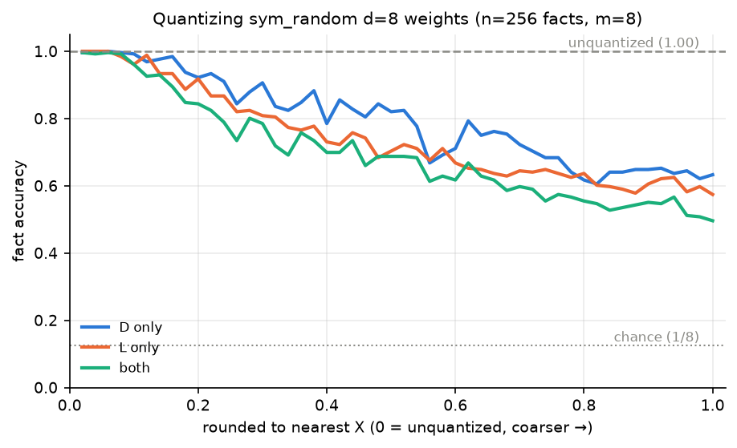

The weights themselves at five rounding levels (both matrices rounded; black divider = position-1 | position-2 blocks of L):

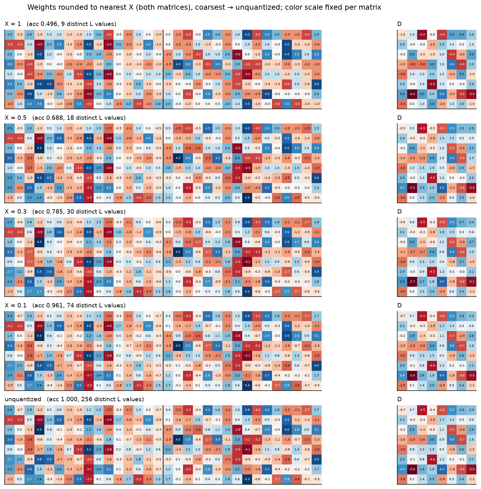

## Logit-slice SVD

SVD of each label's V_in × V_in logit slice: top-3 rank-1 components shown individually (σ·u·vᵀ), then cumulatively. Titles give each component's singular value and share of the slice's squared-singular-value energy.

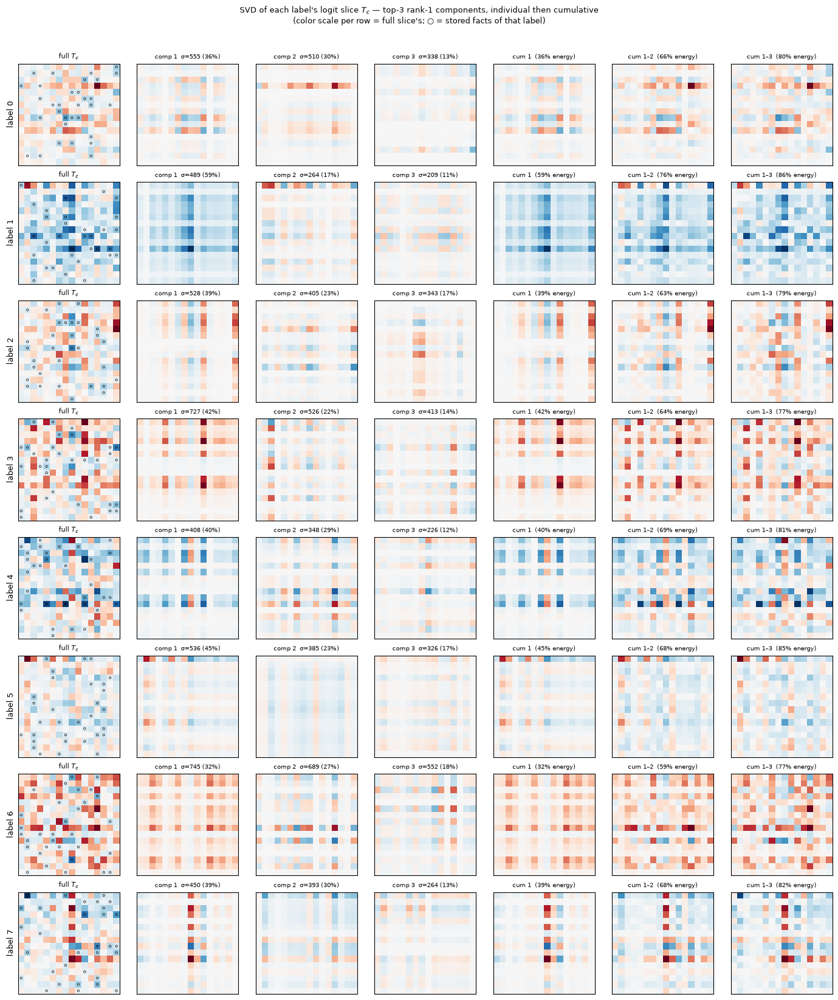

## Label-slice cosine similarity

Frobenius cosine similarity between the full logit slices: cos(A,B) = tr(AᵀB)/(‖A‖_F‖B‖_F), i.e. cosine similarity of the flattened 16×16 matrices.

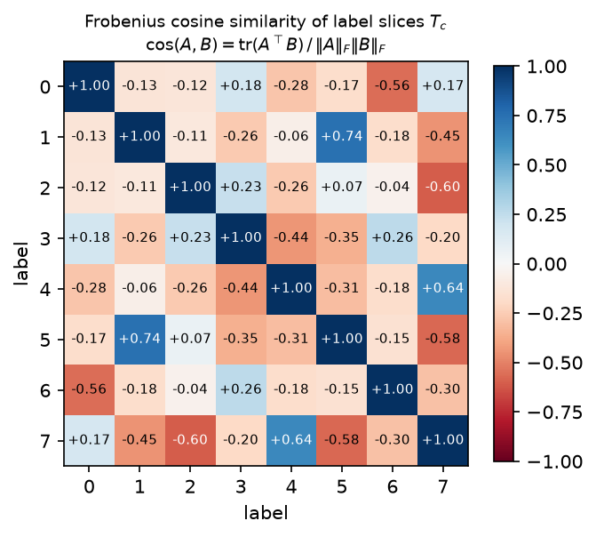

## Sparsity (iterative L1 + magnitude pruning)

Loop: 300 epochs CE+L1 (λ=0.003) → permanently zero the 5% smallest-|w| of the *remaining* weights (pooled over L and D). At each level, the blue curve shows a 1500-epoch no-L1 finetune of the masked model.

Sparsest level keeping finetuned acc ≥ 0.9: **37% ablated** (162 of 256 L weights and 40 of 64 D weights remain).

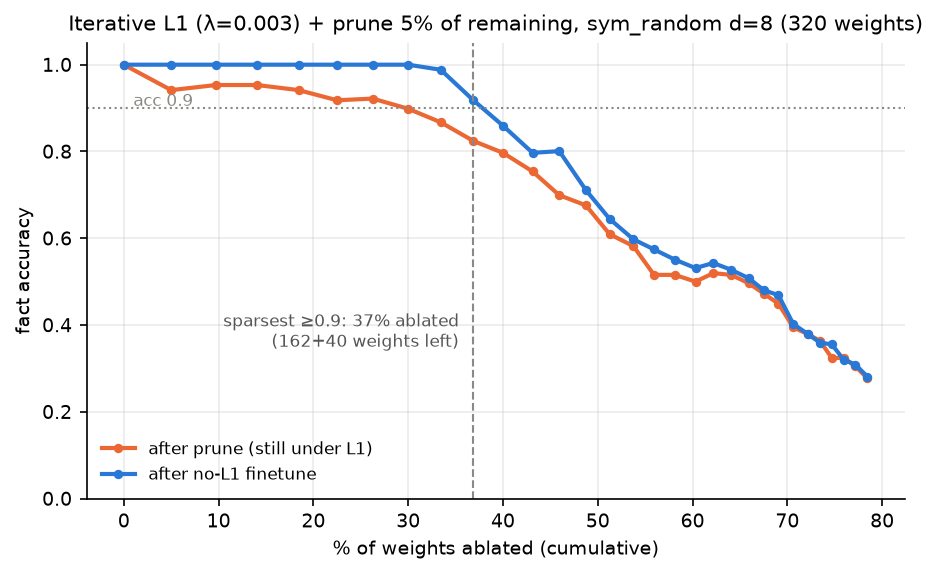

### Pruned models: weights and logit tensors

#### 30% ablated (finetuned acc 1.000; 180/256 L and 44/64 D weights remain)

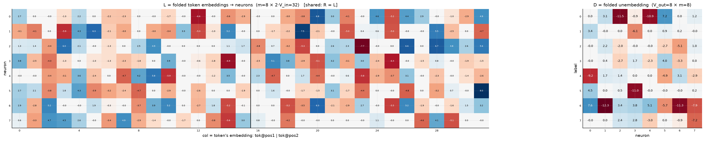

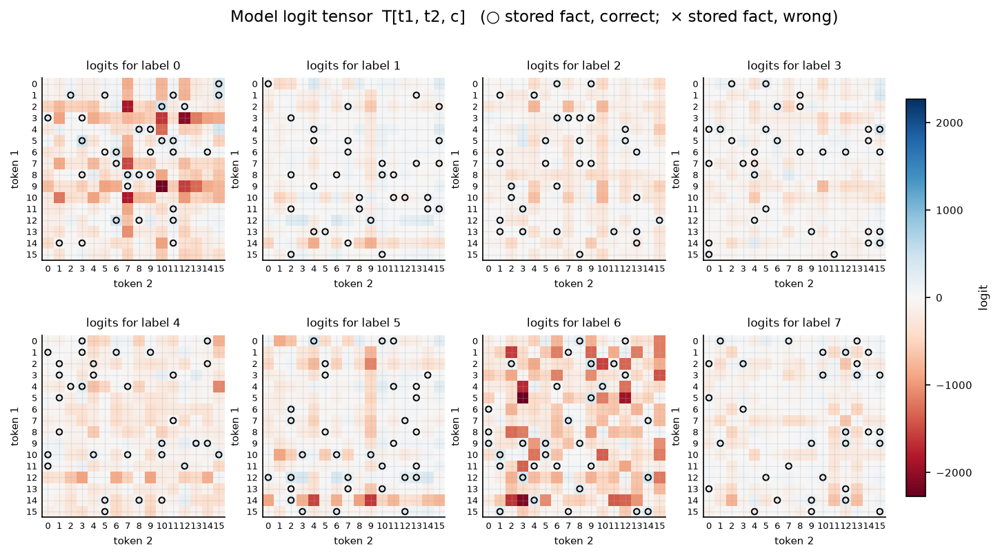

#### 37% ablated (finetuned acc 0.918; 162/256 L and 40/64 D weights remain)

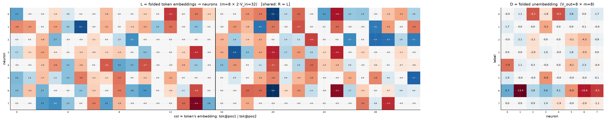

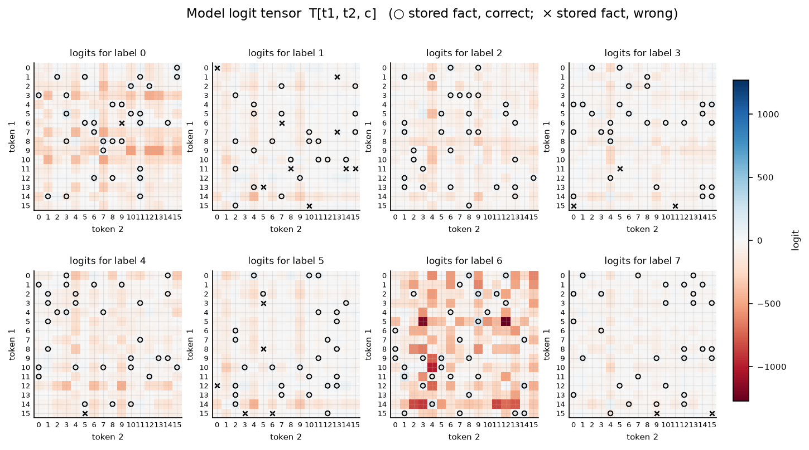

#### 62% ablated (finetuned acc 0.543; 96/256 L and 25/64 D weights remain)

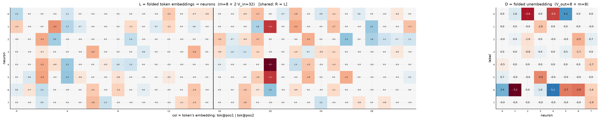

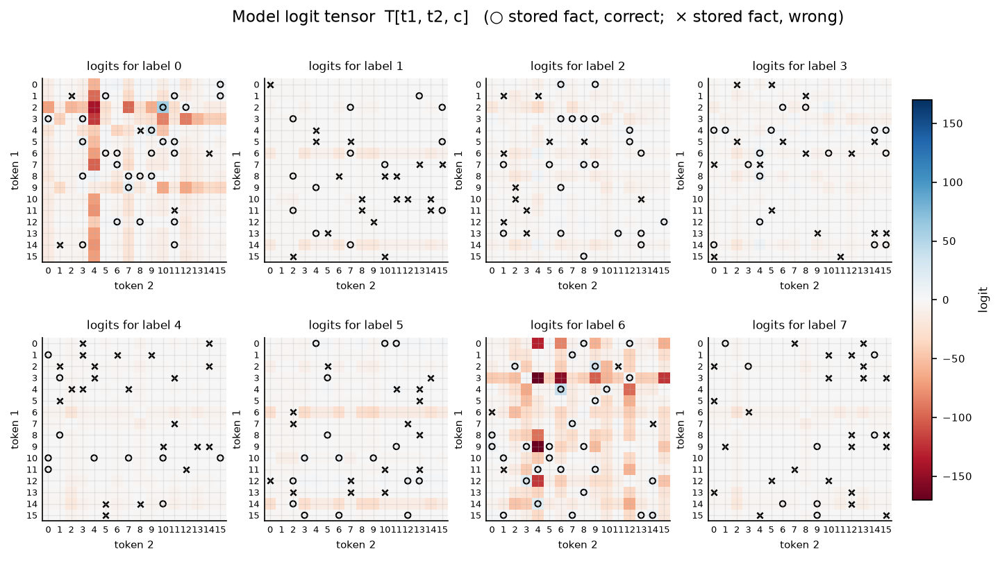

## Sparsity: D only

Same iterative loop, but the L1 penalty and pruning apply only to the readout D; L trains freely (never penalized or masked).

Sparsest level keeping finetuned acc ≥ 0.9: **58% of D ablated** (27 of 64 D weights remain — 3.4 per label).

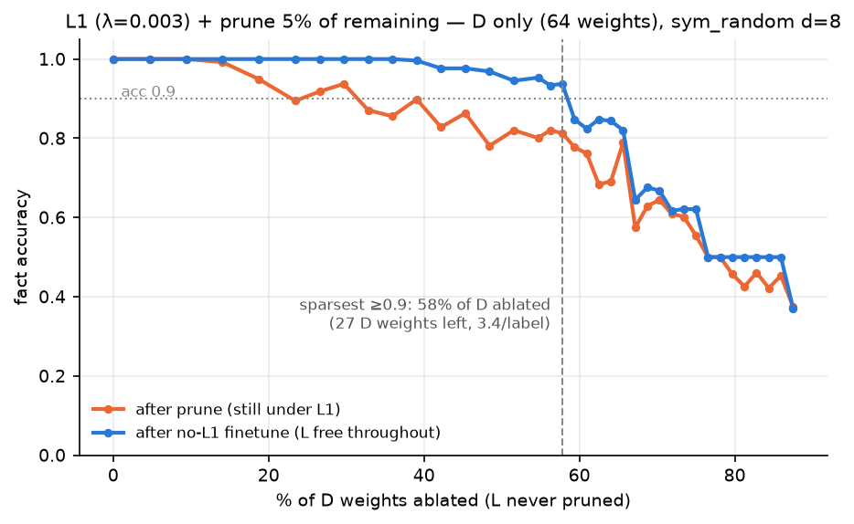

### D-only frontier model

The model at the acc ≥ 0.9 frontier of D-only pruning (round 17: 27/64 D weights, finetuned acc 0.938; nonzero D weights per label: [3, 2, 2, 5, 2, 2, 8, 3]). L is dense — never pruned — but has been retrained to suit the sparse readout.

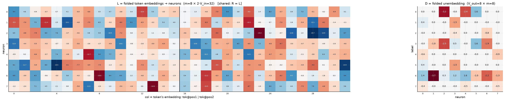

Canonical form of the frontier model: each D column's largest-|entry| scaled to 1, with the scale folded into the corresponding L row as its square root; functionally identical (max logit diff 3.7e-04). Remaining D entries (signs, within-column ratios) are irreducible structure.

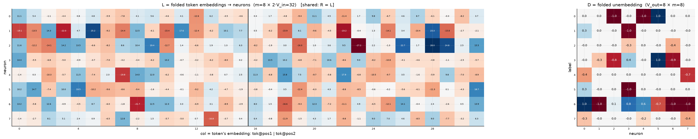
