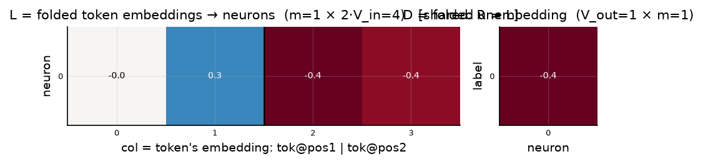
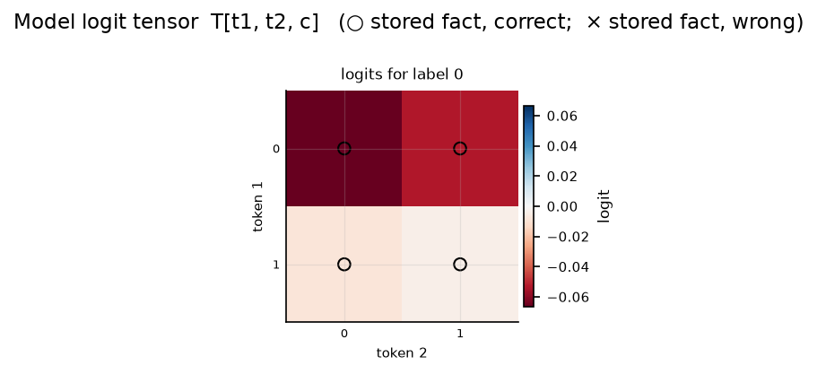

# Symmetric bilinear model (R = L), d = 1

| | |
|---|---|
| architecture | `logits = D((Lx) ⊙ (Lx))` — shared input matrix, x = [onehot(t1); onehot(t2)]. All hidden activations are ≥ 0. |
| V_in / V_out / m | 2 / 1 / 1 |
| parameters | 5 |
| capacity (acc ≥ 0.9, any of 11 seeds) | **4** of 4 possible facts |
| showcase model trained on | 4 facts (best seed of ≤11) |
| memorized (argmax correct) | **4 / 4**  (acc 1.000) |
| margin stats | min +0.00, median +0.00, max +0.00 |

> **Degenerate case:** V_out = 1 means there is only one label, so every fact is trivially 'memorized' by argmax. Included for completeness.

> **Sequential labels:** labels follow input enumeration order — pair index `t1·2 + t2`, first 4 pairs → label 0, next block → label 1, … Under this scaling that reduces to the rule `label = t1 // 2` (t2 is irrelevant), so this is a *learnable rule*, not random memorization — capacities are not comparable to the random-label reports.

## Weights

These three matrices are the *entire* model — the challenge architecture (post Fig. 4) folds the MLP input matrix into the embeddings and the output matrix into the unembedding. Because the input is a one-hot concat, **column t of L/R *is* token t's embedding vector**, mapping it straight to neuron pre-activations; **D is the unembedding** (neurons → label logits). The black divider separates the position-1 block (columns 0..V_in-1, read by token 1) from the position-2 block (read by token 2).

## Third-order logit tensor

The model's complete input→output function: `T[t1, t2, c]` for every possible input pair, one panel per label. Circles mark stored facts of that label (× = stored but predicted wrong). A perfect memorizer would have every circled cell be the winner across its panel-stack; everything un-circled is free to be arbitrary interference.

## Worked examples by success tier

Facts sorted by margin = `logit[correct] − max wrong logit` (positive ⇒ memorized). `c*` is the strongest competing label.

*(no unmemorized facts — this model is at 100% accuracy)*
