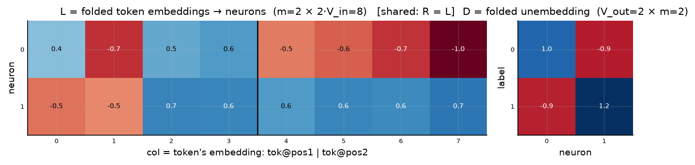
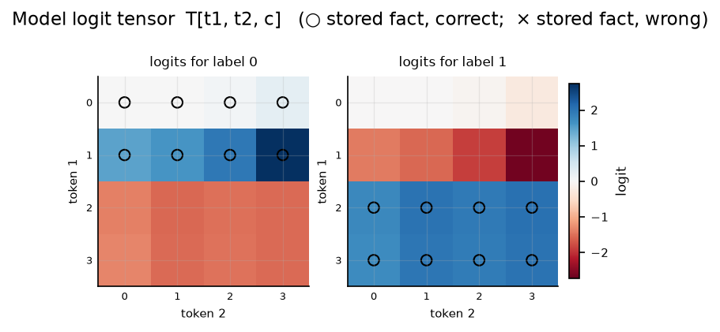

# Symmetric bilinear model (R = L), d = 2

| | |
|---|---|
| architecture | `logits = D((Lx) ⊙ (Lx))` — shared input matrix, x = [onehot(t1); onehot(t2)]. All hidden activations are ≥ 0. |
| V_in / V_out / m | 4 / 2 / 2 |
| parameters | 20 |
| capacity (acc ≥ 0.9, any of 11 seeds) | **16** of 16 possible facts |
| showcase model trained on | 16 facts (best seed of ≤11) |
| memorized (argmax correct) | **16 / 16**  (acc 1.000) |
| margin stats | min +0.01, median +3.18, max +5.37 |

> **Sequential labels:** labels follow input enumeration order — pair index `t1·4 + t2`, first 8 pairs → label 0, next block → label 1, … Under this scaling that reduces to the rule `label = t1 // 2` (t2 is irrelevant), so this is a *learnable rule*, not random memorization — capacities are not comparable to the random-label reports.

## Weights

These three matrices are the *entire* model — the challenge architecture (post Fig. 4) folds the MLP input matrix into the embeddings and the output matrix into the unembedding. Because the input is a one-hot concat, **column t of L/R *is* token t's embedding vector**, mapping it straight to neuron pre-activations; **D is the unembedding** (neurons → label logits). The black divider separates the position-1 block (columns 0..V_in-1, read by token 1) from the position-2 block (read by token 2).

## Third-order logit tensor

The model's complete input→output function: `T[t1, t2, c]` for every possible input pair, one panel per label. Circles mark stored facts of that label (× = stored but predicted wrong). A perfect memorizer would have every circled cell be the winner across its panel-stack; everything un-circled is free to be arbitrary interference.

## Worked examples by success tier

Facts sorted by margin = `logit[correct] − max wrong logit` (positive ⇒ memorized). `c*` is the strongest competing label.

### Near-perfect (largest margin, ~zero loss)

**Fact 7** — margin +5.37, CE loss 0.005

`t1=1, t2=3` → label **0**. `Lx[n] = L[n,1] + L[n,4+3]`, same for `Rx`; `h = Lx*Rx`; `logit[c] = Σ_n D[c,n]·h[n]`.

| n | Lx | Rx | h=Lx·Rx | D[y=0,n] | →logit[0] | D[c*=1,n] | →logit[1] |
|---|---|---|---|---|---|---|---|
| 0 | -1.71 | -1.71 | +2.91 | +0.96 | +2.79 | -0.93 | -2.71 |
| 1 | +0.24 | +0.24 | +0.06 | -0.94 | -0.05 | +1.20 | +0.07 |
| **Σ** | | | | | **+2.73** | | **-2.64** |

All logits: [**+2.73**, -2.64] — margin +5.37 vs label 1.

**Fact 6** — margin +3.84, CE loss 0.021

`t1=1, t2=2` → label **0**. `Lx[n] = L[n,1] + L[n,4+2]`, same for `Rx`; `h = Lx*Rx`; `logit[c] = Σ_n D[c,n]·h[n]`.

| n | Lx | Rx | h=Lx·Rx | D[y=0,n] | →logit[0] | D[c*=1,n] | →logit[1] |
|---|---|---|---|---|---|---|---|
| 0 | -1.44 | -1.44 | +2.06 | +0.96 | +1.97 | -0.93 | -1.92 |
| 1 | +0.16 | +0.16 | +0.02 | -0.94 | -0.02 | +1.20 | +0.03 |
| **Σ** | | | | | **+1.95** | | **-1.89** |

All logits: [**+1.95**, -1.89] — margin +3.84 vs label 1.

### Comfortable (median margin)

**Fact 5** — margin +3.18, CE loss 0.041

`t1=1, t2=1` → label **0**. `Lx[n] = L[n,1] + L[n,4+1]`, same for `Rx`; `h = Lx*Rx`; `logit[c] = Σ_n D[c,n]·h[n]`.

| n | Lx | Rx | h=Lx·Rx | D[y=0,n] | →logit[0] | D[c*=1,n] | →logit[1] |
|---|---|---|---|---|---|---|---|
| 0 | -1.31 | -1.31 | +1.72 | +0.96 | +1.65 | -0.93 | -1.60 |
| 1 | +0.17 | +0.17 | +0.03 | -0.94 | -0.03 | +1.20 | +0.04 |
| **Σ** | | | | | **+1.62** | | **-1.56** |

All logits: [**+1.62**, -1.56] — margin +3.18 vs label 1.

**Fact 8** — margin +3.15, CE loss 0.042

`t1=2, t2=0` → label **1**. `Lx[n] = L[n,2] + L[n,4+0]`, same for `Rx`; `h = Lx*Rx`; `logit[c] = Σ_n D[c,n]·h[n]`.

| n | Lx | Rx | h=Lx·Rx | D[y=1,n] | →logit[1] | D[c*=0,n] | →logit[0] |
|---|---|---|---|---|---|---|---|
| 0 | -0.01 | -0.01 | +0.00 | -0.93 | -0.00 | +0.96 | +0.00 |
| 1 | +1.21 | +1.21 | +1.47 | +1.20 | +1.77 | -0.94 | -1.38 |
| **Σ** | | | | | **+1.77** | | **-1.38** |

All logits: [-1.38, **+1.77**] — margin +3.15 vs label 0.

### At the margin (barely memorized)

**Fact 1** — margin +0.03, CE loss 0.679

`t1=0, t2=1` → label **0**. `Lx[n] = L[n,0] + L[n,4+1]`, same for `Rx`; `h = Lx*Rx`; `logit[c] = Σ_n D[c,n]·h[n]`.

| n | Lx | Rx | h=Lx·Rx | D[y=0,n] | →logit[0] | D[c*=1,n] | →logit[1] |
|---|---|---|---|---|---|---|---|
| 0 | -0.17 | -0.17 | +0.03 | +0.96 | +0.03 | -0.93 | -0.03 |
| 1 | +0.11 | +0.11 | +0.01 | -0.94 | -0.01 | +1.20 | +0.01 |
| **Σ** | | | | | **+0.02** | | **-0.01** |

All logits: [**+0.02**, -0.01] — margin +0.03 vs label 1.

**Fact 0** — margin +0.01, CE loss 0.686

`t1=0, t2=0` → label **0**. `Lx[n] = L[n,0] + L[n,4+0]`, same for `Rx`; `h = Lx*Rx`; `logit[c] = Σ_n D[c,n]·h[n]`.

| n | Lx | Rx | h=Lx·Rx | D[y=0,n] | →logit[0] | D[c*=1,n] | →logit[1] |
|---|---|---|---|---|---|---|---|
| 0 | -0.09 | -0.09 | +0.01 | +0.96 | +0.01 | -0.93 | -0.01 |
| 1 | +0.02 | +0.02 | +0.00 | -0.94 | -0.00 | +1.20 | +0.00 |
| **Σ** | | | | | **+0.01** | | **-0.01** |

All logits: [**+0.01**, -0.01] — margin +0.01 vs label 1.

*(no unmemorized facts — this model is at 100% accuracy)*
