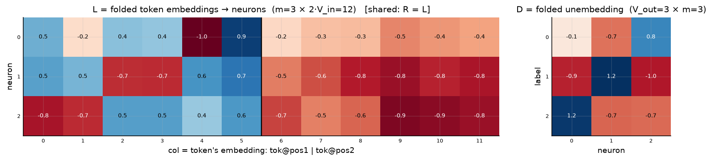
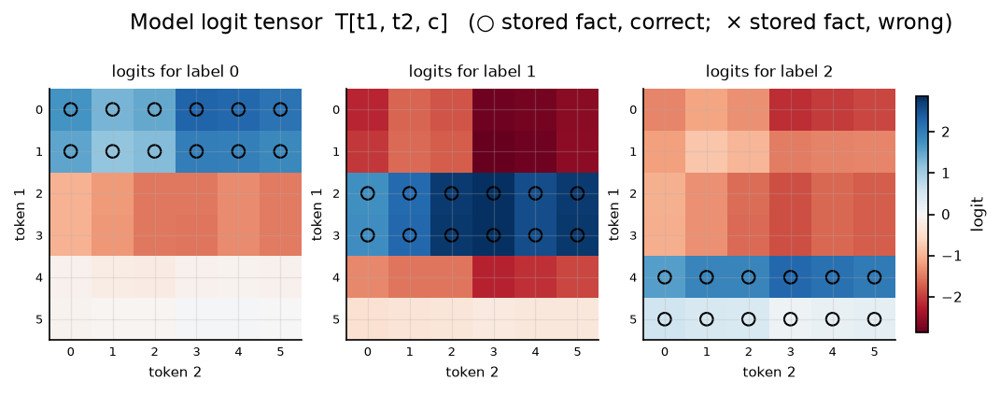

# Symmetric bilinear model (R = L), d = 3

| | |
|---|---|
| architecture | `logits = D((Lx) ⊙ (Lx))` — shared input matrix, x = [onehot(t1); onehot(t2)]. All hidden activations are ≥ 0. |
| V_in / V_out / m | 6 / 3 / 3 |
| parameters | 45 |
| capacity (acc ≥ 0.9, any of 11 seeds) | **36** of 36 possible facts |
| showcase model trained on | 36 facts (best seed of ≤11) |
| memorized (argmax correct) | **36 / 36**  (acc 1.000) |
| margin stats | min +0.08, median +2.78, max +4.42 |

> **Sequential labels:** labels follow input enumeration order — pair index `t1·6 + t2`, first 12 pairs → label 0, next block → label 1, … Under this scaling that reduces to the rule `label = t1 // 2` (t2 is irrelevant), so this is a *learnable rule*, not random memorization — capacities are not comparable to the random-label reports.

## Weights

These three matrices are the *entire* model — the challenge architecture (post Fig. 4) folds the MLP input matrix into the embeddings and the output matrix into the unembedding. Because the input is a one-hot concat, **column t of L/R *is* token t's embedding vector**, mapping it straight to neuron pre-activations; **D is the unembedding** (neurons → label logits). The black divider separates the position-1 block (columns 0..V_in-1, read by token 1) from the position-2 block (read by token 2).

## Third-order logit tensor

The model's complete input→output function: `T[t1, t2, c]` for every possible input pair, one panel per label. Circles mark stored facts of that label (× = stored but predicted wrong). A perfect memorizer would have every circled cell be the winner across its panel-stack; everything un-circled is free to be arbitrary interference.

## Worked examples by success tier

Facts sorted by margin = `logit[correct] − max wrong logit` (positive ⇒ memorized). `c*` is the strongest competing label.

### Near-perfect (largest margin, ~zero loss)

**Fact 3** — margin +4.42, CE loss 0.018

`t1=0, t2=3` → label **0**. `Lx[n] = L[n,0] + L[n,6+3]`, same for `Rx`; `h = Lx*Rx`; `logit[c] = Σ_n D[c,n]·h[n]`.

| n | Lx | Rx | h=Lx·Rx | D[y=0,n] | →logit[0] | D[c*=2,n] | →logit[2] |
|---|---|---|---|---|---|---|---|
| 0 | +0.00 | +0.00 | +0.00 | -0.14 | -0.00 | +1.17 | +0.00 |
| 1 | -0.31 | -0.31 | +0.10 | -0.66 | -0.06 | -0.71 | -0.07 |
| 2 | -1.73 | -1.73 | +3.01 | +0.79 | +2.36 | -0.68 | -2.05 |
| **Σ** | | | | | **+2.30** | | **-2.12** |

All logits: [**+2.30**, -2.78, -2.12] — margin +4.42 vs label 2.

**Fact 21** — margin +4.41, CE loss 0.021

`t1=3, t2=3` → label **1**. `Lx[n] = L[n,3] + L[n,6+3]`, same for `Rx`; `h = Lx*Rx`; `logit[c] = Σ_n D[c,n]·h[n]`.

| n | Lx | Rx | h=Lx·Rx | D[y=1,n] | →logit[1] | D[c*=0,n] | →logit[0] |
|---|---|---|---|---|---|---|---|
| 0 | -0.09 | -0.09 | +0.01 | -0.93 | -0.01 | -0.14 | -0.00 |
| 1 | -1.58 | -1.58 | +2.49 | +1.21 | +3.01 | -0.66 | -1.65 |
| 2 | -0.38 | -0.38 | +0.14 | -0.96 | -0.14 | +0.79 | +0.11 |
| **Σ** | | | | | **+2.87** | | **-1.54** |

All logits: [-1.54, **+2.87**, -1.85] — margin +4.41 vs label 0.

### Comfortable (median margin)

**Fact 18** — margin +2.78, CE loss 0.114

`t1=3, t2=0` → label **1**. `Lx[n] = L[n,3] + L[n,6+0]`, same for `Rx`; `h = Lx*Rx`; `logit[c] = Σ_n D[c,n]·h[n]`.

| n | Lx | Rx | h=Lx·Rx | D[y=1,n] | →logit[1] | D[c*=0,n] | →logit[0] |
|---|---|---|---|---|---|---|---|
| 0 | +0.19 | +0.19 | +0.04 | -0.93 | -0.03 | -0.14 | -0.00 |
| 1 | -1.23 | -1.23 | +1.52 | +1.21 | +1.84 | -0.66 | -1.00 |
| 2 | -0.12 | -0.12 | +0.02 | -0.96 | -0.01 | +0.79 | +0.01 |
| **Σ** | | | | | **+1.79** | | **-1.00** |

All logits: [-1.00, **+1.79**, -1.05] — margin +2.78 vs label 0.

**Fact 12** — margin +2.76, CE loss 0.117

`t1=2, t2=0` → label **1**. `Lx[n] = L[n,2] + L[n,6+0]`, same for `Rx`; `h = Lx*Rx`; `logit[c] = Σ_n D[c,n]·h[n]`.

| n | Lx | Rx | h=Lx·Rx | D[y=1,n] | →logit[1] | D[c*=0,n] | →logit[0] |
|---|---|---|---|---|---|---|---|
| 0 | +0.21 | +0.21 | +0.05 | -0.93 | -0.04 | -0.14 | -0.01 |
| 1 | -1.23 | -1.23 | +1.51 | +1.21 | +1.83 | -0.66 | -1.00 |
| 2 | -0.13 | -0.13 | +0.02 | -0.96 | -0.02 | +0.79 | +0.01 |
| **Σ** | | | | | **+1.77** | | **-0.99** |

All logits: [-0.99, **+1.77**, -1.03] — margin +2.76 vs label 0.

### At the margin (barely memorized)

**Fact 34** — margin +0.17, CE loss 0.889

`t1=5, t2=4` → label **2**. `Lx[n] = L[n,5] + L[n,6+4]`, same for `Rx`; `h = Lx*Rx`; `logit[c] = Σ_n D[c,n]·h[n]`.

| n | Lx | Rx | h=Lx·Rx | D[y=2,n] | →logit[2] | D[c*=0,n] | →logit[0] |
|---|---|---|---|---|---|---|---|
| 0 | +0.49 | +0.49 | +0.24 | +1.17 | +0.28 | -0.14 | -0.03 |
| 1 | -0.03 | -0.03 | +0.00 | -0.71 | -0.00 | -0.66 | -0.00 |
| 2 | -0.32 | -0.32 | +0.10 | -0.68 | -0.07 | +0.79 | +0.08 |
| **Σ** | | | | | **+0.21** | | **+0.05** |

All logits: [+0.05, -0.32, **+0.21**] — margin +0.17 vs label 0.

**Fact 33** — margin +0.08, CE loss 0.949

`t1=5, t2=3` → label **2**. `Lx[n] = L[n,5] + L[n,6+3]`, same for `Rx`; `h = Lx*Rx`; `logit[c] = Σ_n D[c,n]·h[n]`.

| n | Lx | Rx | h=Lx·Rx | D[y=2,n] | →logit[2] | D[c*=0,n] | →logit[0] |
|---|---|---|---|---|---|---|---|
| 0 | +0.45 | +0.45 | +0.20 | +1.17 | +0.23 | -0.14 | -0.03 |
| 1 | -0.13 | -0.13 | +0.02 | -0.71 | -0.01 | -0.66 | -0.01 |
| 2 | -0.35 | -0.35 | +0.12 | -0.68 | -0.08 | +0.79 | +0.10 |
| **Σ** | | | | | **+0.14** | | **+0.06** |

All logits: [+0.06, -0.28, **+0.14**] — margin +0.08 vs label 0.

*(no unmemorized facts — this model is at 100% accuracy)*
