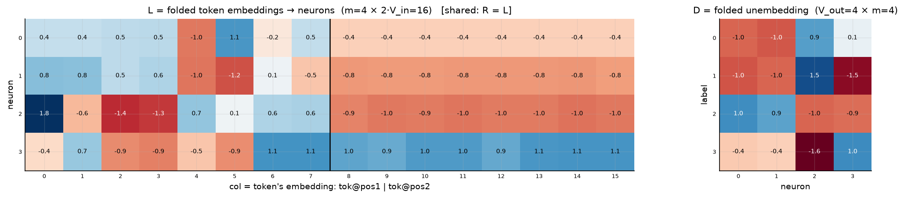
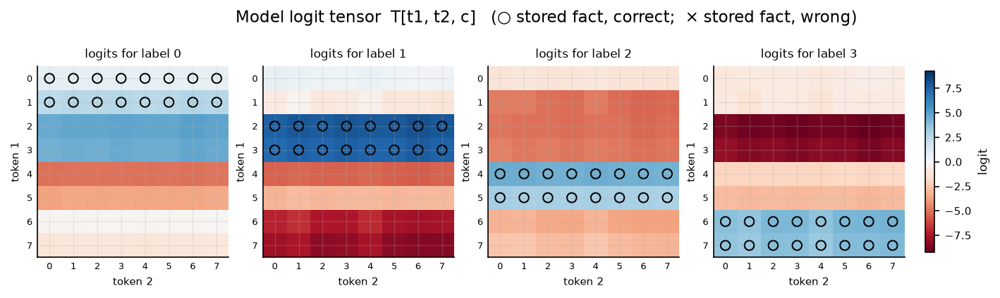

# Symmetric bilinear model (R = L), d = 4

| | |
|---|---|
| architecture | `logits = D((Lx) ⊙ (Lx))` — shared input matrix, x = [onehot(t1); onehot(t2)]. All hidden activations are ≥ 0. |
| V_in / V_out / m | 8 / 4 / 4 |
| parameters | 80 |
| capacity (acc ≥ 0.9, any of 11 seeds) | **64** of 64 possible facts |
| showcase model trained on | 64 facts (best seed of ≤11) |
| memorized (argmax correct) | **64 / 64**  (acc 1.000) |
| margin stats | min +0.11, median +3.65, max +6.57 |

> **Sequential labels:** labels follow input enumeration order — pair index `t1·8 + t2`, first 16 pairs → label 0, next block → label 1, … Under this scaling that reduces to the rule `label = t1 // 2` (t2 is irrelevant), so this is a *learnable rule*, not random memorization — capacities are not comparable to the random-label reports.

## Weights

These three matrices are the *entire* model — the challenge architecture (post Fig. 4) folds the MLP input matrix into the embeddings and the output matrix into the unembedding. Because the input is a one-hot concat, **column t of L/R *is* token t's embedding vector**, mapping it straight to neuron pre-activations; **D is the unembedding** (neurons → label logits). The black divider separates the position-1 block (columns 0..V_in-1, read by token 1) from the position-2 block (read by token 2).

## Third-order logit tensor

The model's complete input→output function: `T[t1, t2, c]` for every possible input pair, one panel per label. Circles mark stored facts of that label (× = stored but predicted wrong). A perfect memorizer would have every circled cell be the winner across its panel-stack; everything un-circled is free to be arbitrary interference.

## Worked examples by success tier

Facts sorted by margin = `logit[correct] − max wrong logit` (positive ⇒ memorized). `c*` is the strongest competing label.

### Near-perfect (largest margin, ~zero loss)

**Fact 36** — margin +6.57, CE loss 0.002

`t1=4, t2=4` → label **2**. `Lx[n] = L[n,4] + L[n,8+4]`, same for `Rx`; `h = Lx*Rx`; `logit[c] = Σ_n D[c,n]·h[n]`.

| n | Lx | Rx | h=Lx·Rx | D[y=2,n] | →logit[2] | D[c*=3,n] | →logit[3] |
|---|---|---|---|---|---|---|---|
| 0 | -1.41 | -1.41 | +2.00 | +1.02 | +2.03 | -0.44 | -0.87 |
| 1 | -1.78 | -1.78 | +3.15 | +0.88 | +2.77 | -0.39 | -1.24 |
| 2 | -0.22 | -0.22 | +0.05 | -0.96 | -0.05 | -1.64 | -0.08 |
| 3 | +0.44 | +0.44 | +0.19 | -0.92 | -0.18 | +1.04 | +0.20 |
| **Σ** | | | | | **+4.57** | | **-1.99** |

All logits: [-5.07, -5.32, **+4.57**, -1.99] — margin +6.57 vs label 3.

**Fact 33** — margin +6.56, CE loss 0.002

`t1=4, t2=1` → label **2**. `Lx[n] = L[n,4] + L[n,8+1]`, same for `Rx`; `h = Lx*Rx`; `logit[c] = Σ_n D[c,n]·h[n]`.

| n | Lx | Rx | h=Lx·Rx | D[y=2,n] | →logit[2] | D[c*=3,n] | →logit[3] |
|---|---|---|---|---|---|---|---|
| 0 | -1.42 | -1.42 | +2.01 | +1.02 | +2.04 | -0.44 | -0.88 |
| 1 | -1.77 | -1.77 | +3.12 | +0.88 | +2.74 | -0.39 | -1.23 |
| 2 | -0.24 | -0.24 | +0.06 | -0.96 | -0.05 | -1.64 | -0.09 |
| 3 | +0.43 | +0.43 | +0.19 | -0.92 | -0.17 | +1.04 | +0.19 |
| **Σ** | | | | | **+4.56** | | **-2.00** |

All logits: [-5.04, -5.28, **+4.56**, -2.00] — margin +6.56 vs label 3.

### Comfortable (median margin)

**Fact 14** — margin +3.65, CE loss 0.050

`t1=1, t2=6` → label **0**. `Lx[n] = L[n,1] + L[n,8+6]`, same for `Rx`; `h = Lx*Rx`; `logit[c] = Σ_n D[c,n]·h[n]`.

| n | Lx | Rx | h=Lx·Rx | D[y=0,n] | →logit[0] | D[c*=3,n] | →logit[3] |
|---|---|---|---|---|---|---|---|
| 0 | +0.01 | +0.01 | +0.00 | -0.96 | -0.00 | -0.44 | -0.00 |
| 1 | -0.04 | -0.04 | +0.00 | -1.02 | -0.00 | -0.39 | -0.00 |
| 2 | -1.60 | -1.60 | +2.57 | +0.91 | +2.34 | -1.64 | -4.23 |
| 3 | +1.79 | +1.79 | +3.19 | +0.12 | +0.39 | +1.04 | +3.31 |
| **Σ** | | | | | **+2.73** | | **-0.92** |

All logits: [**+2.73**, -0.96, -5.40, -0.92] — margin +3.65 vs label 3.

**Fact 11** — margin +3.48, CE loss 0.058

`t1=1, t2=3` → label **0**. `Lx[n] = L[n,1] + L[n,8+3]`, same for `Rx`; `h = Lx*Rx`; `logit[c] = Σ_n D[c,n]·h[n]`.

| n | Lx | Rx | h=Lx·Rx | D[y=0,n] | →logit[0] | D[c*=1,n] | →logit[1] |
|---|---|---|---|---|---|---|---|
| 0 | +0.01 | +0.01 | +0.00 | -0.96 | -0.00 | -1.04 | -0.00 |
| 1 | -0.02 | -0.02 | +0.00 | -1.02 | -0.00 | -0.96 | -0.00 |
| 2 | -1.58 | -1.58 | +2.48 | +0.91 | +2.26 | +1.46 | +3.64 |
| 3 | +1.74 | +1.74 | +3.04 | +0.12 | +0.37 | -1.48 | -4.49 |
| **Σ** | | | | | **+2.63** | | **-0.86** |

All logits: [**+2.63**, -0.86, -5.18, -0.94] — margin +3.48 vs label 1.

### At the margin (barely memorized)

**Fact 4** — margin +0.11, CE loss 0.808

`t1=0, t2=4` → label **0**. `Lx[n] = L[n,0] + L[n,8+4]`, same for `Rx`; `h = Lx*Rx`; `logit[c] = Σ_n D[c,n]·h[n]`.

| n | Lx | Rx | h=Lx·Rx | D[y=0,n] | →logit[0] | D[c*=1,n] | →logit[1] |
|---|---|---|---|---|---|---|---|
| 0 | +0.00 | +0.00 | +0.00 | -0.96 | -0.00 | -1.04 | -0.00 |
| 1 | -0.01 | -0.01 | +0.00 | -1.02 | -0.00 | -0.96 | -0.00 |
| 2 | +0.89 | +0.89 | +0.79 | +0.91 | +0.71 | +1.46 | +1.15 |
| 3 | +0.58 | +0.58 | +0.34 | +0.12 | +0.04 | -1.48 | -0.50 |
| **Σ** | | | | | **+0.76** | | **+0.65** |

All logits: [**+0.76**, +0.65, -1.07, -0.94] — margin +0.11 vs label 1.

**Fact 1** — margin +0.11, CE loss 0.817

`t1=0, t2=1` → label **0**. `Lx[n] = L[n,0] + L[n,8+1]`, same for `Rx`; `h = Lx*Rx`; `logit[c] = Σ_n D[c,n]·h[n]`.

| n | Lx | Rx | h=Lx·Rx | D[y=0,n] | →logit[0] | D[c*=1,n] | →logit[1] |
|---|---|---|---|---|---|---|---|
| 0 | -0.00 | -0.00 | +0.00 | -0.96 | -0.00 | -1.04 | -0.00 |
| 1 | +0.00 | +0.00 | +0.00 | -1.02 | -0.00 | -0.96 | -0.00 |
| 2 | +0.87 | +0.87 | +0.76 | +0.91 | +0.69 | +1.46 | +1.12 |
| 3 | +0.58 | +0.58 | +0.33 | +0.12 | +0.04 | -1.48 | -0.49 |
| **Σ** | | | | | **+0.73** | | **+0.63** |

All logits: [**+0.73**, +0.63, -1.04, -0.91] — margin +0.11 vs label 1.

*(no unmemorized facts — this model is at 100% accuracy)*
