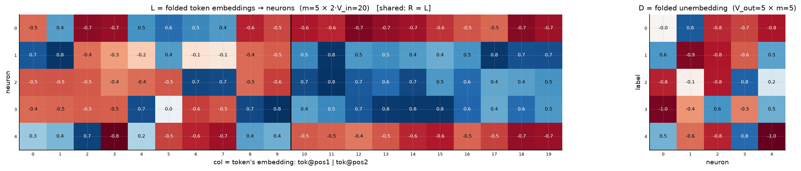
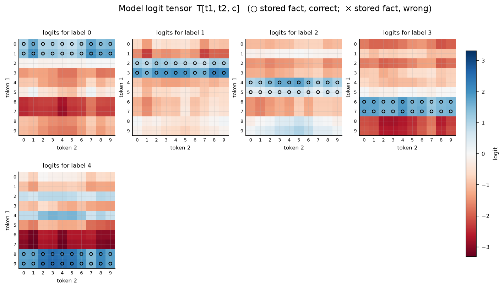

# Symmetric bilinear model (R = L), d = 5

| | |
|---|---|
| architecture | `logits = D((Lx) ⊙ (Lx))` — shared input matrix, x = [onehot(t1); onehot(t2)]. All hidden activations are ≥ 0. |
| V_in / V_out / m | 10 / 5 / 5 |
| parameters | 125 |
| capacity (acc ≥ 0.9, any of 11 seeds) | **100** of 100 possible facts |
| showcase model trained on | 100 facts (best seed of ≤11) |
| memorized (argmax correct) | **100 / 100**  (acc 1.000) |
| margin stats | min +0.04, median +1.64, max +3.35 |

> **Sequential labels:** labels follow input enumeration order — pair index `t1·10 + t2`, first 20 pairs → label 0, next block → label 1, … Under this scaling that reduces to the rule `label = t1 // 2` (t2 is irrelevant), so this is a *learnable rule*, not random memorization — capacities are not comparable to the random-label reports.

## Weights

These three matrices are the *entire* model — the challenge architecture (post Fig. 4) folds the MLP input matrix into the embeddings and the output matrix into the unembedding. Because the input is a one-hot concat, **column t of L/R *is* token t's embedding vector**, mapping it straight to neuron pre-activations; **D is the unembedding** (neurons → label logits). The black divider separates the position-1 block (columns 0..V_in-1, read by token 1) from the position-2 block (read by token 2).

## Third-order logit tensor

The model's complete input→output function: `T[t1, t2, c]` for every possible input pair, one panel per label. Circles mark stored facts of that label (× = stored but predicted wrong). A perfect memorizer would have every circled cell be the winner across its panel-stack; everything un-circled is free to be arbitrary interference.

## Worked examples by success tier

Facts sorted by margin = `logit[correct] − max wrong logit` (positive ⇒ memorized). `c*` is the strongest competing label.

### Near-perfect (largest margin, ~zero loss)

**Fact 61** — margin +3.35, CE loss 0.089

`t1=6, t2=1` → label **3**. `Lx[n] = L[n,6] + L[n,10+1]`, same for `Rx`; `h = Lx*Rx`; `logit[c] = Σ_n D[c,n]·h[n]`.

| n | Lx | Rx | h=Lx·Rx | D[y=3,n] | →logit[3] | D[c*=1,n] | →logit[1] |
|---|---|---|---|---|---|---|---|
| 0 | -0.09 | -0.09 | +0.01 | -0.96 | -0.01 | +0.58 | +0.00 |
| 1 | +0.66 | +0.66 | +0.43 | -0.44 | -0.19 | -0.94 | -0.40 |
| 2 | +1.50 | +1.50 | +2.26 | +0.60 | +1.35 | -0.82 | -1.85 |
| 3 | -0.04 | -0.04 | +0.00 | -0.51 | -0.00 | -0.61 | -0.00 |
| 4 | -1.08 | -1.08 | +1.17 | +0.50 | +0.58 | +0.54 | +0.63 |
| **Σ** | | | | | **+1.73** | | **-1.62** |

All logits: [-2.32, -1.62, -1.66, **+1.73**, -3.18] — margin +3.35 vs label 1.

**Fact 71** — margin +3.30, CE loss 0.089

`t1=7, t2=1` → label **3**. `Lx[n] = L[n,7] + L[n,10+1]`, same for `Rx`; `h = Lx*Rx`; `logit[c] = Σ_n D[c,n]·h[n]`.

| n | Lx | Rx | h=Lx·Rx | D[y=3,n] | →logit[3] | D[c*=1,n] | →logit[1] |
|---|---|---|---|---|---|---|---|
| 0 | -0.16 | -0.16 | +0.02 | -0.96 | -0.02 | +0.58 | +0.01 |
| 1 | +0.69 | +0.69 | +0.47 | -0.44 | -0.21 | -0.94 | -0.44 |
| 2 | +1.49 | +1.49 | +2.23 | +0.60 | +1.33 | -0.82 | -1.83 |
| 3 | +0.01 | +0.01 | +0.00 | -0.51 | -0.00 | -0.61 | -0.00 |
| 4 | -1.14 | -1.14 | +1.31 | +0.50 | +0.65 | +0.54 | +0.71 |
| **Σ** | | | | | **+1.75** | | **-1.55** |

All logits: [-2.37, -1.55, -1.63, **+1.75**, -3.31] — margin +3.30 vs label 1.

### Comfortable (median margin)

**Fact 80** — margin +1.64, CE loss 0.355

`t1=8, t2=0` → label **4**. `Lx[n] = L[n,8] + L[n,10+0]`, same for `Rx`; `h = Lx*Rx`; `logit[c] = Σ_n D[c,n]·h[n]`.

| n | Lx | Rx | h=Lx·Rx | D[y=4,n] | →logit[4] | D[c*=1,n] | →logit[1] |
|---|---|---|---|---|---|---|---|
| 0 | -1.26 | -1.26 | +1.59 | +0.47 | +0.75 | +0.58 | +0.93 |
| 1 | +0.06 | +0.06 | +0.00 | -0.57 | -0.00 | -0.94 | -0.00 |
| 2 | +0.26 | +0.26 | +0.07 | -0.78 | -0.05 | -0.82 | -0.06 |
| 3 | +1.14 | +1.14 | +1.30 | +0.78 | +1.02 | -0.61 | -0.80 |
| 4 | -0.05 | -0.05 | +0.00 | -1.01 | -0.00 | +0.54 | +0.00 |
| **Σ** | | | | | **+1.71** | | **+0.07** |

All logits: [-0.97, +0.07, -0.23, -2.14, **+1.71**] — margin +1.64 vs label 1.

**Fact 99** — margin +1.63, CE loss 0.353

`t1=9, t2=9` → label **4**. `Lx[n] = L[n,9] + L[n,10+9]`, same for `Rx`; `h = Lx*Rx`; `logit[c] = Σ_n D[c,n]·h[n]`.

| n | Lx | Rx | h=Lx·Rx | D[y=4,n] | →logit[4] | D[c*=2,n] | →logit[2] |
|---|---|---|---|---|---|---|---|
| 0 | -1.20 | -1.20 | +1.45 | +0.47 | +0.69 | -0.78 | -1.13 |
| 1 | +0.22 | +0.22 | +0.05 | -0.57 | -0.03 | -0.05 | -0.00 |
| 2 | -0.08 | -0.08 | +0.01 | -0.78 | -0.01 | -0.81 | -0.01 |
| 3 | +1.24 | +1.24 | +1.54 | +0.78 | +1.21 | +0.81 | +1.26 |
| 4 | -0.29 | -0.29 | +0.09 | -1.01 | -0.09 | +0.16 | +0.01 |
| **Σ** | | | | | **+1.77** | | **+0.14** |

All logits: [-1.12, -0.11, +0.14, -2.15, **+1.77**] — margin +1.63 vs label 2.

### At the margin (barely memorized)

**Fact 25** — margin +0.08, CE loss 0.913

`t1=2, t2=5` → label **1**. `Lx[n] = L[n,2] + L[n,10+5]`, same for `Rx`; `h = Lx*Rx`; `logit[c] = Σ_n D[c,n]·h[n]`.

| n | Lx | Rx | h=Lx·Rx | D[y=1,n] | →logit[1] | D[c*=4,n] | →logit[4] |
|---|---|---|---|---|---|---|---|
| 0 | -1.28 | -1.28 | +1.64 | +0.58 | +0.96 | +0.47 | +0.78 |
| 1 | -0.05 | -0.05 | +0.00 | -0.94 | -0.00 | -0.57 | -0.00 |
| 2 | -0.03 | -0.03 | +0.00 | -0.82 | -0.00 | -0.78 | -0.00 |
| 3 | +0.29 | +0.29 | +0.08 | -0.61 | -0.05 | +0.78 | +0.07 |
| 4 | +0.10 | +0.10 | +0.01 | +0.54 | +0.01 | -1.01 | -0.01 |
| **Σ** | | | | | **+0.91** | | **+0.83** |

All logits: [-0.10, **+0.91**, -1.21, -1.61, +0.83] — margin +0.08 vs label 4.

**Fact 42** — margin +0.04, CE loss 0.782

`t1=4, t2=2` → label **2**. `Lx[n] = L[n,4] + L[n,10+2]`, same for `Rx`; `h = Lx*Rx`; `logit[c] = Σ_n D[c,n]·h[n]`.

| n | Lx | Rx | h=Lx·Rx | D[y=2,n] | →logit[2] | D[c*=4,n] | →logit[4] |
|---|---|---|---|---|---|---|---|
| 0 | -0.27 | -0.27 | +0.07 | -0.78 | -0.06 | +0.47 | +0.03 |
| 1 | +0.25 | +0.25 | +0.06 | -0.05 | -0.00 | -0.57 | -0.04 |
| 2 | +0.22 | +0.22 | +0.05 | -0.81 | -0.04 | -0.78 | -0.04 |
| 3 | +1.37 | +1.37 | +1.89 | +0.81 | +1.54 | +0.78 | +1.48 |
| 4 | -0.17 | -0.17 | +0.03 | +0.16 | +0.00 | -1.01 | -0.03 |
| **Σ** | | | | | **+1.44** | | **+1.41** |

All logits: [-1.30, -1.20, **+1.44**, -1.02, +1.41] — margin +0.04 vs label 4.

*(no unmemorized facts — this model is at 100% accuracy)*
