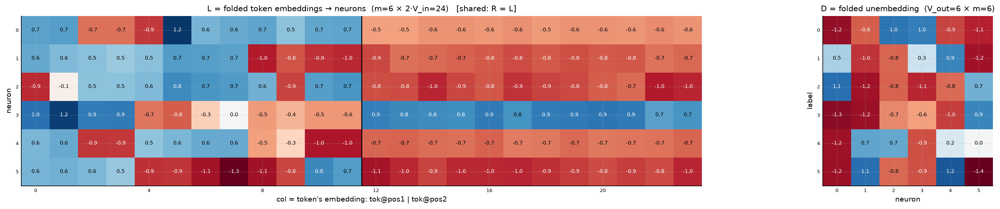
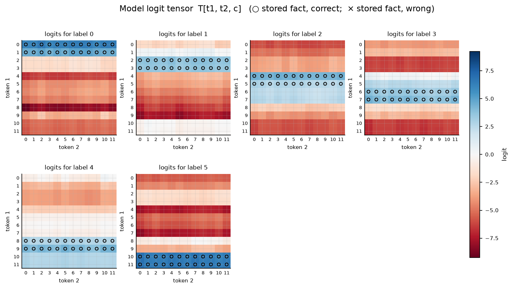

# Symmetric bilinear model (R = L), d = 6

| | |
|---|---|
| architecture | `logits = D((Lx) ⊙ (Lx))` — shared input matrix, x = [onehot(t1); onehot(t2)]. All hidden activations are ≥ 0. |
| V_in / V_out / m | 12 / 6 / 6 |
| parameters | 180 |
| capacity (acc ≥ 0.9, any of 11 seeds) | **144** of 144 possible facts |
| showcase model trained on | 144 facts (best seed of ≤11) |
| memorized (argmax correct) | **144 / 144**  (acc 1.000) |
| margin stats | min +0.16, median +3.95, max +7.60 |

> **Sequential labels:** labels follow input enumeration order — pair index `t1·12 + t2`, first 24 pairs → label 0, next block → label 1, … Under this scaling that reduces to the rule `label = t1 // 2` (t2 is irrelevant), so this is a *learnable rule*, not random memorization — capacities are not comparable to the random-label reports.

## Weights

These three matrices are the *entire* model — the challenge architecture (post Fig. 4) folds the MLP input matrix into the embeddings and the output matrix into the unembedding. Because the input is a one-hot concat, **column t of L/R *is* token t's embedding vector**, mapping it straight to neuron pre-activations; **D is the unembedding** (neurons → label logits). The black divider separates the position-1 block (columns 0..V_in-1, read by token 1) from the position-2 block (read by token 2).

## Third-order logit tensor

The model's complete input→output function: `T[t1, t2, c]` for every possible input pair, one panel per label. Circles mark stored facts of that label (× = stored but predicted wrong). A perfect memorizer would have every circled cell be the winner across its panel-stack; everything un-circled is free to be arbitrary interference.

## Worked examples by success tier

Facts sorted by margin = `logit[correct] − max wrong logit` (positive ⇒ memorized). `c*` is the strongest competing label.

### Near-perfect (largest margin, ~zero loss)

**Fact 113** — margin +7.60, CE loss 0.001

`t1=9, t2=5` → label **4**. `Lx[n] = L[n,9] + L[n,12+5]`, same for `Rx`; `h = Lx*Rx`; `logit[c] = Σ_n D[c,n]·h[n]`.

| n | Lx | Rx | h=Lx·Rx | D[y=4,n] | →logit[4] | D[c*=3,n] | →logit[3] |
|---|---|---|---|---|---|---|---|
| 0 | -0.06 | -0.06 | +0.00 | -1.18 | -0.00 | -1.26 | -0.00 |
| 1 | -1.63 | -1.63 | +2.66 | +0.74 | +1.95 | -1.20 | -3.18 |
| 2 | -1.78 | -1.78 | +3.17 | +0.72 | +2.29 | -0.67 | -2.14 |
| 3 | +0.33 | +0.33 | +0.11 | -0.90 | -0.10 | -0.58 | -0.06 |
| 4 | -0.92 | -0.92 | +0.86 | +0.21 | +0.18 | -0.97 | -0.83 |
| 5 | -1.82 | -1.82 | +3.30 | +0.03 | +0.11 | +0.92 | +3.03 |
| **Σ** | | | | | **+4.42** | | **-3.18** |

All logits: [-3.32, -8.32, -4.30, -3.18, **+4.42**, -3.44] — margin +7.60 vs label 3.

**Fact 8** — margin +7.39, CE loss 0.001

`t1=0, t2=8` → label **0**. `Lx[n] = L[n,0] + L[n,12+8]`, same for `Rx`; `h = Lx*Rx`; `logit[c] = Σ_n D[c,n]·h[n]`.

| n | Lx | Rx | h=Lx·Rx | D[y=0,n] | →logit[0] | D[c*=4,n] | →logit[4] |
|---|---|---|---|---|---|---|---|
| 0 | +0.11 | +0.11 | +0.01 | -1.23 | -0.01 | -1.18 | -0.01 |
| 1 | -0.13 | -0.13 | +0.02 | -0.84 | -0.02 | +0.74 | +0.01 |
| 2 | -1.72 | -1.72 | +2.97 | +1.02 | +3.03 | +0.72 | +2.14 |
| 3 | +1.88 | +1.88 | +3.53 | +0.97 | +3.43 | -0.90 | -3.18 |
| 4 | -0.08 | -0.08 | +0.01 | -0.95 | -0.01 | +0.21 | +0.00 |
| 5 | -0.24 | -0.24 | +0.06 | -1.09 | -0.06 | +0.03 | +0.00 |
| **Σ** | | | | | **+6.36** | | **-1.03** |

All logits: [**+6.36**, -1.44, -6.17, -4.02, -1.03, -5.59] — margin +7.39 vs label 4.

### Comfortable (median margin)

**Fact 54** — margin +3.95, CE loss 0.021

`t1=4, t2=6` → label **2**. `Lx[n] = L[n,4] + L[n,12+6]`, same for `Rx`; `h = Lx*Rx`; `logit[c] = Σ_n D[c,n]·h[n]`.

| n | Lx | Rx | h=Lx·Rx | D[y=2,n] | →logit[2] | D[c*=3,n] | →logit[3] |
|---|---|---|---|---|---|---|---|
| 0 | -1.44 | -1.44 | +2.07 | +1.06 | +2.20 | -1.26 | -2.62 |
| 1 | -0.25 | -0.25 | +0.06 | -1.18 | -0.07 | -1.20 | -0.07 |
| 2 | -0.30 | -0.30 | +0.09 | -0.82 | -0.07 | -0.67 | -0.06 |
| 3 | +0.21 | +0.21 | +0.04 | -1.06 | -0.05 | -0.58 | -0.02 |
| 4 | -0.15 | -0.15 | +0.02 | -0.79 | -0.02 | -0.97 | -0.02 |
| 5 | -1.86 | -1.86 | +3.45 | +0.68 | +2.34 | +0.92 | +3.17 |
| **Σ** | | | | | **+4.32** | | **+0.37** |

All logits: [-6.26, -3.22, **+4.32**, +0.37, -2.26, -7.35] — margin +3.95 vs label 3.

**Fact 139** — margin +3.95, CE loss 0.020

`t1=11, t2=7` → label **5**. `Lx[n] = L[n,11] + L[n,12+7]`, same for `Rx`; `h = Lx*Rx`; `logit[c] = Σ_n D[c,n]·h[n]`.

| n | Lx | Rx | h=Lx·Rx | D[y=5,n] | →logit[5] | D[c*=4,n] | →logit[4] |
|---|---|---|---|---|---|---|---|
| 0 | +0.10 | +0.10 | +0.01 | -1.20 | -0.01 | -1.18 | -0.01 |
| 1 | -1.78 | -1.78 | +3.17 | +1.06 | +3.35 | +0.74 | +2.33 |
| 2 | -0.10 | -0.10 | +0.01 | -0.80 | -0.01 | +0.72 | +0.01 |
| 3 | +0.35 | +0.35 | +0.12 | -0.89 | -0.11 | -0.90 | -0.11 |
| 4 | -1.74 | -1.74 | +3.04 | +1.19 | +3.62 | +0.21 | +0.64 |
| 5 | -0.16 | -0.16 | +0.03 | -1.40 | -0.04 | +0.03 | +0.00 |
| **Σ** | | | | | **+6.81** | | **+2.86** |

All logits: [-5.47, -0.40, -6.24, -6.79, +2.86, **+6.81**] — margin +3.95 vs label 4.

### At the margin (barely memorized)

**Fact 71** — margin +0.20, CE loss 0.622

`t1=5, t2=11` → label **2**. `Lx[n] = L[n,5] + L[n,12+11]`, same for `Rx`; `h = Lx*Rx`; `logit[c] = Σ_n D[c,n]·h[n]`.

| n | Lx | Rx | h=Lx·Rx | D[y=2,n] | →logit[2] | D[c*=3,n] | →logit[3] |
|---|---|---|---|---|---|---|---|
| 0 | +0.67 | +0.67 | +0.45 | +1.06 | +0.47 | -1.26 | -0.57 |
| 1 | -0.02 | -0.02 | +0.00 | -1.18 | -0.00 | -1.20 | -0.00 |
| 2 | -0.16 | -0.16 | +0.03 | -0.82 | -0.02 | -0.67 | -0.02 |
| 3 | -0.02 | -0.02 | +0.00 | -1.06 | -0.00 | -0.58 | -0.00 |
| 4 | -0.15 | -0.15 | +0.02 | -0.79 | -0.02 | -0.97 | -0.02 |
| 5 | -1.87 | -1.87 | +3.49 | +0.68 | +2.37 | +0.92 | +3.21 |
| **Σ** | | | | | **+2.80** | | **+2.60** |

All logits: [-4.37, -3.91, **+2.80**, +2.60, -0.39, -5.43] — margin +0.20 vs label 3.

**Fact 65** — margin +0.16, CE loss 0.639

`t1=5, t2=5` → label **2**. `Lx[n] = L[n,5] + L[n,12+5]`, same for `Rx`; `h = Lx*Rx`; `logit[c] = Σ_n D[c,n]·h[n]`.

| n | Lx | Rx | h=Lx·Rx | D[y=2,n] | →logit[2] | D[c*=3,n] | →logit[3] |
|---|---|---|---|---|---|---|---|
| 0 | +0.66 | +0.66 | +0.43 | +1.06 | +0.46 | -1.26 | -0.55 |
| 1 | -0.12 | -0.12 | +0.01 | -1.18 | -0.02 | -1.20 | -0.02 |
| 2 | -0.11 | -0.11 | +0.01 | -0.82 | -0.01 | -0.67 | -0.01 |
| 3 | -0.01 | -0.01 | +0.00 | -1.06 | -0.00 | -0.58 | -0.00 |
| 4 | -0.07 | -0.07 | +0.01 | -0.79 | -0.00 | -0.97 | -0.00 |
| 5 | -1.87 | -1.87 | +3.51 | +0.68 | +2.38 | +0.92 | +3.23 |
| **Σ** | | | | | **+2.81** | | **+2.65** |

All logits: [-4.38, -3.96, **+2.81**, +2.65, -0.38, -5.43] — margin +0.16 vs label 3.

*(no unmemorized facts — this model is at 100% accuracy)*
