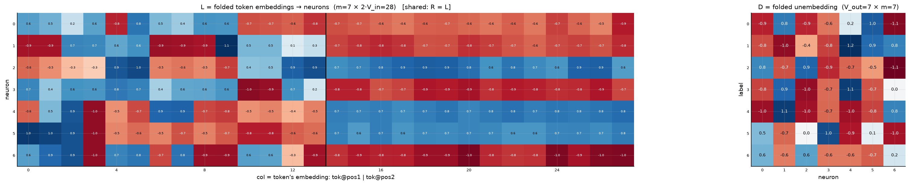
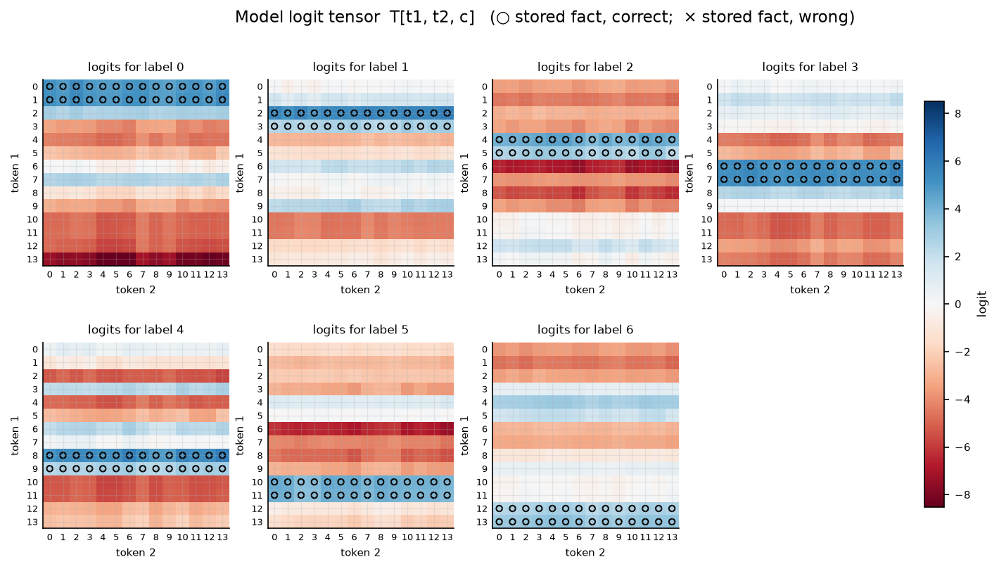

# Symmetric bilinear model (R = L), d = 7

| | |
|---|---|
| architecture | `logits = D((Lx) ⊙ (Lx))` — shared input matrix, x = [onehot(t1); onehot(t2)]. All hidden activations are ≥ 0. |
| V_in / V_out / m | 14 / 7 / 7 |
| parameters | 245 |
| capacity (acc ≥ 0.9, any of 11 seeds) | **196** of 196 possible facts |
| showcase model trained on | 196 facts (best seed of ≤11) |
| memorized (argmax correct) | **196 / 196**  (acc 1.000) |
| margin stats | min +0.08, median +2.77, max +4.73 |

> **Sequential labels:** labels follow input enumeration order — pair index `t1·14 + t2`, first 28 pairs → label 0, next block → label 1, … Under this scaling that reduces to the rule `label = t1 // 2` (t2 is irrelevant), so this is a *learnable rule*, not random memorization — capacities are not comparable to the random-label reports.

## Weights

These three matrices are the *entire* model — the challenge architecture (post Fig. 4) folds the MLP input matrix into the embeddings and the output matrix into the unembedding. Because the input is a one-hot concat, **column t of L/R *is* token t's embedding vector**, mapping it straight to neuron pre-activations; **D is the unembedding** (neurons → label logits). The black divider separates the position-1 block (columns 0..V_in-1, read by token 1) from the position-2 block (read by token 2).

## Third-order logit tensor

The model's complete input→output function: `T[t1, t2, c]` for every possible input pair, one panel per label. Circles mark stored facts of that label (× = stored but predicted wrong). A perfect memorizer would have every circled cell be the winner across its panel-stack; everything un-circled is free to be arbitrary interference.

## Worked examples by success tier

Facts sorted by margin = `logit[correct] − max wrong logit` (positive ⇒ memorized). `c*` is the strongest competing label.

### Near-perfect (largest margin, ~zero loss)

**Fact 0** — margin +4.73, CE loss 0.023

`t1=0, t2=0` → label **0**. `Lx[n] = L[n,0] + L[n,14+0]`, same for `Rx`; `h = Lx*Rx`; `logit[c] = Σ_n D[c,n]·h[n]`.

| n | Lx | Rx | h=Lx·Rx | D[y=0,n] | →logit[0] | D[c*=4,n] | →logit[4] |
|---|---|---|---|---|---|---|---|
| 0 | -0.10 | -0.10 | +0.01 | -0.91 | -0.01 | -1.00 | -0.01 |
| 1 | -1.63 | -1.63 | +2.65 | +0.82 | +2.18 | +1.09 | +2.90 |
| 2 | +0.04 | +0.04 | +0.00 | -0.88 | -0.00 | -0.98 | -0.00 |
| 3 | -0.13 | -0.13 | +0.02 | -0.62 | -0.01 | -0.67 | -0.01 |
| 4 | +0.11 | +0.11 | +0.01 | +0.17 | +0.00 | -0.99 | -0.01 |
| 5 | +1.77 | +1.77 | +3.12 | +0.97 | +3.04 | -0.79 | -2.47 |
| 6 | -0.19 | -0.19 | +0.04 | -1.07 | -0.04 | +0.78 | +0.03 |
| **Σ** | | | | | **+5.15** | | **+0.43** |

All logits: [**+5.15**, +0.12, -3.56, +0.15, +0.43, -1.44, -3.79] — margin +4.73 vs label 4.

**Fact 2** — margin +4.73, CE loss 0.020

`t1=0, t2=2` → label **0**. `Lx[n] = L[n,0] + L[n,14+2]`, same for `Rx`; `h = Lx*Rx`; `logit[c] = Σ_n D[c,n]·h[n]`.

| n | Lx | Rx | h=Lx·Rx | D[y=0,n] | →logit[0] | D[c*=4,n] | →logit[4] |
|---|---|---|---|---|---|---|---|
| 0 | -0.02 | -0.02 | +0.00 | -0.91 | -0.00 | -1.00 | -0.00 |
| 1 | -1.71 | -1.71 | +2.92 | +0.82 | +2.40 | +1.09 | +3.20 |
| 2 | +0.18 | +0.18 | +0.03 | -0.88 | -0.03 | -0.98 | -0.03 |
| 3 | +0.02 | +0.02 | +0.00 | -0.62 | -0.00 | -0.67 | -0.00 |
| 4 | +0.11 | +0.11 | +0.01 | +0.17 | +0.00 | -0.99 | -0.01 |
| 5 | +1.78 | +1.78 | +3.18 | +0.97 | +3.09 | -0.79 | -2.52 |
| 6 | -0.24 | -0.24 | +0.06 | -1.07 | -0.06 | +0.78 | +0.04 |
| **Σ** | | | | | **+5.41** | | **+0.68** |

All logits: [**+5.41**, -0.09, -3.78, +0.34, +0.68, -1.65, -3.97] — margin +4.73 vs label 4.

### Comfortable (median margin)

**Fact 38** — margin +2.77, CE loss 0.069

`t1=2, t2=10` → label **1**. `Lx[n] = L[n,2] + L[n,14+10]`, same for `Rx`; `h = Lx*Rx`; `logit[c] = Σ_n D[c,n]·h[n]`.

| n | Lx | Rx | h=Lx·Rx | D[y=1,n] | →logit[1] | D[c*=0,n] | →logit[0] |
|---|---|---|---|---|---|---|---|
| 0 | -0.49 | -0.49 | +0.24 | -0.76 | -0.18 | -0.91 | -0.22 |
| 1 | -0.00 | -0.00 | +0.00 | -1.03 | -0.00 | +0.82 | +0.00 |
| 2 | +0.29 | +0.29 | +0.08 | -0.44 | -0.04 | -0.88 | -0.07 |
| 3 | -0.15 | -0.15 | +0.02 | -0.80 | -0.02 | -0.62 | -0.01 |
| 4 | +1.70 | +1.70 | +2.89 | +1.16 | +3.36 | +0.17 | +0.49 |
| 5 | +1.65 | +1.65 | +2.72 | +0.91 | +2.47 | +0.97 | +2.65 |
| 6 | -0.07 | -0.07 | +0.00 | +0.79 | +0.00 | -1.07 | -0.01 |
| **Σ** | | | | | **+5.60** | | **+2.83** |

All logits: [+2.83, **+5.60**, -3.07, +0.86, -5.34, -2.27, -3.54] — margin +2.77 vs label 0.

**Fact 182** — margin +2.77, CE loss 0.093

`t1=13, t2=0` → label **6**. `Lx[n] = L[n,13] + L[n,14+0]`, same for `Rx`; `h = Lx*Rx`; `logit[c] = Σ_n D[c,n]·h[n]`.

| n | Lx | Rx | h=Lx·Rx | D[y=6,n] | →logit[6] | D[c*=2,n] | →logit[2] |
|---|---|---|---|---|---|---|---|
| 0 | -1.48 | -1.48 | +2.18 | +0.55 | +1.21 | +0.75 | +1.64 |
| 1 | -0.47 | -0.47 | +0.22 | -0.59 | -0.13 | -0.74 | -0.16 |
| 2 | +1.60 | +1.60 | +2.58 | +0.62 | +1.60 | +0.93 | +2.40 |
| 3 | -0.63 | -0.63 | +0.40 | -0.62 | -0.25 | -0.88 | -0.35 |
| 4 | +0.20 | +0.20 | +0.04 | -0.62 | -0.02 | -0.68 | -0.03 |
| 5 | +0.13 | +0.13 | +0.02 | -0.71 | -0.01 | -0.49 | -0.01 |
| 6 | -1.69 | -1.69 | +2.87 | +0.22 | +0.62 | -1.14 | -3.26 |
| **Σ** | | | | | **+3.01** | | **+0.24** |

All logits: [-7.37, -1.01, +0.24, -4.32, -2.53, -1.37, **+3.01**] — margin +2.77 vs label 2.

### At the margin (barely memorized)

**Fact 128** — margin +0.12, CE loss 0.767

`t1=9, t2=2` → label **4**. `Lx[n] = L[n,9] + L[n,14+2]`, same for `Rx`; `h = Lx*Rx`; `logit[c] = Σ_n D[c,n]·h[n]`.

| n | Lx | Rx | h=Lx·Rx | D[y=4,n] | →logit[4] | D[c*=1,n] | →logit[1] |
|---|---|---|---|---|---|---|---|
| 0 | +0.02 | +0.02 | +0.00 | -1.00 | -0.00 | -0.76 | -0.00 |
| 1 | +0.27 | +0.27 | +0.07 | +1.09 | +0.08 | -1.03 | -0.07 |
| 2 | +0.06 | +0.06 | +0.00 | -0.98 | -0.00 | -0.44 | -0.00 |
| 3 | -0.06 | -0.06 | +0.00 | -0.67 | -0.00 | -0.80 | -0.00 |
| 4 | -0.01 | -0.01 | +0.00 | -0.99 | -0.00 | +1.16 | +0.00 |
| 5 | +0.09 | +0.09 | +0.01 | -0.79 | -0.01 | +0.91 | +0.01 |
| 6 | -1.75 | -1.75 | +3.07 | +0.78 | +2.40 | +0.79 | +2.42 |
| **Σ** | | | | | **+2.46** | | **+2.35** |

All logits: [-3.22, +2.35, -3.55, +0.11, **+2.46**, -3.02, +0.62] — margin +0.12 vs label 1.

**Fact 139** — margin +0.08, CE loss 0.746

`t1=9, t2=13` → label **4**. `Lx[n] = L[n,9] + L[n,14+13]`, same for `Rx`; `h = Lx*Rx`; `logit[c] = Σ_n D[c,n]·h[n]`.

| n | Lx | Rx | h=Lx·Rx | D[y=4,n] | →logit[4] | D[c*=1,n] | →logit[1] |
|---|---|---|---|---|---|---|---|
| 0 | -0.22 | -0.22 | +0.05 | -1.00 | -0.05 | -0.76 | -0.04 |
| 1 | +0.27 | +0.27 | +0.07 | +1.09 | +0.08 | -1.03 | -0.08 |
| 2 | -0.14 | -0.14 | +0.02 | -0.98 | -0.02 | -0.44 | -0.01 |
| 3 | -0.09 | -0.09 | +0.01 | -0.67 | -0.01 | -0.80 | -0.01 |
| 4 | +0.08 | +0.08 | +0.01 | -0.99 | -0.01 | +1.16 | +0.01 |
| 5 | +0.10 | +0.10 | +0.01 | -0.79 | -0.01 | +0.91 | +0.01 |
| 6 | -1.93 | -1.93 | +3.72 | +0.78 | +2.90 | +0.79 | +2.92 |
| **Σ** | | | | | **+2.89** | | **+2.81** |

All logits: [-3.97, +2.81, -4.24, +0.08, **+2.89**, -3.61, +0.79] — margin +0.08 vs label 1.

*(no unmemorized facts — this model is at 100% accuracy)*
