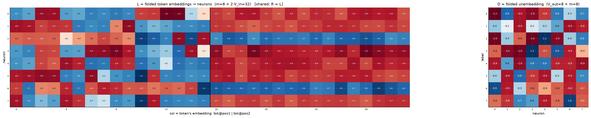
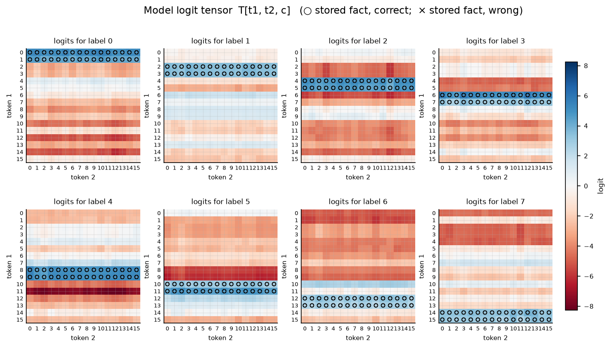

# Symmetric bilinear model (R = L), d = 8

| | |
|---|---|
| architecture | `logits = D((Lx) ⊙ (Lx))` — shared input matrix, x = [onehot(t1); onehot(t2)]. All hidden activations are ≥ 0. |
| V_in / V_out / m | 16 / 8 / 8 |
| parameters | 320 |
| capacity (acc ≥ 0.9, any of 11 seeds) | **256** of 256 possible facts |
| showcase model trained on | 256 facts (best seed of ≤11) |
| memorized (argmax correct) | **256 / 256**  (acc 1.000) |
| margin stats | min +0.05, median +3.58, max +5.54 |

> **Sequential labels:** labels follow input enumeration order — pair index `t1·16 + t2`, first 32 pairs → label 0, next block → label 1, … Under this scaling that reduces to the rule `label = t1 // 2` (t2 is irrelevant), so this is a *learnable rule*, not random memorization — capacities are not comparable to the random-label reports.

## Weights

These three matrices are the *entire* model — the challenge architecture (post Fig. 4) folds the MLP input matrix into the embeddings and the output matrix into the unembedding. Because the input is a one-hot concat, **column t of L/R *is* token t's embedding vector**, mapping it straight to neuron pre-activations; **D is the unembedding** (neurons → label logits). The black divider separates the position-1 block (columns 0..V_in-1, read by token 1) from the position-2 block (read by token 2).

## Third-order logit tensor

The model's complete input→output function: `T[t1, t2, c]` for every possible input pair, one panel per label. Circles mark stored facts of that label (× = stored but predicted wrong). A perfect memorizer would have every circled cell be the winner across its panel-stack; everything un-circled is free to be arbitrary interference.

## Worked examples by success tier

Facts sorted by margin = `logit[correct] − max wrong logit` (positive ⇒ memorized). `c*` is the strongest competing label.

### Near-perfect (largest margin, ~zero loss)

**Fact 186** — margin +5.54, CE loss 0.010

`t1=11, t2=10` → label **5**. `Lx[n] = L[n,11] + L[n,16+10]`, same for `Rx`; `h = Lx*Rx`; `logit[c] = Σ_n D[c,n]·h[n]`.

| n | Lx | Rx | h=Lx·Rx | D[y=5,n] | →logit[5] | D[c*=6,n] | →logit[6] |
|---|---|---|---|---|---|---|---|
| 0 | -1.33 | -1.33 | +1.76 | +0.37 | +0.65 | +0.95 | +1.66 |
| 1 | -0.30 | -0.30 | +0.09 | -0.88 | -0.08 | -0.86 | -0.08 |
| 2 | +1.63 | +1.63 | +2.66 | +0.83 | +2.21 | +0.32 | +0.86 |
| 3 | -0.42 | -0.42 | +0.18 | -0.76 | -0.14 | -0.64 | -0.11 |
| 4 | -0.10 | -0.10 | +0.01 | -0.87 | -0.01 | -0.43 | -0.00 |
| 5 | -1.51 | -1.51 | +2.27 | +0.30 | +0.67 | -0.64 | -1.46 |
| 6 | +0.36 | +0.36 | +0.13 | -0.86 | -0.11 | -0.83 | -0.11 |
| 7 | -1.50 | -1.50 | +2.26 | +0.69 | +1.55 | -0.69 | -1.55 |
| **Σ** | | | | | **+4.75** | | **-0.79** |

All logits: [-0.96, -2.34, -4.14, -2.61, -7.95, **+4.75**, -0.79, -1.88] — margin +5.54 vs label 6.

**Fact 26** — margin +5.41, CE loss 0.014

`t1=1, t2=10` → label **0**. `Lx[n] = L[n,1] + L[n,16+10]`, same for `Rx`; `h = Lx*Rx`; `logit[c] = Σ_n D[c,n]·h[n]`.

| n | Lx | Rx | h=Lx·Rx | D[y=0,n] | →logit[0] | D[c*=2,n] | →logit[2] |
|---|---|---|---|---|---|---|---|
| 0 | -0.10 | -0.10 | +0.01 | -1.07 | -0.01 | -1.04 | -0.01 |
| 1 | -1.55 | -1.55 | +2.42 | +0.85 | +2.05 | +0.39 | +0.94 |
| 2 | +0.20 | +0.20 | +0.04 | -0.88 | -0.04 | -0.63 | -0.03 |
| 3 | -0.22 | -0.22 | +0.05 | -0.98 | -0.05 | -1.04 | -0.05 |
| 4 | -0.14 | -0.14 | +0.02 | -0.76 | -0.01 | +1.06 | +0.02 |
| 5 | -1.61 | -1.61 | +2.58 | +0.76 | +1.96 | -0.99 | -2.54 |
| 6 | +1.63 | +1.63 | +2.65 | +0.32 | +0.86 | +0.38 | +1.01 |
| 7 | -0.07 | -0.07 | +0.01 | +0.71 | +0.00 | +0.75 | +0.00 |
| **Σ** | | | | | **+4.76** | | **-0.66** |

All logits: [**+4.76**, -0.78, -0.66, -2.29, -2.89, -3.65, -5.96, -0.77] — margin +5.41 vs label 2.

### Comfortable (median margin)

**Fact 137** — margin +3.58, CE loss 0.045

`t1=8, t2=9` → label **4**. `Lx[n] = L[n,8] + L[n,16+9]`, same for `Rx`; `h = Lx*Rx`; `logit[c] = Σ_n D[c,n]·h[n]`.

| n | Lx | Rx | h=Lx·Rx | D[y=4,n] | →logit[4] | D[c*=1,n] | →logit[1] |
|---|---|---|---|---|---|---|---|
| 0 | -0.02 | -0.02 | +0.00 | -0.87 | -0.00 | +0.42 | +0.00 |
| 1 | -1.23 | -1.23 | +1.51 | +0.59 | +0.89 | +0.08 | +0.12 |
| 2 | +0.09 | +0.09 | +0.01 | -0.96 | -0.01 | -0.90 | -0.01 |
| 3 | -1.74 | -1.74 | +3.03 | +0.78 | +2.37 | +0.16 | +0.49 |
| 4 | -1.45 | -1.45 | +2.10 | +0.78 | +1.64 | +0.33 | +0.69 |
| 5 | -0.11 | -0.11 | +0.01 | -0.82 | -0.01 | +0.56 | +0.01 |
| 6 | -0.03 | -0.03 | +0.00 | -0.83 | -0.00 | -0.91 | -0.00 |
| 7 | -0.06 | -0.06 | +0.00 | -0.93 | -0.00 | -0.84 | -0.00 |
| **Σ** | | | | | **+4.87** | | **+1.29** |

All logits: [-3.26, +1.29, -0.36, +0.26, **+4.87**, -5.45, -4.15, -1.16] — margin +3.58 vs label 1.

**Fact 40** — margin +3.58, CE loss 0.049

`t1=2, t2=8` → label **1**. `Lx[n] = L[n,2] + L[n,16+8]`, same for `Rx`; `h = Lx*Rx`; `logit[c] = Σ_n D[c,n]·h[n]`.

| n | Lx | Rx | h=Lx·Rx | D[y=1,n] | →logit[1] | D[c*=4,n] | →logit[4] |
|---|---|---|---|---|---|---|---|
| 0 | -1.61 | -1.61 | +2.60 | +0.42 | +1.08 | -0.87 | -2.26 |
| 1 | -1.36 | -1.36 | +1.86 | +0.08 | +0.14 | +0.59 | +1.09 |
| 2 | +0.19 | +0.19 | +0.04 | -0.90 | -0.03 | -0.96 | -0.03 |
| 3 | -1.44 | -1.44 | +2.07 | +0.16 | +0.34 | +0.78 | +1.62 |
| 4 | -1.43 | -1.43 | +2.05 | +0.33 | +0.67 | +0.78 | +1.60 |
| 5 | -1.56 | -1.56 | +2.44 | +0.56 | +1.38 | -0.82 | -2.01 |
| 6 | +0.19 | +0.19 | +0.04 | -0.91 | -0.03 | -0.83 | -0.03 |
| 7 | -0.24 | -0.24 | +0.06 | -0.84 | -0.05 | -0.93 | -0.05 |
| **Σ** | | | | | **+3.50** | | **-0.07** |

All logits: [-2.92, **+3.50**, -4.34, -0.54, -0.07, -3.27, -2.98, -4.98] — margin +3.58 vs label 4.

### At the margin (barely memorized)

**Fact 174** — margin +0.10, CE loss 0.699

`t1=10, t2=14` → label **5**. `Lx[n] = L[n,10] + L[n,16+14]`, same for `Rx`; `h = Lx*Rx`; `logit[c] = Σ_n D[c,n]·h[n]`.

| n | Lx | Rx | h=Lx·Rx | D[y=5,n] | →logit[5] | D[c*=6,n] | →logit[6] |
|---|---|---|---|---|---|---|---|
| 0 | -1.49 | -1.49 | +2.21 | +0.37 | +0.82 | +0.95 | +2.10 |
| 1 | -0.15 | -0.15 | +0.02 | -0.88 | -0.02 | -0.86 | -0.02 |
| 2 | +1.53 | +1.53 | +2.36 | +0.83 | +1.96 | +0.32 | +0.77 |
| 3 | -0.24 | -0.24 | +0.06 | -0.76 | -0.04 | -0.64 | -0.04 |
| 4 | -0.00 | -0.00 | +0.00 | -0.87 | -0.00 | -0.43 | -0.00 |
| 5 | +0.35 | +0.35 | +0.12 | +0.30 | +0.04 | -0.64 | -0.08 |
| 6 | +0.23 | +0.23 | +0.05 | -0.86 | -0.04 | -0.83 | -0.04 |
| 7 | +0.23 | +0.23 | +0.05 | +0.69 | +0.04 | -0.69 | -0.04 |
| **Σ** | | | | | **+2.75** | | **+2.65** |

All logits: [-4.35, -1.20, -3.90, -3.74, -4.33, **+2.75**, +2.65, +0.28] — margin +0.10 vs label 6.

**Fact 163** — margin +0.05, CE loss 0.724

`t1=10, t2=3` → label **5**. `Lx[n] = L[n,10] + L[n,16+3]`, same for `Rx`; `h = Lx*Rx`; `logit[c] = Σ_n D[c,n]·h[n]`.

| n | Lx | Rx | h=Lx·Rx | D[y=5,n] | →logit[5] | D[c*=6,n] | →logit[6] |
|---|---|---|---|---|---|---|---|
| 0 | -1.49 | -1.49 | +2.22 | +0.37 | +0.83 | +0.95 | +2.10 |
| 1 | -0.01 | -0.01 | +0.00 | -0.88 | -0.00 | -0.86 | -0.00 |
| 2 | +1.54 | +1.54 | +2.37 | +0.83 | +1.97 | +0.32 | +0.77 |
| 3 | -0.33 | -0.33 | +0.11 | -0.76 | -0.09 | -0.64 | -0.07 |
| 4 | +0.01 | +0.01 | +0.00 | -0.87 | -0.00 | -0.43 | -0.00 |
| 5 | +0.21 | +0.21 | +0.04 | +0.30 | +0.01 | -0.64 | -0.03 |
| 6 | +0.14 | +0.14 | +0.02 | -0.86 | -0.02 | -0.83 | -0.02 |
| 7 | +0.27 | +0.27 | +0.07 | +0.69 | +0.05 | -0.69 | -0.05 |
| **Σ** | | | | | **+2.76** | | **+2.71** |

All logits: [-4.50, -1.23, -3.90, -3.74, -4.25, **+2.76**, +2.71, +0.34] — margin +0.05 vs label 6.

*(no unmemorized facts — this model is at 100% accuracy)*
